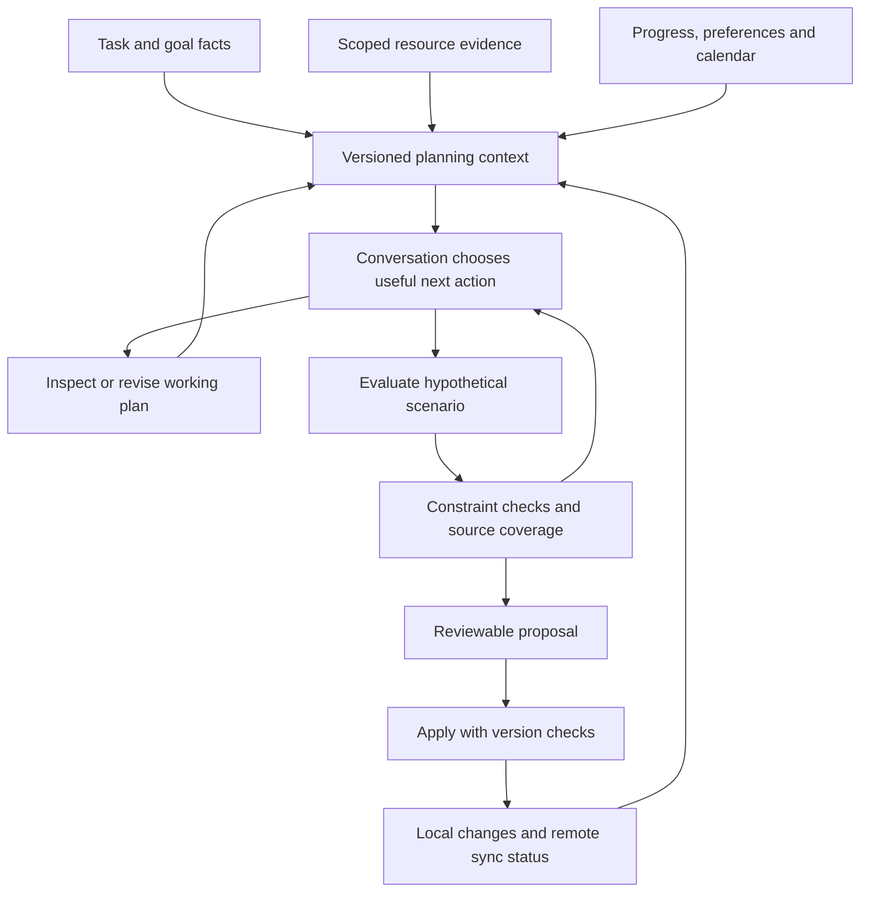

# Marina contextual time-management copilot: implementation game plan

Date: 3 October 2026. Planning baseline: `6f627ecbd37cce9dfe1e0e71f70dbfea5789e98a`. Source behavior is grounded in the current repository, the [implementation checkpoint](copilot-implementation-2026-10-03.md), and the [expanded research](time-management-copilot-research-2026-10-03.md#16-closer-alternatives-the-expanded-search-for-marinas-actual-objective).

**Status: P00–P02 and P03.1 complete; P03.2 reopened; 68 of 78 sections remain open.** The [P00 checkpoint](planning-checkpoints/P00.md) records fixtures and diagnostics; [P01.1](planning-checkpoints/P01.1.md) records typed identities. The [P01–P02 checkpoint](planning-checkpoints/P01-P02.md) expands each new leaf into reviewed child steps, with frontend/backend behavior, concurrency and recovery tests, migration evidence and limitations. [P03.1](planning-checkpoints/P03.1.md) unifies own-task accounting. P03.2 hierarchy accounting and its UI are deployed, but real chatbot answers failed semantic review and several model endpoints failed. The [expanded P03.2 repair checklist](planning-checkpoints/P03.2.md#8-reopened-chatbot-correctness-and-provider-recovery-checklist) owns those defects through closure, including when the fix touches another package's modules. P03.3 is not the next implementation step. Persistent manual plan memory is implemented; automatic chat use, workload inference and effort forecasting remain later work. Proposed repairs and tests below are not passing results.

**Execution style requested by the user:** implement and test small sections through successive prompts, inspect each section's results, then decide whether to continue, repair or expand. The default future implementation unit is one leaf ID, such as `P03.1`, not the whole document. A later user instruction can explicitly authorize a larger batch. Section 10 supplies copyable prompts, checkpoint records and the continuation protocol. This planning task does not start implementing the features.

Navigation: [architecture and state](#3-architecture-and-state-contracts), [78 implementation sections](#5-implementation-work-breakdown), [test fixtures](#6-fixture-catalogue-and-test-implementation-detail), [stress profiles](#7-stress-profiles-and-provisional-performance-budgets), [worked examples](#8-worked-planning-walkthroughs-and-test-oracles), [delivery slices](#9-delivery-sequence-feature-flags-and-stopping-gates), [execution prompts and prerequisites](#10-section-by-section-execution-protocol), [whole-chatbot coverage](#11-whole-chatbot-coverage-and-explicit-boundaries), [actual validation evidence](#12-evidence-recorded-while-preparing-this-plan).

## 1. Product contract and adoption decision

Marina helps the user manage time across work, study, personal commitments, goals and tasks. A persistent, revisable plan remembers the desired outcome, what resources contribute, completed and remaining work, uncertainty and decisions. The conversation can investigate, compare, explain and revise. Calendar placement verifies a concrete option when useful.

The user has endorsed this combination subject to engineering judgment. Combine the strongest ideas; do not install every reviewed product or turn their individual workflows into mandatory rules.

| Inspiration | Implement in Marina | Do not assume |
| --- | --- | --- |
| Conversational Planning for Personal Plans | Model-selected clarification, investigation and plan revision across turns. | A fixed three-action conversation menu or demonstrated human-effort accuracy. |
| PExA/PTIME | Shared task/time facts, explicit preferences, feasibility feedback and progress-aware revision. | Historical procedures or a new autonomous assistant framework are required. |
| TaskTracer/activity-centric computing | Goal/task context containing relevant documents, decisions and progress. | Continuous desktop surveillance or a new folder hierarchy for every discussion. |
| GAIA | Typed context sections, selective loading and task-associated working state. | Its fixed urgency ranking, source license or cache behavior can be copied into Marina. |
| Smart Agentic Calendar/OR-Tools | Placement comparisons, explicit constraints, repeatable scheduler tests. | Their objectives and dependency policies match Marina or must replace its current scheduler. |
| SkedPal/Morgen/Sunsama | Optional time allocations, preferred work windows, editable previews and clear planned/actual time. | Time budgets are effort estimates; calendar reservations are completed work. |
| RADAR/PEARL/COMPASS | Source-to-task evidence, preference revisions, and separate feasibility/usefulness evaluations. | Research scores transfer to Marina, or reinforcement learning is needed initially. |
| LlamaIndex/Docling | Structural overviews, incremental extraction and page/figure provenance where benchmarks justify them. | A Python migration, new vector database or full-library reindex is a prerequisite. |

Primary references, evidence limits and pinned licenses are retained in the research document. This plan proposes original changes to the current TypeScript application. It does not authorize copying restricted source or sending the user's library to additional services.

### Non-negotiable behavior

- A task can be planned without resources, a deadline or a known estimate. Missing facts are visible; they are not zero work.
- Plan detail is created lazily and deepened when useful. No compulsory planning wizard for simple tasks.
- Model reasoning explores meaningful alternatives. Server code checks identities, scope, arithmetic, dependency order and mutations.
- Resource scope, scheduling context and permission to change records are distinct. Global busy time does not grant access to unrelated documents.
- Existing estimates, logs, reservations, remaining forecasts and completion are separate facts.
- A resource can have different roles for different tasks. An attached book is not automatically required reading in full.
- An assistant finishing tool calls does not mean the human task is finished.
- Source requirements are evidence; they cannot grant permission, silently change a deadline, or override user instructions.
- Unknown, partial, stale, conflicted, canceled and failed states remain distinguishable.
- Proposed scenarios cannot alter tasks, calendar events or Google records. Applying reviewed changes remains a separate boundary.

## 2. Current source map and gaps to preserve in the plan

| Area | Existing implementation | Change boundary |
| --- | --- | --- |
| Conversation | [copilotConversation.ts](../server/services/copilotConversation.ts), [capabilities](../server/services/copilotCapabilities.ts), [contracts](../server/services/copilotContracts.ts), [tools](../server/services/copilotTools.ts) | Extend modular capabilities and typed tool observations; retain bounded retries and model choice. |
| Chat UI | [CopilotView.tsx](../src/views/CopilotView.tsx), [source cards](../src/components/CopilotSources.tsx), [Markdown](../src/components/CopilotMarkdown.tsx), [context picker](../src/components/ResourceContextPicker.tsx) | Add compact plan/scenario/progress views using existing Markdown, Radix and source components. |
| Resource scope | [resourceScope.ts](../shared/resourceScope.ts), [Drive ancestry](../server/services/driveAncestry.ts), [access](../server/services/driveResourceAccess.ts), [directory scan](../server/services/driveDirectoryScan.ts) | Carry the same boundary into all derived planning artifacts and async jobs. |
| Ingestion/retrieval | [structuredIngestion.ts](../server/services/structuredIngestion.ts), [elements](../server/services/documentElements.ts), [chunk pipeline](../server/services/chunkPipeline.ts), [documentRag.ts](../server/services/documentRag.ts), [reading](../server/services/documentReading.ts) | Add task-purpose overviews and coverage; preserve versioned page checkpoints and exact evidence. |
| Resource relationships | [resourceContext.ts](../server/services/resourceContext.ts), [edges](../server/routes/edges.ts), [ResourceProfilePanel](../src/components/ResourceProfilePanel.tsx) | Add relationship roles without moving shared originals or duplicating resources. |
| Effort/progress | [estimateSuggest.ts](../server/services/estimateSuggest.ts), [workTimer.ts](../server/services/workTimer.ts), [work sessions](../server/routes/work-sessions.ts), [task types](../src/db/schema.ts) | Preserve baseline estimates and measured history; add remaining-work semantics and corrections. |
| Scheduling | [scheduler.ts](../server/services/scheduler.ts), [planLayout.ts](../server/services/planLayout.ts), [AI route](../server/routes/ai.ts), [schedule preview](../server/routes/schedule-preview.ts), [scope resolver](../server/services/planTaskScope.ts) | Unify input/accounting adapters across routes before adding hypothetical tasks. Keep existing dependency invariants. |
| Writes/sync | [proposal route](../server/routes/ai-proposals.ts), [action validation](../server/services/actionValidation.ts), [Google sync](../server/services/googleWorkspaceSync.ts) | Add fresh-snapshot validation, scenario idempotency and visible remote-sync results. |
| Persistence/jobs | [schema.sql](../server/schema.sql), [migrations](../server/migrations), [resource dispatch](../server/services/resourceDispatch.ts), [processing](../server/services/resourceProcessing.ts) | Additive migrations and durable resumable jobs; no interactive full-library processing. |
| Verification | [synthetic audit](../audits/copilot/README.md), [integration config](../vitest.integration.config.ts), [Playwright config](../playwright.config.ts) | Add goal/task planning fixtures and actual database/browser coverage; preserve distinction from live-model evaluation. |

Known starting gaps: `CHAT-01` allows a resource identity to reach task-proposal preparation; `RAG-02` lacks dependable rejection of irrelevant candidates. `VIS-01` and `VIS-02` are expected limitations of native PDF text extraction, not end-to-end visual-pipeline failures. Correct the first two and test the full visual path. Do not “fix” a native-text primitive test by claiming it interprets images.

The current scheduling inputs occur in multiple routes. The proposed adapter must cover chat planning, schedule preview and other consumers identified by a call-site search. A fix in one route is not sufficient. The current estimate helper uses a same-goal/global median or a labeled 60-minute fallback; no resource-aware forecasting is implemented by that helper.

## 3. Architecture and state contracts



This is a map of allowed operations, not a pipeline that must run on every message. Greeting, factual lookup and simple scheduling requests retain fast paths. New filenames and endpoints below are **proposed**, not links to files that already exist.

### 3.1 Proposed modules and ownership

Use `shared/planningContracts.ts` for validated transport shapes; `server/services/planning/` for `planRepository`, `planningContext`, `workAccounting`, `resourceRoles`, `requirements`, `effortForecast`, `scenarioEvaluator`, `planInvalidation` and `decisionMemory`; and `server/routes/planning.ts` for read/revision/scenario routes. Frontend additions belong under `src/components/planning/`, with query hooks colocated or in the existing client-data convention verified during implementation.

Keep source parsing in existing ingestion services, existing schedule algorithms in their services, and writes in the durable proposal boundary. Avoid a second task table that drifts from `tasks`, an independent calendar cache that ignores sync freshness, or duplicate copies of full resource text in every plan revision.

### 3.2 Proposed persisted records

Names are provisional; agree the migration naming when implementing. Reuse existing identities, evidence and job infrastructure where the required lifecycle fits.

| Record | Minimum fields and constraints | Ownership/version behavior |
| --- | --- | --- |
| `planning_plans` | ID; exactly one root task or goal FK; active revision; lifecycle; timestamps. Unique active root. | One lazily created working plan per root; revisions preserve discussion state without creating user tasks. |
| `planning_plan_revisions` | Plan ID; increasing revision; base revision; output definition; work-item JSON; uncertainty; decision references; actor; schema version. Unique `(plan_id, revision)`. | Compare-and-swap writes. Append ordinary revisions; retention/redaction is a separately controlled operation. |
| `planning_resource_roles` | Resource FK; exactly one task/goal association; role; selected section/page ranges; asserted/inferred/confirmed status; source version; supersession. | Do not put one global role on the resource. Existing attachment alone yields “unspecified,” not “required.” |
| `planning_requirements` | Plan/work-item ID; outcome; evidence references; status; explicit/inferred/user-confirmed origin; conflict links. | Source version and scope guard every evidence reference. Revisions can withdraw a requirement. |
| `planning_effort_forecasts` | Work-item ID; remaining low/central/high or unknown; basis; assumptions; history sample IDs/count; model/config; prediction time; source/progress versions. | Append forecasts, keep user estimate unchanged. Confidence level is null unless statistically calibrated. |
| `planning_progress_observations` | Task/work-item ID; optional existing session FK; measured/reported/inferred origin; accomplishments; remaining-work statement; correction/supersession. | Unique source-event/idempotency key; overlapping sessions do not automatically add twice. |
| `planning_scenarios` | Plan/base revision; bounded task/calendar snapshot; temporary work IDs; proposed changes; assumptions; evaluation; status; expiry/cancellation. | Saves hypothetical planning state only. Applying delegates to durable proposals; do not independently write calendar events. |
| `planning_decisions` | Explicit preference/decision; scope; effective dates; source message/confirmation; status; supersession. | Keep inferred hypotheses distinguishable from explicit choices; edits and forgetting supported. |
| Existing outbox/jobs, extended or specialized | Event ID; affected entity/version; cursor; lease; attempt; next retry; result/error. | Separate ingestion, plan invalidation and external-sync lifecycles even if infrastructure is shared. |

Use database foreign keys for concrete entities where practical. For polymorphic references, enforce a discriminated type and existence/visibility checks; an untyped UUID is insufficient. Do not invent multi-tenant guarantees: Marina currently has a private workspace gate. A future account model requires an explicit ownership migration.

### 3.3 Read, revision and scenario API contract

| Proposed operation | Inputs | Result and failure contract |
| --- | --- | --- |
| `GET /api/planning/context` | Typed root, selected resource scope, date window, optional cursor. | Snapshot versions, current plan, time facts, evidence manifest, omissions, source freshness. Paginated, no hidden write. |
| `POST /api/planning/plans` | Typed root, idempotency key. | Lazily creates planning state; duplicate request returns same plan. Does not create tasks/events. |
| `POST /api/planning/plans/:id/revisions` | Base revision, validated patch, explicit actor/origin. | New revision or `409 stale_revision`; user corrections take precedence over an older model result. |
| `POST /api/planning/scenarios` | Plan revision, bounded hypothetical work/constraints, snapshot token, idempotency key. | Completed evaluation or `202` job handle when background processing is required. No task/calendar mutation. |
| `GET /api/planning/scenarios/:id` | Typed scenario ID. | Progress/evaluation, versions and staleness; resumed results checked against current scope. |
| `POST /api/planning/scenarios/:id/proposal` | Chosen scenario, explicit affected-record set, version token. | Durable proposal or actionable stale/unsupported result. Reads cannot silently broaden write scope. |
| Existing proposal Apply endpoint | Proposal ID and expected revision/snapshot. | Atomic local result or conflict; remote sync pending/failed is a separate visible status. |

Use structured error codes such as `scope_mismatch`, `source_unavailable`, `snapshot_stale`, `budget_exhausted`, `provider_unavailable`, `invalid_reference` and `unsupported_constraint`. Include retryability and an actionable explanation. Do not return an empty array to disguise an upstream failure.

### 3.4 Version, consistency and budget rules

A context snapshot captures plan revision, task/progress revisions, relevant goal/milestone/dependency changes, schedule preferences/timezone, calendar revision/fetch freshness, resource generations/access checks, and model/prompt schema version. Read related database facts in a consistent transaction where appropriate; external-provider freshness remains separate. Revalidate the affected read-set and availability window before Apply. A snapshot hash alone is not proof that nothing changed.

Use opaque, server-validated cursors bound to root/scope/query/version. Do not expose raw SQL offsets as authority. A canceled/stale background result must not overwrite a newer revision. Retain original facts and explicit omissions when prompt budgets compress context. Saved source excerpts can outlive access changes in existing history; new retrieval must be revoked immediately, with a separately defined retention/redaction policy.

Define budgets for interactive calls, tool rounds, result sizes, extraction pages, concurrency and provider spend. Do not raise the current Vercel/provider deadlines as the main latency solution. Background work must have resumable status and cancellation; a timeout must not trigger an uncontrolled second run.

## 4. Test specification conventions

Each leaf work item below has six required fields: **Backend**, **Frontend**, **Unit**, **Integration**, **Stress/failure**, and **Done**. `Pxx.y-U01` names the first unit case under that leaf; likewise `I`, `F`, `S`. Number every described assertion when creating tests. Keep stable IDs in test titles so a failed case can be traced back to its requirement.

Unit tests exercise pure contracts/calculations and scripted providers. Integration tests exercise real PostgreSQL, HTTP, transactions and actual job transitions with controlled external services. Frontend tests use Testing Library and Playwright for behavior, keyboard and touch. Model evaluations measure evidence selection and recommendation quality separately. Stress tests specify workload, faults and an observable oracle; a large fixture with no assertion is not a stress test.

The stress profile IDs `S1`–`S8` are defined in section 7. Leaf-level cases below supplement their common oracles. Model/provider and production load tests are opt-in, budgeted, and use synthetic or explicitly authorized data. No test may point at the primary application database by default. An integration suite that skips without a test database is recorded as skipped, never passed.

## 5. Implementation work breakdown

Each package lists related contracts to explain integration scope. These are not an all-or-nothing package dependency: the exact leaf prerequisites in section 10.2 determine execution order. A package's optional experiment must not block its earlier useful behavior.

### P00 — Baseline and reproducible evaluation fixtures

Related contracts: none. Implemented under `audits/planning/`, shared diagnostic contracts and current chat routes/components. See the [P00 acceptance checkpoint](planning-checkpoints/P00.md) for executed cases and explicit instrumentation boundaries.

#### P00.1 [x] Freeze representative work and calendar fixtures

- **Backend:** Define immutable synthetic task/goal/resource/calendar snapshots with clock, timezone, source versions and expected evidence. Include no-resource, book, client deliverable and mixed work/study cases.
- **Frontend:** Provide fixture states for absent plan, loading, partial evidence, ready plan, stale proposal and provider failure; reuse them in component tests.
- **Unit:** Validate fixture identities, deadline arithmetic and evidence references. An unknown estimate must remain null after serialization; an unrelated resource ID must fail a task reference.
- **Integration:** Load and clean only fixture-owned rows in an isolated database; replay the same fixture twice with identical initial state.
- **Stress/failure:** S1 seeds 1–100 permute entity insertion order; truncate a fixture file and require a clear validation failure, not silent defaults.
- **Done:** Fixtures and expected outcomes are reviewed, versioned and reproducible without live model calls.

#### P00.2 [x] Establish current behavior and known-failure accounting

- **Backend:** Run the current audit and focused scheduling/scope/context suites; inventory all consumers of remaining-work arithmetic and proposal identity validation.
- **Frontend:** Record current chat, source-card and preview behavior before changing it; retain existing accessible controls and scope persistence.
- **Unit:** Keep `CHAT-01` and `RAG-02` as explicit defect reproductions until repaired. Keep native-text visual limitations separate from positive OCR/vision tests.
- **Integration:** Identify which baseline checks require PostgreSQL or a browser and report missing prerequisites; never reuse an unknown running app server.
- **Stress/failure:** S1 verify a deliberately failing assertion makes the runner fail. Expected failures must be listed separately from ordinary passes.
- **Done:** Baseline receipt includes commit, test names, skips and known failures, not just a total green count.

#### P00.3 [x] Build evaluator traces and failure classification

- **Backend:** Capture bounded event traces for context reads, evidence selection, forecasts, scenario validation and Apply; record source/config versions without secrets.
- **Frontend:** Extend response details with understandable phases and omissions; detailed payload inspection stays a secondary action.
- **Unit:** A provider timeout is classified differently from no relevant evidence; redaction removes tokens and raw credential headers; hidden source bodies are not logged by default.
- **Integration:** Correlate one request across route, job and proposal without duplicating events; verify retention deletes only expired trace data.
- **Stress/failure:** S7/S8 simulate dropped telemetry and oversized events; core operations remain correct, event storage remains bounded, missing diagnostics are visible.
- **Done:** A failing scenario can be attributed to retrieval, interpretation, forecasting, scheduling, UI or persistence.

### P01 — Typed planning contracts and identity boundaries

Related contracts: P00.1. Proposed home: `shared/planningContracts.ts`, existing copilot contracts/action validation.

#### P01.1 [x] Define typed references, work items and evidence status

- **Backend:** Discriminated task/goal/resource/work-item references; finite nonnegative minutes; ordered ranges; explicit unknown/partial/stale status; strict payload size limits.
- **Frontend:** Shared parsing guards display invalid responses as recoverable errors; never coerce missing effort into “0 min.”
- **Unit:** Reject wrong entity kinds, NaN/infinity, negative time, reversed ranges, duplicate temporary IDs and unknown action types. Accept zero only where its meaning is explicit.
- **Integration:** Route rejects malformed JSON with no writes; resource ID cannot pass `update_task` preparation even if previously observed by a tool.
- **Stress/failure:** S1 fuzz nested payload depth, long Unicode titles and 10,000 references; reject excess input before expensive retrieval.
- **Done:** `CHAT-01` becomes an ordinary passing regression; typed checks exist before preview and at Apply.

#### P01.2 [x] Define plan, scenario and provider outcome states

- **Backend:** Explicit transitions: draft/revising/current/stale/archived for plan state; evaluating/ready/partial/conflicted/failed/canceled/superseded for scenarios. Applied status belongs to the accepted proposal/result.
- **Frontend:** Distinguish incomplete evidence, invalid schedule, unavailable provider and canceled request; expose the next useful action.
- **Unit:** Invalid transitions fail; a late success after cancellation cannot become current; feasible under assumptions differs from unconditional feasibility.
- **Integration:** Persist/reload each state, retry safely, and reject unsupported client state mutations.
- **Stress/failure:** S4 interleave 100 cancellation/retry/result events; exactly one authoritative terminal result survives per revision.
- **Done:** No ambiguous “ready” status conflates extraction, understanding, scheduling and completed human work.

#### P01.3 [x] Define scope, version and error envelopes

- **Backend:** Separate evidence scope, global scheduling context and proposed write set; snapshot token binds revisions and selected scope. Use structured retry/error metadata.
- **Frontend:** Show scope chips and stale-state messages; changing scope cannot render a late answer as though it used the new selection.
- **Unit:** Reject forged cursor/snapshot, goal-task mismatch and widened evidence IDs. Preserve global busy intervals without adding unrelated document references.
- **Integration:** Scope switch while a request runs cancels or quarantines the old result; invalid snapshots cannot create proposals.
- **Stress/failure:** S4/S6 rapid scope switching and replayed cursors across 50 roots; assert zero new cross-scope evidence in responses, citations and caches.
- **Done:** All new endpoints and jobs use one validated scope/version contract.

### P02 — Persistent plans, revisions and safe migrations

Related contracts: P01.1–P01.3. Implemented in `server/services/planning/`, shared contracts, the Plan panel and M-031. The [expanded child checklist](planning-checkpoints/P01-P02.md) records the verified backup, migration/restore rehearsal and scoped acceptance results.

#### P02.1 [x] Add plan storage without duplicating task facts

- **Backend:** Create root/revision records with concrete FKs, uniqueness and schema versions. Reference current tasks/resources; do not snapshot full documents into each revision.
- **Frontend:** A task/goal can show “Plan” before one exists; create lazily when the user starts planning. Ordinary task navigation remains fast.
- **Unit:** One root type required; duplicate create returns the same root; migrated attachment roles begin unspecified; old chat works with no plan.
- **Integration:** Apply migration on empty and representative prior schema; concurrent creates yield one plan. Rollback application code remains able to read legacy data.
- **Stress/failure:** S2/S4 seed 10,000 roots and race 20 creates per selected root; verify uniqueness, query plans and bounded response size.
- **Done:** Additive migration and isolated restore rehearsal pass; production receipt exists before migration is enabled.

#### P02.2 [x] Implement revisions and conflict-safe editing

- **Backend:** Append revisions with compare-and-swap base version; merge only explicitly independent fields or return a conflict. User corrections supersede older generated drafts.
- **Frontend:** Preserve unsaved text on conflict and show the newer revision; reload restores the last saved plan and pending local edits distinctly.
- **Unit:** Two edits from revision 4 cannot both silently produce current revision 5. Repeated idempotency key returns the original result; changed payload with that key conflicts.
- **Integration:** Two real database clients race edits; transaction boundaries protect head pointer and revision rows; process failure leaves no half revision.
- **Stress/failure:** S4 run 100 concurrent edits and intermittent disconnects; revision order is unique, no lost acknowledged changes, retries do not duplicate history.
- **Done:** Every saved plan revision has an origin and a recoverable predecessor.

#### P02.3 [x] Add archive, retention and derived-data invalidation

- **Backend:** Archive roots without deleting source files; separate retention of draft artifacts from required audit history. Access revocation suppresses derived evidence immediately on new reads.
- **Frontend:** Archived plans are clearly labeled and excluded from active suggestions; expose recover/forget actions discreetly with accurate consequences.
- **Unit:** Archiving a plan does not complete tasks; deleting an excerpt cannot delete the original; a revoked source cannot reappear through a summary cache.
- **Integration:** Verify cascades/tombstones and restore behavior for plan deletion, task archival and source removal; recheck backup coverage of new tables.
- **Stress/failure:** S2/S4/S8 interrupt cleanup and replay it; no orphan current pointers, no cross-root deletion, bounded resumable batches.
- **Done:** Retention policy distinguishes user facts, source-derived text, traces and versions; recovery tests cover each.

### P03 — Work, time and progress accounting

Related contracts: P01.1, P00.2. Proposed home: `workAccounting`; adapt every existing scheduler-input route.

#### P03.1 [x] Separate estimate, effort remaining and time reservation

- **Backend:** Return user estimate, measured/reported time, explicit remaining forecast, overrun/unknown state and future eligible reservations separately. Reconcile reservations only against the same task/window/work version.
- **Frontend:** Show “remaining unknown” for an unfinished overrun; distinguish “work remains” from “needs more calendar time.” Explain forecast basis on demand.
- **Unit:** Estimate 60/logged 70/incomplete -> unknown remaining; remaining 90/reserved 90 -> no new reservation, still 90 work remaining; canceled/past blocks do not reserve future work.
- **Integration:** Chat plan and schedule-preview endpoints return consistent accounting for the same snapshot; duplicate event-task links cannot count twice.
- **Stress/failure:** S1/S2 100,000 session/link rows with duplicates and corrections; no negative minutes, safe numeric bounds and deterministic deduplication.
- **Done:** One shared accounting implementation is used by all inventoried planning consumers.

#### P03.2 [ ] Respect hierarchy and rollup semantics through the chatbot answer

- **Backend:** Preserve inclusive/additive accounting and residual work; extend typed current evidence and validation through read-only planning replies as well as proposals. Check fact identity, scope, shortfalls, proposed allocations and unsupported completion claims. Bound correction/retry work and distinguish unavailable endpoints from invalid answers. Repairs must reach every relevant conversation path; changing prompt wording alone is insufficient.
- **Frontend:** Keep the deployed Counted work breakdown. Chat must agree with it, distinguish verified facts from proposed tradeoffs, label partial/stale evidence, preserve failed turns and offer accurate retry/model-selection controls. No hidden model switch or success-looking error. Maintain keyboard/touch access and four-viewport checks.
- **Unit:** Retain hierarchy tests; add independent answer fixtures for inclusive 60 remaining, additive 150 against 90 (60 short), optional-resource/task separation, unknowns, guarantees, unsupported claims, contradictory prose, invalid structured claims, empty/truncated output, 410/429/5xx, cancellation and retry ceilings. Replaying each original failed answer must fail semantic acceptance, even with HTTP 200 and valid JSON.
- **Integration:** Run production tool schemas and the conversation loop against isolated real PostgreSQL/HTTP fixtures; compare API, prompt evidence, chat and UI totals. Reparent/mode edits invalidate in-flight claims. Discussion, validation repair and provider retries never apply changes. Real model availability, useful answering and semantic accuracy receive separate verdicts and denominators.
- **Stress/failure:** S1/S3/S4/S6/S7 exercise 10,000-task hierarchies, bounded context, duplicate evidence, races, interrupted streams, 100 mocked concurrent requests, retry storms and exhausted budgets. Preserve existing hierarchy bounds; use mock providers for load, not public endpoints. Failed/missing evaluation cannot produce a passing result.
- **Done:** All applicable children P03.2.7–P03.2.19 and the [closure gates](planning-checkpoints/P03.2.md#86-closure-gates-and-next-prompt) pass; the failure ledger has no unresolved release blockers. Deployed accounting alone does not complete this leaf. A permanently unavailable endpoint must have verified recovery or explicit unavailable handling and an actually usable evaluated chat path; it must never be counted as a successful model test.

The [P03.2 checkpoint](planning-checkpoints/P03.2.md) preserves delivered P03.2.1–P03.2.6 and contains 13 repair children (P03.2.7 delivered; 12 still open), an expanded 32-family regression matrix, file-level implementation targets, test oracles and closure criteria. These children refine this leaf and do not add top-level leaves to the 78-section graph. P03.2 pulls forward only the contracts needed from P09/P10/P18/P19/P20/P24/P25; this does not complete those packages or create a circular dependency. Repair P03.2 before advancing to P03.3 under the current user instruction.

#### P03.3 [ ] Separate attention, waiting, capacity and completion

- **Backend:** Distinguish focused work from elapsed waiting; represent necessary follow-up attention. Availability is interval union/intersection, not a naive sum of calendar durations.
- **Frontend:** A waiting step can show the next required action; overlapping focus work is a conflict. Completing a timer prompts optional progress rather than completing the task.
- **Unit:** Overlapping meetings block their union once; two 30-minute focus tasks cannot occupy the same slot; a 60-minute wait plus 10-minute check is not 70 minutes of continuous focus.
- **Integration:** Timer/session/progress updates preserve origin and do not erase pending work or book time implicitly.
- **Stress/failure:** S1/S3 irregular durations, DST boundaries, overlapping meetings and canceled sessions; compare against an independent interval oracle.
- **Done:** Calendar feasibility and human completion remain separate under every source of time data.

### P04 — Task/resource roles and Drive scope

Related contracts: P01, P02.1. Reuse Drive ancestry, directory scan and resource context.

#### P04.1 [ ] Add a resource's role within a task or goal

- **Backend:** Save optional brief/required-reading/reference/example/prerequisite/output roles on associations, with selected ranges and origin. Support unspecified/custom descriptions without rigid classification requirements.
- **Frontend:** Compact role chip near the task attachment; editable by keyboard/touch. Upload still selects the destination task/goal and shows its Drive location.
- **Unit:** Same book required for task A and reference for B retains two roles; attaching alone implies neither full-book reading nor required work.
- **Integration:** Association edit leaves file identity/location intact, invalidates only relevant requirements and survives reload; existing uploads remain compatible.
- **Stress/failure:** S2 10,000 associations to a shared resource; paginated reads avoid duplicate documents and cross-task role leakage.
- **Done:** Role changes are reviewable and source-specific without duplicating originals.

#### P04.2 [ ] Propagate root/scope checks through derived planning data

- **Backend:** Apply current ancestry and selected-scope checks to overviews, requirements, memories, jobs, page previews and citations; async payloads store scope identity, not permanent access grants.
- **Frontend:** Out-of-scope or moved sources show an unavailable reference and retained non-sensitive task facts where valid; do not auto-switch to a broader library.
- **Unit:** Move-out, trash, shortcut, missing parent, forged child selection and stale ancestry cache fail guarded reads. Calendar occupancy remains usable independently.
- **Integration:** Move a synthetic Drive file between mocked roots while a job runs; recheck before publishing and serving the result.
- **Stress/failure:** S4/S6 revoke access during extraction and pagination; no newly served derived body/citation after revocation is detected.
- **Done:** Scope protection covers indirect evidence paths as well as direct resource search.

#### P04.3 [ ] Keep refresh incremental and ownership explicit

- **Backend:** Refresh only selected directories through resumable cursors; upsert changed identities and verify deletions separately. A partial task scan cannot reconcile the entire library as absent.
- **Frontend:** Show discovery versus indexing progress and last successful refresh. Entering `@task` can use the last valid index while changed files process.
- **Unit:** Rename preserves identity; two scans find one file; empty partial page deletes nothing elsewhere; changed version queues one effective job.
- **Integration:** Interrupt/restart a multi-page scan, change a file midscan and replay outbox events; affected plan freshness is correct.
- **Stress/failure:** S2/S5/S6 10,000 directory entries with throttling and an expired cursor; bounded requests, resumable restart and no duplicates or unrelated tombstones.
- **Done:** Large-library refresh does not become a synchronous prerequisite for every chat.

### P05 — Structured and visual resource understanding

Related contracts: P04.2–P04.3, P01.2; current structured ingestion remains the starting implementation.

#### P05.1 [ ] Build versioned document and section overviews

- **Backend:** Persist outline/section/table/figure references and extraction coverage, with parser/model versions. Distinguish source structure from a task-specific interpretation. Reuse unchanged artifacts by content/version key.
- **Frontend:** Resource details show indexed pages, missing pages and extracted structure; task planning references the overview without claiming full understanding.
- **Unit:** Heading changes, missing page labels, repeated headings, tables spanning pages and empty text preserve stable provenance. Summary references must point to actual source elements.
- **Integration:** Replace one source generation and publish its overview atomically only when its manifest is coherent; older valid generation remains clearly versioned during processing.
- **Stress/failure:** S5 1,000-page synthetic document with failures every 50 pages; resume only unfinished units and report the true coverage denominator.
- **Done:** Every overview is traceable and incomplete extraction cannot appear as complete task analysis.

#### P05.2 [ ] Preserve images, tables, formulas and interpretation limits

- **Backend:** Route image-only or visual requirements through existing OCR/structure/vision roles; retain page/bounding-box references, original text, interpretation and failure status separately. Crop/render lazily where suitable.
- **Frontend:** Evidence card identifies text versus visual interpretation, opens the source page and shows a figure preview when available; accessible descriptive text accompanies images.
- **Unit:** OCR text cannot masquerade as chart interpretation; formulas survive formatting; small diagrams are not discarded solely by size. Invalid boxes/page numbers fail validation.
- **Integration:** Mixed native/image PDF fixture yields the hidden code through OCR and chart evidence through the visual path; provider failure leaves partial status and retryable page work.
- **Stress/failure:** S5/S7 dense scans, rotated pages, oversized render dimensions, corrupt PDF and provider 429s; bounded memory, retries and no false “fully understood” state.
- **Done:** Positive visual-path assertions complement native-text limitations, with evidence quality reviewed on labeled fixtures.

#### P05.3 [ ] Compare optional extraction workers before adoption

- **Backend:** Evaluate current pipeline versus an isolated Docling/LlamaIndex adapter on identical fixtures. Define a versioned worker result contract, cancellation and resource limits; inspect current licenses/dependencies before implementation.
- **Frontend:** Keep the same progress/evidence presentation regardless of worker; expose meaningful degraded status rather than framework names.
- **Unit:** Adapter outputs normalize page/section IDs, evidence kinds and coverage consistently; reject truncated malformed output instead of accepting partial JSON as complete.
- **Integration:** Worker restart, incompatible output version and delayed callback do not overwrite a newer generation; the current pipeline remains a rollback path.
- **Stress/failure:** S5/S7 benchmark fidelity, peak memory, cold start, cost/page and recovery at increasing sizes; inject process termination midbatch.
- **Done:** Adopt only with measured benefit on the relevant fixture classes and an operational rollback; otherwise close with a documented no-adoption decision.

### P06 — Retrieval, relevance and evidence coverage

Related contracts: P04, P05.1, P01.3. Extend existing hybrid retrieval and reading tools.

#### P06.1 [ ] Retrieve candidate resources semantically within scope

- **Backend:** Combine title/alias/lexical/vector candidates and reranking; preserve exact matches while allowing contextual alternatives. Return uncertainty when candidates are weak and keep scope filtering server-side.
- **Frontend:** Show which resource was used with a visible title/page; ask a concise disambiguation only when competing candidates materially change the answer.
- **Unit:** Typo/near-title query can discover a relevant candidate; unrelated baking passage for a quasar question is rejected or explicitly insufficient. Similar algebra titles cannot be silently equated.
- **Integration:** Real PostgreSQL filters both retrieval lanes identically; embedding outage reports degraded lexical results, reranker outage preserves status and provenance.
- **Stress/failure:** S2/S7 evaluate 10,000 resources and 1 million synthetic chunk metadata rows with paginated filters; no unscoped fallback, bounded candidate/result budgets.
- **Done:** `RAG-02` passes an ordinary regression and a held-out relevance/abstention set improves without unacceptable recall loss. A fixed universal similarity threshold is not assumed calibrated.

#### P06.2 [ ] Add collection-oriented investigation for planning

- **Backend:** Retrieve scoped inventory and overviews first, then inspect task-relevant requirements, neighboring passages and visual elements. Track inspected sources separately from indexed sources and matched sources.
- **Frontend:** Compact coverage summary opens into sources reviewed, unavailable files and unresolved sections; no fabricated “100% understood” percentage.
- **Unit:** Required appendix outside top-k is discoverable through structure; conflicting editions remain separate; duplicate pages do not inflate coverage; 20 selected sources with 12 returned passages cannot claim all were inspected.
- **Integration:** Multi-round reads honor cursors and total budgets; an interrupted investigation resumes its coverage ledger without rescanning unchanged content.
- **Stress/failure:** S2/S5/S7 hundreds of documents with one critical exception; bounded background investigation returns partial context and a continuation instead of blocking indefinitely.
- **Done:** A labeled multi-file requirement fixture can explain both evidence found and evidence still missing.

#### P06.3 [ ] Bind citations and evidence to source versions

- **Backend:** Requirements/forecasts reference returned evidence IDs plus generation/page/element. Validate references before persistence and serving; separate quoted text, interpretation and model inference.
- **Frontend:** Extend existing cards with purpose (“supports this requirement”), version/stale indicator and page preview; mobile access works without hover.
- **Unit:** Fabricated IDs, out-of-range pages, unsafe URLs, wrong generations and unsupported quote spans fail. A nearby citation does not automatically validate every answer sentence.
- **Integration:** Source changes after answer save show historical excerpt versus current-file distinction; revoked source prevents a new page fetch and suppresses derived use.
- **Stress/failure:** S6/S7 500 citations, malformed Markdown and delayed previews; virtualized/paginated cards stay usable, safe links only, no duplicate or wrong-scope card reuse.
- **Done:** Citation contracts pass separately from semantic support evaluation; unsupported requirement claims remain measurable.

### P07 — From resources to work requirements

Related contracts: P02, P04.1, P06.2–P06.3. Proposed home: requirements service and plan revision patches.

#### P07.1 [ ] Identify the intended outcome and completion evidence

- **Backend:** Extract candidate deliverables and completion conditions from explicit user statements and scoped evidence. Distinguish an outcome from a document summary, a reading assignment and an assistant action.
- **Frontend:** Display a short editable outcome and source-backed requirement list; uncertain interpretations use restrained labels and can be corrected inline.
- **Unit:** “Prepare a report” produces an output requirement, not “read all files”; an optional appendix stays optional; no-resource tasks accept user-defined completion evidence.
- **Integration:** A correction saves a new revision and invalidates dependent forecasts; extraction must not create tasks or deadlines automatically.
- **Stress/failure:** S1/S5/S7 1,000 conflicting candidate statements and malicious instructions embedded in a brief; bounded extraction, source text cannot authorize tools or change scope.
- **Done:** Each requirement is explicit, inferred or user-confirmed, with valid provenance or a clear user-statement origin.

#### P07.2 [ ] Model work breakdown, prerequisites and shared effort

- **Backend:** Propose work items only to useful granularity; preserve temporary IDs until accepted. Infer prerequisites as proposed edges and deduplicate shared preparation only with an explicit shared-work identity.
- **Frontend:** Expand/recombine suggested steps, show assumptions, and allow a simple task to remain one item. Detail stays optional and mobile sections collapse cleanly.
- **Unit:** Reading and implementing are different activities; same resource attached twice does not imply same work; invented dependencies remain unconfirmed; proposed cycles are detected.
- **Integration:** Accept selected items through proposal mapping; temporary IDs map consistently to created tasks without duplicating existing ones.
- **Stress/failure:** S1/S3 proposed 10,000-step output is bounded/rejected before persistence; 100-item valid breakdown preserves order, references and no parent/child double count.
- **Done:** Breakdown improves a planning question without manufacturing obligations or requiring exhaustive decomposition.

#### P07.3 [ ] Handle contradictions, source revisions and withdrawal

- **Backend:** Keep competing requirements with source versions, precedence evidence and unresolved status. A newer file is not automatically authoritative; user confirmation can resolve which applies.
- **Frontend:** Show the specific conflicting statements and their scheduling consequence; correction retains other accepted decisions.
- **Unit:** Brief requires 10 pages while later explicit instruction says 5 -> conflict until authority is resolved; optional-reference correction removes its assumed workload, not the file.
- **Integration:** Withdraw a requirement, update only dependent forecasts/scenarios and preserve historical reasoning with superseded status.
- **Stress/failure:** S4/S5 concurrent source replacement and user correction; stale extraction cannot resurrect a withdrawn requirement.
- **Done:** Plan state never silently merges incompatible source obligations into a confident workload total.

### P08 — Remaining-effort forecasts and calibration

Related contracts: P03, P07. Initial forecasts are provisional; no training pipeline is required for the first release.

#### P08.1 [ ] Build provisional forecasts with explicit assumptions

- **Backend:** Forecast remaining activities from user facts, requirement scope and comparable history. Preserve user estimate separately; emit unknown or ordered low/central/high values with basis and prediction-time versions.
- **Frontend:** Show a concise range or unknown state with expandable assumptions; allow “I know this already” or “there is more work” corrections without editing a complex form.
- **Unit:** A 120-minute budget cannot become a 120-minute estimate; page count alone cannot determine effort; invalid/negative ranges fail; overrun stays unknown absent new evidence.
- **Integration:** Record forecast without changing saved estimates or events; a later model result cannot override a user-corrected requirement revision.
- **Stress/failure:** S7 timeout, malformed output and contradictory estimates; retain the last labeled valid forecast or unknown, never silently select an invented value.
- **Done:** Every displayed estimate has basis, assumptions and freshness, with no uncalibrated statistical-confidence label.

#### P08.2 [ ] Use comparable history without corrupt labels

- **Backend:** Query relevant measured/reported outcomes with sample provenance, excluding canceled/incomplete-as-complete and copied planned time. Keep the existing median helper as a transparent baseline.
- **Frontend:** Explain sample count and weak comparability; allow a user to correct an actual-time record through existing controls.
- **Unit:** No samples -> honest fallback/unknown; same goal but unrelated activity does not imply strong relevance; an unfinished 5-hour task is not a zero-minute completed example.
- **Integration:** Session correction or deletion changes future forecasts and their history lineage, without rewriting earlier predictions; imported guessed values stay labeled.
- **Stress/failure:** S2/S7 100,000 history rows, extreme outliers and missing metadata; bounded retrieval and robust comparisons, no future outcome leakage.
- **Done:** History-based claims can be reproduced from stored prediction-time inputs and stated sample selection.

#### P08.3 [ ] Evaluate forecast value and duration sensitivity

- **Backend:** Compare median, activity/history and resource-informed forecasts using time-ordered held-out fixtures/pilot data. Evaluate low/central/high scenarios without labeling them probabilities.
- **Frontend:** Explain when a plan fits only under the shorter assumption; do not display falsely precise “chance of success” badges.
- **Unit:** Wider required effort cannot improve reported free capacity with other facts fixed; absolute error calculations handle zero/small durations; interval coverage excludes unknown bounds correctly.
- **Integration:** Freeze model/config/source versions, reproduce evaluation exports and prevent revisions of the same task leaking into training/test partitions.
- **Stress/failure:** S7 repeated model runs and sparse histories; report variance, missing outcomes, cost and failures rather than averaging failures away.
- **Done:** Resource-informed estimates ship as improved forecasts only after beating the baseline on agreed metrics; otherwise retain provisional status.

### P09 — Bounded planning context and modular prompting

Related contracts: P02–P04, P06–P08 for their available sections. Missing advanced sections remain explicit and do not prevent simple planning.

#### P09.1 [ ] Assemble a versioned context about the work

- **Backend:** Assemble root outcome, requirements, progress, effort, explicit decisions, busy time and omissions into typed sections; use consistent database reads and separate external freshness.
- **Frontend:** Context inspector shows which categories were available and which assumptions the response used; source details remain secondary.
- **Unit:** Undated/unestimated tasks remain visible; selected resources exclude unrelated evidence while global commitments constrain availability; failed calendar retrieval is unknown, not empty availability.
- **Integration:** A snapshot spanning task/progress updates cannot mix incompatible revisions; cursor pagination yields no duplicate or silently omitted scoped rows.
- **Stress/failure:** S2/S4 10,000 tasks and rapidly changing calendars; bound window/read size, mark truncation, and never claim complete planning from a capped result.
- **Done:** The model receives a consistent, bounded view with enough metadata to request missing evidence.

#### P09.2 [ ] Load planning rules/tools only when useful

- **Backend:** Extend existing capability discovery with planning-context, requirement inspection, forecast and scenario tools; common identity/scope invariants always remain. Separate stable instructions from per-turn facts.
- **Frontend:** Preserve quick greetings and simple lookups; response details report actual tool/model timing without promising streaming before implemented.
- **Unit:** Greeting does not load all resource/planning schemas; “plan tomorrow” can discover planning despite short text; source text cannot activate privileged capabilities or override rules.
- **Integration:** Test complete scripted tool loops for mixed resource/scheduling requests, model switching and malformed tool arguments; validated contracts remain provider-independent.
- **Stress/failure:** S7 large history/tool observations trigger bounded summarization and explicit omissions; important deadline/scope constraints cannot disappear in blind head/tail truncation.
- **Done:** Prompt size and latency are measured by request type; modular loading improves overhead without losing required behavior.

#### P09.3 [ ] Keep the user's work plan distinct from agent execution

- **Backend:** Persist durable plan state independently of the transient tool loop; compact prior conversation into versioned decisions and open issues, never raw chain-of-thought. Store concise evidence-backed rationale.
- **Frontend:** “Analyzing resources” means assistant activity; “report completed” requires human progress evidence. Reload resumes the plan without showing a running job that has already ended.
- **Unit:** All tools succeed but no human work done -> task remains open; conversation truncation preserves confirmed plan decisions; changing resource scope excludes old document content.
- **Integration:** Resume another chat using the same plan with permitted scope; interrupted execution reuses completed artifacts but checks freshness.
- **Stress/failure:** S6/S7 1,000-message conversation and repeated restarts; bounded prompt, stable decisions, no replayed mutations or stale completion state.
- **Done:** A useful long-running plan survives chat-history limits and provider failures.

### P10 — Adaptive conversation and revisable plans

Related contracts: P09, P02.2; scenario evaluation becomes available through P11. Discussion remains useful before that tool exists.

#### P10.1 [ ] Let the model choose the next useful action

- **Backend:** Tool descriptions and prompt examples support inspect, clarify, compare, revise and answer, without routing every request through a fixed sequence. Track unresolved material questions in plan state.
- **Frontend:** Keep ordinary chat primary; use a compact clarification control only when needed, with free text always available. No forced three-choice strategy menu.
- **Unit:** Scripted model may investigate before asking, answer directly when enough is known, or revise after a correction. Tool limits stop repeated identical reads without pretending the investigation is complete.
- **Integration:** Run a multi-turn fixture: ambiguous outcome -> evidence read -> tentative plan -> user correction -> revised plan; original user decisions remain intact.
- **Stress/failure:** S7 repeated calls, irrelevant questions and circular tool requests exhaust a bounded budget with an actionable partial result.
- **Done:** Contract tests pass and human-reviewed evaluations show helpful question timing rather than merely matching a prescribed sequence.

#### P10.2 [ ] Revise only the affected plan content

- **Backend:** Model produces a validated patch against a base revision; map requested corrections to affected requirements/work items/assumptions. Keep removed items as superseded where retention requires history.
- **Frontend:** Show concise before/after changes; user can edit or reject a proposed change. A saved explicit correction stays visible after refresh.
- **Unit:** “Calculations are done” changes their remaining work, not unrelated writing; “this is optional” removes an obligation without deleting the resource; “not this week” is scoped in time.
- **Integration:** Concurrent user edit beats an older model patch; rejecting a proposal preserves the active accepted plan and records the rejection distinctly.
- **Stress/failure:** S4/S7 100 sequential corrections, out-of-order responses and session retries; no resurrection of superseded requirements or loss of acknowledged user edits.
- **Done:** Each revision has an understandable diff, valid references and a consistent base version.

#### P10.3 [ ] Support planning horizons and meaningful alternatives

- **Backend:** Keep longer-horizon outcomes coarse and near-term work detailed; evaluate only evidence-supported alternatives. A model cannot treat an ungranted deadline extension as a fact.
- **Frontend:** Discuss consequences such as moved work, optional scope and uncertainty in natural language; expandable comparison cards appear when they help.
- **Unit:** User can introduce an alternative outside previously shown options; no-deadline important work is not automatically low priority; date-window changes preserve fixed commitments.
- **Integration:** Move from task discussion to goal-level comparison using explicit scope expansion; apply permission remains limited to the chosen affected records.
- **Stress/failure:** S3/S7 hundreds of candidate combinations are bounded and summarized with search limitations; never claim all possible plans were exhausted.
- **Done:** Evaluation accepts multiple valid recommendations and checks support for the user's priorities, not one golden paragraph.

### P11 — Hypothetical scenario evaluation

Related contracts: P03, P07–P09, P01.3. Proposed home: `scenarioEvaluator`, scenario route and adapter to current scheduling services.

#### P11.1 [ ] Evaluate temporary work without changing application facts

- **Backend:** Pure evaluator consumes a frozen snapshot plus validated hypothetical work/constraint changes. Temporary IDs cannot collide with saved task IDs; optionally persist the evaluation artifact alone.
- **Frontend:** Clearly label an option as proposed and show what would change; existing task/calendar views remain unchanged while comparing.
- **Unit:** Repeated input gives identical deterministic feasibility output; evaluator does not mutate input arrays; invalid IDs and unsupported constraints produce explicit diagnostics.
- **Integration:** Database before/after comparison shows no task/event/estimate updates during evaluation; persistent scenario rows retain their own version lineage.
- **Stress/failure:** S3/S4 50 simultaneous scenario requests, duplicate retries and cancellation; isolated results, bounded concurrency and no unintended writes.
- **Done:** A hypothetical breakdown can be assessed before the user creates any subtasks or calendar blocks.

#### P11.2 [ ] Return partial, unknown and infeasible outcomes accurately

- **Backend:** Report time available, required under each stated effort assumption, placed/unplaced work, dependency failures, unresolved facts and source coverage. Separate arithmetic shortage from unavailable input and heuristic failure to find a fit.
- **Frontend:** Show the main limiting factor and an expandable explanation; “unknown effort” is not an impossible-plan verdict, and a partial result is not a complete schedule.
- **Unit:** Central 70/high 110 with 90 available -> central fits/high short by 20; missing calendar -> feasibility unknown; missing prerequisite -> blocked, not zero-minute success.
- **Integration:** Clock placement and day totals agree on reported remaining work; unavailable source/forecast produces a valid partial response rather than malformed output.
- **Stress/failure:** S1/S3 conflicting constraints, dense calendars and interrupted solver; preserve valid diagnostics, enforce deadline and return no false proof of infeasibility from greedy failure.
- **Done:** The user can understand why an option fits, does not fit, or cannot yet be assessed.

#### P11.3 [ ] Compare scenario consequences and freshness

- **Backend:** Compare alternatives against the same baseline, counting changed blocks, displaced commitments, unmet requirements and sensitivity to duration. Use stated preferences rather than an unexplained universal score.
- **Frontend:** Side-by-side desktop comparison; stacked mobile cards with consistent metrics and expandable detail. No fixed number of options or automatic winner when tradeoffs remain unresolved.
- **Unit:** Dominated options can be identified only against explicit dimensions; a preferred plan may require more changes; stale versions cannot be mixed in a comparison.
- **Integration:** New meeting or progress correction marks affected comparisons stale and enables reevaluation without applying either plan.
- **Stress/failure:** S3/S4 100 bounded alternatives with a mid-run snapshot change; results retain one baseline or fail clearly, never combine incompatible totals.
- **Done:** Comparisons explain consequences and assumptions, while plan choice stays conversational and user-directed.

### P12 — Deterministic scheduling and preference constraints

Related contracts: P03, P11.1; retain repaired precedence/cycle behavior throughout.

#### P12.1 [ ] Preserve dependency, capacity and clock invariants

- **Backend:** Adapt hypothetical work to existing day allocation and clock placement. Validate prerequisite completion before dependent intervals, absent blockers, cycles and downstream blocked tasks independently.
- **Frontend:** Explain a blocker and offer its task link; distinguish a true cycle member from downstream blocked work and display unplaced work.
- **Unit:** Prerequisite too long -> dependent never fits; zero-minute cycle remains invalid; explicit completed external blocker is allowed; day capacity alone cannot justify an unavailable contiguous slot.
- **Integration:** Same constraints hold in chat, preview and Apply validation, including recovery/overflow paths and imported calendar events.
- **Stress/failure:** S1/S3 10,000-task chain, dense DAG, self-cycle and randomized calendars; no recursion overflow, negative allocation, dependency inversion or overlap.
- **Done:** Existing scheduling regressions pass with the new adapter and new hypothetical-work cases.

#### P12.2 [ ] Add explicit work windows, budgets and session constraints

- **Backend:** Model optional preferred windows, hard exclusions, maximum allocations, splitting/setup/minimum-session requirements and fixed blocks. Preserve their source and hard/soft nature.
- **Frontend:** Compact editable preferences with inheritance/overrides visible; touch-friendly sheet for detail. Warn of conflicting choices without silently relaxing them.
- **Unit:** Maximum study 120 is a cap, not a target or minimum; preferred morning can yield to a hard deadline only as a disclosed tradeoff; overlapping exclusions use interval union.
- **Integration:** Goal preference plus dated task override resolves deterministically; changing timezone or work window invalidates affected previews.
- **Stress/failure:** S1/S3 DST gap/fold, cross-midnight sessions, 10,000 busy intervals and fragmented availability; independent oracle checks valid local/UTC mapping and no extra capacity.
- **Done:** Supported constraints have explicit semantics; unsupported ones return diagnostics rather than being ignored.

#### P12.3 [ ] Benchmark optional placement alternatives and disruption cost

- **Backend:** Put current greedy placement and optional OR-Tools/other candidate behind a pure adapter with identical inputs/output checks. Compare achieved objectives under bounded computation; no automatic library replacement.
- **Frontend:** Display proposed moves and preserved fixed blocks; explain why a changed schedule helps, with a simple option to retain the prior plan.
- **Unit:** Tiny exhaustive fixtures verify feasible alternatives and objective accounting; timeout yields best verified partial result; solver output still passes the common validator.
- **Integration:** Same snapshot produces comparable results across adapters; worker failure falls back only through an explicit labeled path that preserves user intent.
- **Stress/failure:** S3/S7 measure solve time, moved blocks, unplaced work and objective quality at 50/200/1,000 tasks; cap memory/time and report actual limits.
- **Done:** Adopt a replacement only after quality/cost/latency evidence; keep the current algorithm if the benefit is not established.

### P13 — Scoped preferences and decision memory

Related contracts: P02, P09.3. Memory is typed planning evidence, not an unconstrained transcript dump.

#### P13.1 [ ] Store explicit decisions and tentative preferences separately

- **Backend:** Save source message, effective period, task/goal/global scope, explicit versus inferred origin and supersession. Keep personal preferences separate from document requirements.
- **Frontend:** “Used in this plan” opens editable preferences; tentative inferences are labeled and can be dismissed. Important constraints can be corrected inline.
- **Unit:** “Maybe nights suit me” is tentative; “not this Friday” expires/scopes appropriately; an attachment's instruction is not a user preference.
- **Integration:** Context retrieval uses only applicable current memories, with source access checks; user edits persist across conversations.
- **Stress/failure:** S2/S7 10,000 memories and contradictory statements; bounded retrieval, current explicit correction wins within its scope, uncertainty remains where authority is unresolved.
- **Done:** Every remembered planning fact is inspectable, scoped and distinguishable from a guess.

#### P13.2 [ ] Resolve updates, exceptions and forgetting

- **Backend:** Supersede decisions rather than append contradictory active facts; temporary exception overrides a general preference only within its declared interval. Implement deletion/redaction across derived caches.
- **Frontend:** Show effective dates and “changed from” history discreetly; forgetting removes the preference from future advice and explains any retained immutable operational records.
- **Unit:** General mornings + this-week evening exception resolves by date; expired exception does not persist; deleted memory cannot return from a cached summary.
- **Integration:** Correct a preference in one chat and observe it in another current context; in-flight jobs publishing old memory are rejected or invalidated.
- **Stress/failure:** S4/S8 correction/forget race under background summarization; no reintroduction of deleted content, idempotent cleanup and bounded retention work.
- **Done:** Long-term personalization remains user-correctable and cannot silently accumulate contradictory instructions.

#### P13.3 [ ] Learn cautiously from choices and rejections

- **Backend:** Record accepted/rejected/edited alternatives as observations with context. Do not convert one acceptance into a permanent preference; candidate patterns remain tentative until adequate evidence/confirmation.
- **Frontend:** No constant preference questionnaire; occasionally surface a useful inferred pattern with edit/dismiss controls.
- **Unit:** Accepting late work once under deadline pressure does not imply permanent late-work preference; rejection because data was wrong does not imply dislike of the time slot.
- **Integration:** Evaluation reconstructs what preferences were known at each decision, preventing future corrections from leaking into prior predictions.
- **Stress/failure:** S7 repeated contradictory feedback and sparse histories; assistant abstains from unjustified personalization and reports weaker evidence.
- **Done:** Compare helpfulness with explicit-memory-only baseline before enabling behavioral inference broadly; RL remains deferred.

### P14 — Progress feedback and recalibration

Related contracts: P03, P02.2, P08. Existing work-timer/session UI remains the capture foundation.

#### P14.1 [ ] Capture useful progress with little bookkeeping

- **Backend:** Link measured sessions to optional accomplishments and remaining-work statements; support user-reported progress without a timer. Keep source and correction history.
- **Frontend:** Subtle “Update progress” action in task/plan and optional post-session prompt; short text input on mobile, no mandatory completion percentage.
- **Unit:** Session ends without a progress answer -> only elapsed time recorded; “draft done” marks that work item, not the whole task; zero-minute administrative correction is not a work session.
- **Integration:** Save/reload timer plus progress record with distinct IDs; network retry cannot double the logged time or accomplishment.
- **Stress/failure:** S4/S6 double taps, offline retry and two-device submission; one source event produces one effective observation, failed save remains visible.
- **Done:** Progress can update a plan without requiring constant manual tracking or misleading percentage estimates.

#### P14.2 [ ] Reassess remaining work after partial completion or overrun

- **Backend:** Invalidate forecasts affected by new progress; use completed outputs and newly discovered work, not automatic subtraction from a total. Preserve a last-known forecast with stale label until refreshed.
- **Frontend:** Briefly explain what changed and why more/less time is now proposed; avoid blame language and preserve the user's correction.
- **Unit:** 45 minutes logged with no stated accomplishment cannot prove 45 minutes less remaining; figures finished reduces that item; new requirement can increase work despite elapsed time.
- **Integration:** Progress change triggers one effective refresh, marks dependent scenarios stale and leaves fixed calendar events intact until a new proposal is applied.
- **Stress/failure:** S4/S7 repeated progress updates during slow forecasting; only the newest applicable forecast becomes current, canceled calls do not overwrite it.
- **Done:** Remaining-work semantics hold for underruns, overruns, pauses and reopened tasks.

#### P14.3 [ ] Reconcile edits, imports and completion across devices

- **Backend:** Treat Google status, manual task completion, session edits and work-item progress as distinct observations with a reconciliation rule; surface contradictions rather than manufacturing accomplishment evidence.
- **Frontend:** Show a compact conflict when “completed” and reported unfinished work disagree; allow correction, with source visible in detail.
- **Unit:** Reopened task restores unresolved work appropriately; imported completion does not fabricate measured duration; corrected session time changes history labels only once.
- **Integration:** Concurrent external completion/local progress update yields deterministic saved state and visible conflict, not silent lost work.
- **Stress/failure:** S4/S8 reorder sync events, replay webhooks and disconnect during reconciliation; event IDs prevent duplicates and no record is overwritten by an older version.
- **Done:** Progress facts remain traceable and personal forecast calibration receives trustworthy labels.

### P15 — Change detection, invalidation and replanning

Related contracts: P02, P04, P11, P14; durable job foundations from P18.1 must exist before background rollout.

#### P15.1 [ ] Detect relevant changes with durable events

- **Backend:** Emit versioned events for task/deadline/dependency/progress/source/calendar/preference changes; map them to affected plan artifacts. Use a durable outbox and deduplication, not process-memory-only dispatch.
- **Frontend:** Small “Plan needs review” state explains the triggering change; users can inspect the valid last plan while refresh runs.
- **Unit:** Renaming a task affects display but need not re-embed its resources; source content change invalidates dependent requirements; unrelated goal edit leaves the plan current.
- **Integration:** Commit data and event together, crash after commit, then replay the outbox; stale marking still occurs exactly once effectively.
- **Stress/failure:** S4/S5/S8 10,000 events with duplicates, disorder and lease expiry; no missing affected plan, bounded fan-out and no repeated expensive reanalysis.
- **Done:** Acknowledge/save and refresh cannot silently diverge when a process exits.

#### P15.2 [ ] Replan minimally and preserve accepted decisions

- **Backend:** Reevaluate impacted alternatives with fresh facts, preserving unaffected fixed decisions and recording changed constraints. Mark downstream consequences, not every plan in the library.
- **Frontend:** Show “what changed” and proposed moves; keeping the existing plan remains possible with accurate conflict warnings.
- **Unit:** New meeting affects overlapping availability only; unchanged source avoids extraction; an accepted fixed block cannot be moved by a soft preference update.
- **Integration:** Refresh a scenario after a source correction and a new meeting; diff correctly identifies both requirements and schedule changes without writing calendar events.
- **Stress/failure:** S3/S4/S7 change storm while model is slow; coalesce to latest revision, avoid endless restart starvation, return visible deferred/partial status.
- **Done:** Replanning is explainable, bounded and less disruptive when equivalent feasible alternatives exist.

#### P15.3 [ ] Make any proactive assistance explicitly configurable

- **Backend:** Keep on-demand replanning first. Later allow user-configured notifications with scope, quiet hours, rate/dedup limits and reason thresholds; no automatic task/calendar mutation follows a notification.
- **Frontend:** Simple settings and discreet stale indicators; default behavior does not nag after every source edit. Dismissal does not imply accepting a new plan.
- **Unit:** Unchanged state produces no repeat alert; quiet-hour deferral uses user timezone; revoked source details cannot appear in notification content.
- **Integration:** Enable/disable a synthetic notification rule, replay trigger and verify one intended notification; test expiry and unsubscribe.
- **Stress/failure:** S4/S8 1,000 identical signals and prolonged provider failure; bounded delivery queue, no notification storm and visible failed delivery.
- **Done:** Proactive behavior is optional, user-controlled and evaluated for interruption burden before broader enablement.

### P16 — Planning UI across chat, tasks and goals

Related contracts: P02, P09–P11; build component fixtures early under P00.1 and integrate progressively.

#### P16.1 [ ] Add compact plan and requirement cards

- **Backend:** Serve paginated view models with outcome, active revision, coverage, remaining-work status and evidence links; avoid exposing internal prompts or full raw artifacts.
- **Frontend:** Add proposed `PlanSummaryCard`, `RequirementList` and `PlanningContextDrawer`; reuse Radix/source cards/Markdown. Chat, task and goal views show the same plan revision, with restrained secondary actions.
- **Unit:** Empty/unknown/partial/stale/archived states render meaningful text; citations and math remain safe; source interpretation labels persist after reload.
- **Integration:** Open plan from chat, correct a requirement in task view and observe the update in goal view; browser history/back does not reset scope.
- **Stress/failure:** S6 1,000 requirements and 500 evidence links with virtualization/pagination; no unbounded DOM, usable keyboard focus and no layout overflow at 320px.
- **Done:** Desktop and touch users can inspect evidence and edit a plan without hover-only controls or compulsory long forms.

#### P16.2 [ ] Present scenario comparisons and reviewable calendar changes

- **Backend:** Deliver comparable metrics, moved/deleted/created blocks and explicit unscheduled work. Include semantic labels and local-time formatting data rather than relying on color alone.
- **Frontend:** Extend existing plan calendar/options widgets with a clear baseline/diff, stacked mobile alternatives and expandable assumptions. Distinguish evaluate, save plan and Apply actions.
- **Unit:** A proposed block never appears as already saved; high-assumption shortage and unknown effort display differently; labels remain understandable without color.
- **Integration:** Compare, edit, reject, reevaluate and reload a scenario without mutating calendar; focus returns to the launching control when a drawer closes.
- **Stress/failure:** S6 200 blocks, long titles, 200% zoom, portrait/landscape and soft keyboard; interactive targets remain usable and conflict detail stays accessible.
- **Done:** Users can identify changed commitments and incomplete coverage before choosing Apply.

#### P16.3 [ ] Make progress, errors and recovery usable

- **Backend:** Expose operation/job IDs, phase, completed units, meaningful denominator, cancellation and retryability. Model queue time and retrieval time are separate measurements when known.
- **Frontend:** Show concise stages without fabricated percentages; retain last valid result during retry; canceled/failed saves preserve user text. Touch controls stay discreet but at least 44px in their interactive area.
- **Unit:** Unknown total renders indeterminate progress; save failure cannot display “Saved”; double cancel/retry is idempotent; accessible live regions do not announce every token/status tick.
- **Integration:** Network loss after server save, provider timeout and job restart recover through status lookup without duplicate plan creation.
- **Stress/failure:** S6/S7 100 status updates/sec are coalesced; large chat history does not freeze scrolling or move focus; keyboard-only and screen-reader checks cover all new controls.
- **Done:** Error/recovery paths are tested as product flows, not only toast snapshots.

### P17 — Applying accepted changes and Google synchronization

Related contracts: P01, P02.2, P11–P12, P16.2; block rollout until the `CHAT-01` typed-ID defect recorded by P00 is repaired in P01/P17.

#### P17.1 [ ] Prepare proposals with typed effects and fresh prerequisites

- **Backend:** Convert a chosen scenario to durable typed actions with exact affected IDs, base versions and temporary-to-real mappings. Validate scope, supported actions and dependency graph before displaying.
- **Frontend:** Show precisely what will be created/updated/moved; estimated versus accepted facts are labeled. Applying a plan is distinct from confirming a source interpretation.
- **Unit:** Resource ID cannot target a task; inferred prerequisite does not silently become saved; unexpected extra actions fail; a “deadline extension requested” cannot change hard deadline.
- **Integration:** Scenario changes after proposal creation produce stale status; selecting another alternative does not mutate the first or append hidden actions.
- **Stress/failure:** S4/S7 large action batches, duplicate temporary IDs and injected tool payloads; bounded validation and zero unreviewed effects.
- **Done:** Every persisted proposal is valid enough to review and is still revalidated at Apply.

#### P17.2 [ ] Apply atomically and idempotently under concurrency

- **Backend:** Recheck current target revisions, dependencies, source validity where material and relevant calendar occupancy in a transaction/locking strategy. Initially prefer one workspace planning-revision row locked by every relevant task/calendar/progress mutation, including sync writes; this trades concurrency for simple correctness. Commit local actions and outbox together. The design must catch newly inserted conflicting events, not just updates to existing rows; locking only Apply while other writers bypass it is insufficient.
- **Frontend:** Pending Apply disables duplicate submission but retains server idempotency; conflict retains the proposal and offers refresh. Display success only after acknowledged commit.
- **Unit:** Same proposal applied twice returns one effective result; payload/key mismatch conflicts; stale source requirement fails when it changes the intended action.
- **Integration:** Two clients reserve the same slot concurrently; only valid nonconflicting commits succeed. Crash between actions rolls back all local effects; retry after lost response returns original result.
- **Stress/failure:** S4/S8 100 concurrent Apply attempts plus new calendar inserts; no duplicate task/event, no partial batch, no write-skew overbooking.
- **Done:** Test transaction isolation/locking with real PostgreSQL, not only mocks. Commit and preview consistency are evidenced.

#### P17.3 [ ] Report and reconcile remote synchronization separately

- **Backend:** Use durable sync jobs with idempotent remote identifiers and conflict handling; local saved, remote pending, remote failed and synchronized are distinct. Google network calls stay outside the local transaction.
- **Frontend:** Existing sync indicator links to actionable details; successful local Apply must not imply Google is already updated.
- **Unit:** Remote 403/429/timeout is classified accurately; retry cannot duplicate an event; remote deletion/local edit conflict is not silently resolved by data loss.
- **Integration:** Mock remote create succeeds but response is lost, then retry/reconcile finds the same identity. Expired credentials pause remote writes while preserving local result.
- **Stress/failure:** S4/S7/S8 reorder callbacks and interrupt multi-event sync; complete per-item receipts, bounded retry and eventual status convergence without false success.
- **Done:** Reconnect/retry and conflict-resolution paths are verified before live sync testing with designated synthetic records.

### P18 — Operational limits, indexing scale and recovery

Related contracts: P01; P18.1 is a prerequisite for new background features, not work deferred until all UI exists.

#### P18.1 [ ] Durable jobs, resource budgets and cancellation

- **Backend:** Reuse Inngest/outbox/job patterns where suitable; enforce lease/fencing, dedup, bounded retry/backoff, fair concurrency and provider budgets across instances. Scope and input versions travel with every job.
- **Frontend:** Expose queued/running/partial/failed/canceled states and retry target; stale job results remain separate from the latest accepted plan.
- **Unit:** Lease expiry does not grant two workers authority to publish; retry-after handling is bounded; budget exhaustion is resumable/explicit rather than an endless loop.
- **Integration:** Crash worker after provider response but before commit; retries reuse completed checkpoints and reject stale generation writes.
- **Stress/failure:** S5/S7/S8 1,000 jobs, 20 simulated workers, throttled providers and repeated restarts; no lost accepted jobs, no duplicate effective publish, bounded backlog memory.
- **Done:** Interactive requests dispatch and return bounded status; heavy extraction/research does not depend on a long-lived Vercel process.

#### P18.2 [ ] Measure storage and independent scaling dimensions

- **Backend:** Record original bytes, pages, elements, chunks, vector bytes/index overhead, revision/history size and queue work separately. Paginate SQL and use indexes scoped by root/version/status; retain controlled artifact generations.
- **Frontend:** Resource/plan detail shows actionable indexing coverage and storage status; avoid presenting Drive capacity as available Neon vector capacity.
- **Unit:** Storage estimates count dimensions/bytes correctly and label index overhead unknown until measured; scope refresh cannot delete other scopes' artifacts.
- **Integration:** Explain query plans for manifest, requirements and scenario reads; verify old-generation cleanup preserves active references and current results.
- **Stress/failure:** S2/S5 increase resources, pages, vectors and active tasks independently; record database growth, peak RSS, throughput and tail latency. Stop at budget/resource limits with a truthful result.
- **Done:** Publish measured supported workloads; terabytes of originals are never treated as proof of terabyte-scale indexed performance.

#### P18.3 [ ] Backups, rollback, deployment and observability

- **Backend:** Extend backup/restore coverage to new plan state and jobs; verify current cloud backup before schema/data changes and restore into an isolated environment. Use additive schema and flags; old application version must tolerate new records or rollback limits must be explicit.
- **Frontend:** Preserve readable last-valid plans during degraded service and show save/sync failure; disabling a new feature cannot hide already accepted task changes.
- **Unit:** Backup manifest includes every new table/version; restore reports missing originals or unsupported versions; logs redact credentials and avoid unnecessary source bodies.
- **Integration:** Restore a plan with citations/revisions to an isolated database; validate counts, FKs and sample reads. Roll back code with queued jobs and confirm version fencing.
- **Stress/failure:** S8 interrupt backup upload/verification and restore rehearsal; no “verified” receipt before readback checks, recovery respects database/external-file consistency limits.
- **Done:** Release receipt separates Git, deployment, migration, queue, backup and remote sync health; RPO/RTO are measured in rehearsal, not invented.

### P19 — End-to-end evaluation, release gates and controlled expansion

Related contracts: packages in the selected release slice; later optional features need not block the initial slice.

#### P19.1 [ ] Validate complete work/study conversations and model choices

- **Backend:** Version a held-out scenario set and evaluate current baseline versus each added layer. Use frozen clocks and sources; measure discovery, requirements, estimates, feasibility and write behavior separately.
- **Frontend:** User pilot assesses whether alternatives and uncertainty are understandable, and whether correcting a plan is easy on desktop/mobile.
- **Unit:** Deterministic checker rejects unsupported structured claim IDs and invalid references even when prose sounds plausible; semantic support requires labeled evidence/human review. Scripted wrong-tool/right-answer and right-tool/wrong-answer cases remain distinct.
- **Integration:** Run complete synthetic conversation -> evidence -> revision -> scenario -> proposal -> Apply -> progress -> replan flow, including failure paths.
- **Stress/failure:** S7 repeat chosen Kimi/Nemotron configurations with fixed budgets and report all failures/variance; no silent model switch or secret exposure in receipts.
- **Done:** Measured improvement is reported by dimension. Human review calibrates any model judge; acceptance alone does not prove correctness.

#### P19.2 [ ] Gate releases by invariant and outcome evidence

- **Backend:** Feature flags permit internal, read-only, preview and Apply stages. No known identity/scope/idempotency/dependency violation is waived for a good aggregate score.
- **Frontend:** Only verified flows are exposed; partial/experimental status is accurate, and existing task management remains available on rollback.
- **Unit:** Flag combinations cannot bypass validation; disabled Apply rejects API calls as well as hiding a button; rollback preserves saved records.
- **Integration:** Release checklist includes relevant current suites, migration/restore, browser paths and designated live read/health checks; blocked/skipped checks remain explicit.
- **Stress/failure:** S4/S8 disable a feature during in-flight jobs and Apply; completed commits remain visible, unsupported new mutations stop safely, no lost receipts.
- **Done:** A release has a traceable commit, test receipt, measured limitations and recovery path. No zero-defect claim.

#### P19.3 [ ] Decide whether to continue, repair or expand after each section

- **Backend:** Record leaf completion, implemented files, API/schema changes, test results, known issues and dependent items unblocked. Persist a handoff checkpoint in documentation.
- **Frontend:** Include evidence of the actual states users see, especially mobile/errors; an API-only result cannot complete a leaf that promises UI.
- **Unit:** Plan/checkpoint validation flags missing test evidence, unresolved mandatory dependencies and checked boxes without a result record.
- **Integration:** Another session can follow the checkpoint, reproduce commands and identify the next eligible leaf without relying on conversation memory.
- **Stress/failure:** S8 simulate context loss, interrupted work and a changed main branch; recheck source revision and prior edits before continuing, never overwrite unrelated work.
- **Done:** Present the completed leaf's evidence and recommendation. Advance only within the scope of the current user prompt; use the continuation protocol below for the next section.

### P20 — Chat transport, streaming, cancellation and model settings

Related contracts: P01, P09, P18.1 where requests become jobs. Source anchors: [NVIDIA transport](../server/services/nvidiaTransport.ts), [provider calls](../server/ollama.ts), [role catalogue](../server/services/copilotModelRoles.ts), existing Copilot UI. This is a full-chatbot requirement, not an optional polish item.

#### P20.1 [ ] Deliver truthful progress and safe answer streaming

- **Backend:** Define versioned events for started/tool-progress/answer-delta/evidence/proposal/final/error/canceled. Keep tool-control JSON and provider reasoning out of answer text; initially stream status if the current structured protocol cannot safely emit answer deltas. Then implement a distinct validated answer channel for actual incremental text.
- **Frontend:** Render incremental Markdown/math using current components, with citations resolving safely and completed content matching saved history. Distinguish analysis/tool work from the answer; do not display raw hidden reasoning.
- **Unit:** SSE split in the middle of UTF-8, newline, JSON or math reconstructs correctly; control data never renders as an answer; incomplete citation is nonclickable until valid.
- **Integration:** Real HTTP stream persists final message once; reconnect retrieves authoritative status/content; a broken stream marks partial output and does not create phantom proposals.
- **Stress/failure:** S6/S7 10,000 small events, proxy buffering, duplicate sequence numbers, slow consumer and disconnect; bounded memory, no duplicated text and no falsely completed response.
- **Done:** Phase A status streaming and Phase B answer streaming have separate receipts; “streaming complete” requires visible incremental answer text and persistence tests.

#### P20.2 [ ] Propagate cancellation and bounded provider recovery

- **Backend:** Pass request/run cancellation through retrieval and model calls, with durable run ownership for resumed jobs. Distinguish empty final content, reasoning-only output, token exhaustion, malformed response, 403, 429 and timeout; preserve bounded same-model retry policy.
- **Frontend:** Stop control works on touch/keyboard; retain a labeled partial answer and unsent input. Retry can reuse valid evidence with refreshed scope/version, without applying prior proposals twice.
- **Unit:** Cancel before start, during queueing, between tools and after final persistence; no new expensive calls after cancellation. Reasoning-only output cannot be presented as a successful empty answer.
- **Integration:** Simulate NVIDIA async/poll/SSE and other existing providers; deadline/cancellation reaches fetch and tool layer. Lost final response is recovered by request ID.
- **Stress/failure:** S4/S7 cancel 100 runs at different boundaries, inject repeated transient errors and token limits; bounded calls/spend and no leaked active runs.
- **Done:** User sees a truthful reason for failure and can recover without data duplication or silent model substitution.

#### P20.3 [ ] Make role settings and service readiness accurate

- **Backend:** One validated catalogue for chat, OCR, vision, structure, reranking and embedding compatibility; distinguish configured, reachable, authorized and untested. Record effective settings for interactive and background work separately; credentials remain server-side.
- **Frontend:** Recommended defaults plus per-role picker; identify when indexing uses server defaults and when a change requires reindex/migration. Show separate Drive, Google Calendar/Tasks, background queue and model readiness with actionable reconnect/configuration state.
- **Unit:** Invalid model/role pair rejected; chat-model change does not reinterpret old vectors; expired credential status differs from unavailable model; background override is never falsely implied.
- **Integration:** Save/reload selected roles, switch chat model midconversation and verify attribution; test credentials missing/403 with redacted errors. Any live probe is bounded and deliberate.
- **Stress/failure:** S6/S7 many status requests are cached/deduplicated; provider outage does not trigger a probe storm or expose keys. Large catalogue stays navigable on mobile.
- **Done:** Model availability and actual call settings are observable; UI never promises free access or latency based solely on catalogue presence.

### P21 — Tool orchestration, domain discovery and action boundaries

Related contracts: P01, P09, P17 for mutations. Complements conversation design with runtime-level checks across every existing domain.

#### P21.1 [ ] Inventory and normalize the capability catalogue

- **Backend:** Enumerate every current tool/action/domain from copilot contracts and route handlers; document read/proposal/write behavior, typed arguments, pagination, errors and required context. Expose capabilities on demand without title/keyword-only intent matching.
- **Frontend:** Show concise activity names such as “Checking available time”; detailed tool/parameter explanations remain behind response details.
- **Unit:** Every advertised operation resolves to an implementation and validator; no orphan action schema; short or typo-heavy planning requests can discover the right domain through the model.
- **Integration:** Contract tests cover each advertised capability's success, missing entity, out-of-scope input and malformed arguments; tool descriptions cannot authorize an unimplemented operation.
- **Stress/failure:** S1/S7 expanded tool catalogue and changing domains across turns; bounded prompt growth and no missing invariant rules during capability switching.
- **Done:** Capability manifest and API behavior agree, with explicit deprecation/unsupported states for legacy paths.

#### P21.2 [ ] Execute independent reads safely and preserve dependencies

- **Backend:** Batch independent permitted reads under concurrency/deadline budgets; sequence dependent reads and all mutations. Deduplicate equivalent calls; cache by scope/version/query/provider configuration.
- **Frontend:** Progress can show several parallel reads without implying they are different user tasks; delayed results do not reorder the final plan incoherently.
- **Unit:** Resource discovery precedes reading its unknown ID; calendar and known task details may run independently; denied scope prevents dispatch; duplicate query reuses only compatible results.
- **Integration:** One read fails while another succeeds -> structured partial context, not whole-turn silent failure; shared cancellation and version checks remain effective.
- **Stress/failure:** S4/S7 50 requested calls, provider throttling and duplicated tool rounds; queue is bounded, no runaway concurrency, sources remain attributable.
- **Done:** Measure reduced avoidable tool latency without introducing speculative writes or cross-scope caching.

#### P21.3 [ ] Treat retrieved content as data across every tool path

- **Backend:** Keep source text, tool observations and trusted rules separate; validate every proposed action against intent, types, scope and fresh facts. An external MCP server, if ever adopted, uses the same boundary; it is not a privileged reasoning engine.
- **Frontend:** Source requests to change settings or access unrelated files appear only as quoted document content, never as an automatic approval prompt.
- **Unit:** Inject instruction-like text into PDFs, task titles, calendars and tool error strings; it cannot broaden scope, expose secrets or add unsupported actions. Validate structured failures before model retry.
- **Integration:** Exercise injection attempts through search, page reads, summaries and remembered decisions; no source-origin instruction is promoted into system authority.
- **Stress/failure:** S1/S7 long conflicting instructions, hostile links and repeated tool-call requests; bounded parsing, safe rendering and zero unauthorized effective actions in the suite.
- **Done:** Security/authority tests cover the complete tool loop; no claim of universal model immunity follows from finite tests.

### P22 — Unified Resource Library, upload destination and document navigation

Related contracts: P04–P06 and P16. Shared backend roles/scope stay owned by those packages; this package delivers the coherent user workflow.

#### P22.1 [ ] Unify library, task/goal attachments and chat selection

- **Backend:** One resource-association/query contract across library, task, goal and chat; return actual Drive location, saved links, roles and indexing state. Preserve unassigned library items and shared references.
- **Frontend:** Consistent hierarchy/filter/breadcrumb language; upload destination is clear before upload; `@` selection and attachment cards reflect the same root. Compact phone navigation uses a sheet rather than a crowded tree.
- **Unit:** Same source shows same identity/status everywhere; changing a filter does not move a file; a queued upload retains its captured destination; task/subtask inclusion remains explicit.
- **Integration:** Upload from task, open in library, select in chat and navigate to Drive; verify exact association and reload state. Existing Blob originals retain honest provider labels.
- **Stress/failure:** S2/S6 10,000 library entries, deeply nested tasks and rapid navigation; paginated loading, usable breadcrumbs and no wrong-folder upload.
- **Done:** Resource management is one coherent workflow across entry points, with existing originals preserved.

#### P22.2 [ ] Specify upload/import/retry and format support precisely

- **Backend:** Preserve current shared 50MiB policy and validated PDF/TXT/MD/CSV/image types initially; distinguish upload, saved association, extraction and index readiness. Native Office formats or higher limits require a separate evaluated extension with transport, validation, worker and quota support.
- **Frontend:** Show actual size/type limit, destination and stage; successful transfer is not “ready for chat.” Retry individual failed items and expose queued/partial indexing; explain supported conversion/import paths.
- **Unit:** Boundary sizes, spoofed MIME, empty files, unsafe names, image dimensions and corrupt documents fail correctly; Word/PPT uploads are not falsely advertised as currently supported.
- **Integration:** Network loss after upload or metadata save reconciles the same upload identity; canceled upload cleans only its own orphan state; permission failure gives an actionable reconnect result.
- **Stress/failure:** S5/S6/S7 batch 50 files with mixed sizes and failures; bounded concurrency/memory, independent item outcomes and no duplicate originals from retries.
- **Done:** A checked support matrix covers transport/storage/extraction/vision/search/preview for each format; extension decisions get their own leaf before implementation.

#### P22.3 [ ] Make resource details, citations and indexing recovery consistent

- **Backend:** Expose source metadata, folder ancestry, related tasks, active generations, coverage and failed work units through bounded views; reindex dispatches a versioned job without deleting the usable old generation prematurely.
- **Frontend:** Larger chat evidence cards, resource detail, page/figure preview and Drive link use consistent labels. Reindex explains old/new readiness and supports targeted retry; mobile previews provide a reliable open-original fallback.
- **Unit:** Page number versus printed page label differs visibly when known; old-version excerpt is labeled; only actual stored-provider link is offered; failed figure does not hide valid text.
- **Integration:** Reindex a changed synthetic book, keep the old index usable with freshness status, then switch coherently; citation history remains accurate about its version.
- **Stress/failure:** S5/S6 repeated reindex clicks, 1,000 pages, unavailable Drive and long excerpts; dedup work, stable browsing and honest partial coverage.
- **Done:** User can see where a file lives, what Marina has processed and why a particular answer used it.

### P23 — Preserve and improve the rest of the time-management copilot

Related contracts: P03, P09, P21, P17 for accepted writes. This is a regression/behavior package for the whole assistant, not a study-only feature.

#### P23.1 [ ] Cover goal, milestone and task lifecycle conversations

- **Backend:** Read/create/update/archive/complete/reopen/reparent supported task/goal/milestone operations through existing contracts; planning state follows valid lifecycle changes. Document which operations exist instead of inventing unsupported tools.
- **Frontend:** Conversational proposals link to actual task/goal details and show parent/goal/deadline effects; subtle completion controls remain accessible.
- **Unit:** Similar titles are not sufficient identity; ambiguous entities invite candidate resolution; reparent changes inherited timing/scope correctly; archived records cannot enter active plans accidentally.
- **Integration:** Existing CRUD and proposal paths update plan invalidation consistently; complete/reopen does not fabricate time or resource completion. Cross-goal moves preserve links intentionally.
- **Stress/failure:** S2/S4 10,000-task hierarchy and simultaneous edits from normal UI/chat; no orphan links, unexpected bulk mutation or inconsistent plan heads.
- **Done:** Capability matrix includes each supported lifecycle action and its ordinary plus adverse regression case.

#### P23.2 [ ] Cover daily/weekly planning, routines and fixed commitments

- **Backend:** Reconcile deadlines, meetings, events, routines, day overrides, travel/setup where explicitly recorded and active task work. Preserve the distinction between recurring schedule templates and actual completed occurrences.
- **Frontend:** “What is urgent?” and “plan my week” explain time facts and priorities; show fixed versus flexible commitments and overload without treating old overdue tasks as automatically most valuable.
- **Unit:** Routine reservation cannot double-count capacity; missed routine is not completed; expired/archived tasks are handled explicitly; deadline timezone affects urgency consistently.
- **Integration:** Routine check-in, event change and task progress invalidate the right plan; read-only recommendation does not modify recurring schedules.
- **Stress/failure:** S1/S3 dense recurring events, missed occurrences and horizon changes; bounded expansion, no phantom free time or duplicated reservations.
- **Done:** Mixed routines/work/study scenarios remain correct across both existing planner UI and chat.

#### P23.3 [ ] Cover notes, journal, work logs and general conversation

- **Backend:** Preserve supported note/journal extraction, work-log associations and general questions; inferred facts/actions remain proposals where required. Distinguish a reflective statement from an instruction to change tasks.
- **Frontend:** A greeting stays lightweight; note/journal findings can link to the plan without forcing a planning card into every answer. Clear formatting supports lists, math, tables and cited snippets.
- **Unit:** “I might quit this project” does not archive it; a journal mention of work is not automatically measured time; general questions do not unnecessarily scan the Drive library.
- **Integration:** Saved notes and logs appear through permitted context and invalidate only relevant artifacts; existing journal proposal review/Apply behavior remains intact.
- **Stress/failure:** S6/S7 long notes, mixed-language/typo-heavy messages and unrelated context; bounded prompts, no accidental action and no regression in Markdown rendering.
- **Done:** The transformation preserves the assistant's existing useful domains with a recorded regression matrix.

### P24 — Conversation persistence, branches and cross-chat continuity

Related contracts: P02, P09.3, P20. Keeps chat history separate from authoritative planning facts.

#### P24.1 [ ] Save messages and request outcomes reliably

- **Backend:** Assign request/message identities before work starts; persist submitted text and status, then final/partial result consistently. Recover retries by identity; do not lose the user's prompt solely because the provider failed.
- **Frontend:** Pending/saved/failed message states survive reload; retry offers the original input without duplicate bubbles or actions. History pagination preserves order and scope metadata.
- **Unit:** Same request resend produces one effective message pair; failure keeps user text; timestamp ties sort stably; malformed legacy metadata has a safe compatibility path.
- **Integration:** Disconnect before/after persistence and during final response; reload reconstructs accurate status from server records.
- **Stress/failure:** S4/S6 1,000 messages, two tabs and repeated network loss; no missing acknowledged messages or duplicate proposals.
- **Done:** Conversation saving is as observable and retry-safe as task saving.

#### P24.2 [ ] Define edit, regenerate and alternative-discussion behavior

- **Backend:** Treat regenerated/edited messages as a new conversation branch or explicit superseding record, retaining action/proposal lineage. Never replay already applied actions because an answer was regenerated.
- **Frontend:** Show when an answer belongs to an older branch; editing a message explains which later draft discussion is superseded, while accepted real-world changes remain visible.
- **Unit:** Regenerate after Apply cannot apply again; source scope/model settings are explicit for the new branch; rejected alternatives do not become current plan decisions.
- **Integration:** Branch a scenario discussion, accept one alternative and reload both histories; authoritative plan head changes only through intended revision/proposal paths.
- **Stress/failure:** S4/S6 fast regenerate/edit/cancel in two tabs; stable branch IDs, no stale UI becoming current and bounded retained drafts.
- **Done:** Branching semantics are documented before enabling controls; if deferred, edit/regenerate UI must not imply unsupported behavior.

#### P24.3 [ ] Resume a task's plan across chats and sessions

- **Backend:** Retrieve the current plan by typed root independently of the chat; save chat selection/model preferences without granting broader evidence scope. Multiple discussions can reference one plan with conflict-safe revisions.
- **Frontend:** “Continue planning” opens current outcome, assumptions and unresolved questions; new chat remains useful without dragging in unrelated transcript content.
- **Unit:** Same task in new chat has current plan, not all old messages; another task cannot inherit sensitive excerpts; archived plan and stale draft are labeled.
- **Integration:** Plan in one chat, record progress in task UI, continue in a second chat; current versions and scope are respected, unsaved draft is distinguished.
- **Stress/failure:** S2/S4/S6 hundreds of chats and simultaneous plan edits; bounded lookup, no duplicate plan root, no last-response-wins overwrite.
- **Done:** Long-term continuity depends on validated plan state and decisions rather than unlimited context windows.

### P25 — Answer quality, evidence sufficiency and conversational acceptance

Related contracts: P06–P11, P20–P24. Complements structural tests with behavior the user actually experiences.

#### P25.1 [ ] Assess evidence sufficiency and supported claims

- **Backend:** Include explicit source coverage and uncertainty in answering/planning tools; validate reference structure and use labeled evaluation for semantic support. Decide whether to inspect further, answer partially or ask based on missing material facts.
- **Frontend:** State what the answer covers and what remains unknown; do not claim a file/topic is absent just because one search returned no passage.
- **Unit:** Incomplete index cannot yield “all resources checked”; no relevant passages produces an honest insufficient-evidence state; citation structure failure prevents unsupported linked claims.
- **Integration:** Multi-file question with one inaccessible required source returns useful partial results and identifies the missing evidence; retries update coverage coherently.
- **Stress/failure:** S5/S7 bury an exception deep in a document, add misleading near-matches and remove a crucial page; measure false completeness separately from recall.
- **Done:** Held-out source-support evaluation and human review support the answer behavior; structural validation alone is not reported as factual verification.

#### P25.2 [ ] Handle user intent, typos and evolving priorities naturally

- **Backend:** Use current conversation/plan context for pronouns, corrections and ambiguous titles; avoid deterministic literal-title and message-length routing as the sole interpretation method. Ask targeted questions only when materially needed.
- **Frontend:** Keep replies readable and proportionate; a short correction changes the relevant plan, a status question gets a direct answer, and uncertainty does not become a long interrogation.
- **Unit:** Scripted follow-ups “that one,” “only the task files,” “I did the calculations,” and typo-heavy equivalents preserve scope and action intent.
- **Integration:** Multi-turn scenario includes changing objective, rejected assumption and return to an earlier option; no stale preference or abandoned plan is applied.
- **Stress/failure:** S7 noisy/contradictory input, long history and repeated corrections; evaluate question burden, intent preservation and unsupported actions, accepting multiple valid phrasings.
- **Done:** Human-reviewed conversations resemble useful time-management assistance, not only passing tool-call JSON.

#### P25.3 [ ] Compare the transformed assistant against the current experience

- **Backend:** Preserve frozen before/after fixtures for slow greeting, missed semantic candidate, page/figure evidence, workload discussion, preference change and failed provider response. Run ablations to identify which layer helped.
- **Frontend:** Review complete desktop/mobile flows with the user-facing goal: understand options, correct assumptions and choose how to spend time. Record friction and avoid interpreting raw acceptance as success.
- **Unit:** Regression fixtures cover all repaired deterministic failures; reports distinguish failures, abstentions, expected limitations and successful checks.
- **Integration:** Compare saved state and real HTTP behavior across the old-compatible path and enabled feature set; no existing task/resource/sync workflow regresses.
- **Stress/failure:** S1–S8 relevant subsets, held-out cases and bounded chosen-model repetitions; publish cost/latency/quality tradeoffs and unresolved failures.
- **Done:** A release decision explains measured improvements, material regressions and remaining limits, and explicitly recommends continue/repair/expand/defer.

## 6. Fixture catalogue and test implementation detail

Fixtures should be small enough to understand before scaling them. Each stores the frozen clock/timezone, typed identities, expected source passages or figure regions, versions, expected side effects and explicit non-effects. Derived large fixtures retain the seed and parent fixture ID.

| Fixture | Content and expected result | Main leaves |
| --- | --- | --- |
| F01 Simple errand | No documents, unknown duration, no deadline. Discussion works; no invented urgency or precise forecast. | P03.1, P08.1, P10.1 |
| F02 Overrun | Estimate 60, logged 70, incomplete. Remaining unknown; not completed and not silently dropped. | P03.1, P14.2 |
| F03 Fully reserved | Remaining 90, future eligible reservation 90. Additional reservation zero; work still 90. | P03.1, P11.2 |
| F04 Parent accounting | Inclusive parent 120 with children 60+60; additive parent 30 with same children. Totals 120 and 150 respectively. | P03.2 |
| F05 Shared book | Same file required for task A, optional reference for task B. No global role leakage or duplicate original. | P04.1, P07.3 |
| F06 Conflicting editions | Two scoped source versions disagree on required deliverable. Conflict is visible until authority is resolved. | P06.2, P07.3 |
| F07 Tiny visual requirement | Mandatory value appears only in a small figure inside a PDF. Native extraction incomplete; successful OCR/vision evidence can support it. | P05.2, P06.2 |
| F08 Near titles | User mistypes a book title; similar titles exist. Relevant candidates found, uncertain identity not silently asserted. | P06.1, P10.1 |
| F09 Irrelevant retrieval | Quasar question with baking-only candidates. Insufficient evidence rather than answer grounded in baking. | P06.1 |
| F10 Folder boundary | Source moves outside root or selected task while indexing. New derived evidence is unavailable after check detects revocation. | P04.2, P06.3 |
| F11 Partial scan | One task directory refreshes while many library rows are absent from the batch. Unrelated resources survive. | P04.3 |
| F12 Dependency sequence | Prerequisite 70 then dependent 40 minutes, two 45-minute days. Completion cannot fit; dependent starts only after 70 prerequisite minutes. | P12.1 |
| F13 Missing/cyclic blocker | Missing blocker, self-cycle, two-node cycle and downstream task. None becomes feasible through overflow recovery. | P12.1 |
| F14 Fragmented capacity | Total 60 minutes free as six 10-minute gaps, task requires 30 uninterrupted. Total-minutes fit does not imply clock fit. | P03.3, P12.2 |
| F15 Time transitions | Fixed UTC intervals across timezone change and DST gap/fold; explicit offset disambiguates repeated local time. | P12.2 |
| F16 Preference update | Morning preference, this-week evening exception, later correction. Effective scope/date wins; old memory is superseded. | P13.1–P13.3 |
| F17 Concurrent revision | Two editors base revision 5; one saves 6; delayed model result still targets 5. No silent overwrite. | P02.2, P10.2 |
| F18 Apply race | Two proposals claim same free slot; calendar writer inserts a conflicting event. Common locking/version protocol prevents stale overbooking. | P17.2 |
| F19 Remote failure | Local commit succeeds; Google create succeeds but its response is lost. Reconcile without duplicate event; status truthful. | P17.3 |
| F20 Long conversation | 1,000 messages, scope changes and a durable correction. Current plan survives bounded history without forbidden source content. | P09.3 |
| F21 Injection/formatting | Source attempts to alter instructions; malformed citations, raw HTML and unsafe links. No authority promotion; rendering safe. | P07.1, P09.2, P16.1 |
| F22 Mixed work/study | Client deliverable plus existing study reservations, optional references and a later meeting. Resource roles/remaining effort determine alternatives. | P07–P12 |
| F23 Faulted ingestion | Large document, repeated pages, empty text, OCR timeout, render failure and restart. Partial coverage with exact resumed units. | P05, P18.1 |
| F24 Progress contradiction | Google says completed; user reports unfinished review; timer actual corrected. Visible reconciliation with trustworthy labels. | P14.3 |

### 6.1 Unit and property-test rules

Prefer behavioral oracles over snapshots of implementation details. Test invariants using independent helpers: interval union, summed reservations, graph cycle membership and tiny exhaustive feasible schedules. Assert that input objects are unchanged. Compare reordered equivalent inputs to catch accidental SQL/order dependence, but do not demand identical model prose.

For each leaf, expand its named cases into stable test IDs. Example for P03.1: `P03.1-U01` unfinished overrun; `U02` fully reserved remaining work; `U03` canceled reservation; `U04` duplicate event link; `U05` past block; `U06` unknown estimate; `U07` stale forecast; `U08` numeric bounds. Include a negative assertion that no completion flag is changed.

Use seeded generation for interval/graph/accounting properties. Commit every minimized counterexample that uncovers a defect. Introduce property-testing infrastructure only if it adds coverage beyond existing seeded helpers; no package installation is required merely to label a test “stress.”

Critical invariants: no wrong-type target; no scope escape; no unsupported applied action; no negative/duplicated time; no focus overlap; no dependency inversion; no stale/duplicate effective Apply; no false save/sync success. Each must have a case that would fail when the relevant check is deliberately disabled in a local mutation experiment. Do not require a blanket coverage percentage for unrelated files.

### 6.2 Database and HTTP integration rules

Use the real Express application and real schema against an isolated test database. Existing setup uses `DATABASE_URL_TEST`; strengthen the harness to reject known production endpoints/identities and require an explicit test marker, not just a suggestive name. Never print credential URLs. Missing test DB means skipped/blocked evidence for an integration gate.

Race tests require two independent database connections and a controlled barrier so both reach the contested state. Verify committed rows, revision/outbox uniqueness and responses. Inject failure before commit, immediately after commit, before remote dispatch and after remote success. Assert both intended effects and absence of unrelated mutations.

Mock external providers at transport boundaries with strict contracts, including pagination, 403, 429, Retry-After, 5xx, malformed payload, partial stream and lost response. Keep separate opt-in compatibility checks against actual providers; mocked success does not establish endpoint availability.

### 6.3 Frontend and browser rules

Use Testing Library for semantic queries, actual input/click/keyboard behavior and async error states. Use Playwright against the test app/database for persistence, navigation, touch, drawers and Apply. Existing configuration refuses reusing an unknown server; retain that behavior.

Viewports: 1440×900 desktop, 768×1024 tablet, 390×844 phone and 320×568 small phone. Also check landscape, 200% zoom, long translated/Unicode strings, reduced motion and keyboard-only operation. Test targets by their interactive area, not icon size; keep 44px touch targets while the visible control stays subtle. Verify focus trap/return, escape/close, readable contrast, accessible labels and a restrained live region. Conduct a manual screen-reader pass on the new complete flows; automated accessibility assertions alone are insufficient.

Large tables/cards should paginate or virtualize with stable focus and item identity. Test empty, loading, partial, stale, conflict, saving, failed-save, canceled, archived and recovered states. A screenshot alone does not prove behavior, and an API test alone does not finish a frontend leaf.

### 6.4 Model evaluation and prompt experiments

Prepare an initial pilot pack of 60 labeled scenarios: 20 mixed work/study or resource-informed cases, 10 no-resource/uncertain-effort cases, 10 multi-turn corrections/preferences, 10 adverse retrieval/visual cases, and 10 scheduling/scope/failure cases. Keep a held-out subset sealed from prompt tuning and expand with observed errors. These are proposed initial counts, not a statistically sufficient population study.

Compare four configurations with the same model: current baseline; persistent plan/context only; plus requirement/evidence investigation; plus forecasts/scenario evaluation. Then compare selected model configurations separately. Run at least three repetitions for stochastic cases in a bounded pilot, recording every timeout/abstention rather than dropping failed runs. Pin prompts, provider settings and source versions. No fixed random seed is assumed to make remote output fully reproducible.

Score retrieval relevance/coverage, requirement faithfulness, forecast basis, preference adherence, feasibility, explanation clarity and write correctness separately. Semantic quality uses labeled source evidence and human review; deterministic checks verify identities, arithmetic and saved effects. Accept several well-supported alternatives. Record question burden and unnecessary schedule disruption alongside latency/token/provider cost. Display evidence and concise rationale, not private chain-of-thought.

## 7. Stress profiles and provisional performance budgets

All numbers below are **test workloads or initial engineering targets**, not promises about the deployed system. Record hardware, Node version, database size/tier, cache state, provider configuration and concurrency. Revisit targets after the first measurements, with reasons captured in a decision record. Do not weaken correctness targets to improve throughput.

| Profile | Workload ladder | Faults and required oracle |
| --- | --- | --- |
| S1 Deterministic properties | 100 seeds in focused CI; 1,000 in a deeper run; tiny exhaustive graph/calendar cases. | Invalid numbers, arbitrary insertion order, cycles, duplicates and time boundaries. Hard invariants have zero observed violations; counterexamples become fixed regressions. |
| S2 Database/read scale | 100/1,000/10,000 resources; 1,000/100,000/1,000,000 lightweight chunk metadata rows; separate vector runs at 10,000 then 100,000 if budget allows. | Slow query, interrupted cursor, skewed scopes and sparse indexes. Complete pagination or explicit truncation, no N+1 growth, bounded payload. Metadata scale is not vector-scale proof. |
| S3 Planning scale | 50/200/1,000 active tasks, 7/35/90-day windows; separate 10,000-task graph-only chain/cycle tests. | Dense dependencies, fragmented slots, conflicting limits and timed-out candidate solver. Validate every returned block; no full-solver promise for the graph-only case. |
| S4 Concurrency | 2/20/100 request races; 100 repeated idempotency-key requests; competing inserts and scope changes. | Lost responses, out-of-order completion, transaction retry, cancellation and version conflict. One effective acknowledged write per key; no stale overwrite or write-skew overlap. |
| S5 Ingestion/background | 10/100/1,000-page fixtures, 10,000 file manifests, 100/1,000 queued jobs, 2/5/20 simulated workers. | Kill/restart, page failure, generation change, expired lease and queue duplicate. Checkpoint reuse, bounded active work, exact coverage and no publishing obsolete generations. |
| S6 UI/accessibility | Stated viewports, 1,000 requirements/messages, 500 evidence cards, 200 calendar blocks, 100 status events/sec. | Offline/slow network, double tap, focus/navigation changes and scope switch. Stable IDs, no lost edits, usable controls, bounded DOM and no stale result masquerading as current. |
| S7 Provider/context | Synthetic long prompts, 0/1/3 retryable failures, 403/429/5xx, missing/reordered chunks and chosen-model repeated evals. | Bounded retries/time/spend, visible unavailable/partial outcome, no silent model switch, preserved user decisions and valid evidence lineage. |
| S8 Recovery/operations | Restart at every durable boundary; failed deploy/feature disable; backup and isolated restore; handoff with lost conversation context. | No missing acknowledged local writes, no duplicate external effect, verified restore receipt, clear incomplete recovery and reproducible next action. |

Initial local/staging targets, subject to measurement:

- Context assembly with warm database/cache and bounded evidence: p95 under 1 second excluding model calls. Report cold Neon activation and external fetch separately; never conceal them in the user-facing total.
- Deterministic scenario evaluation for 200 active tasks over 35 days: p95 under 2 seconds on the documented test host. Above that, measure and route bounded expensive work asynchronously rather than promising instant results.
- Browser interaction after local data is loaded: target p95 input-to-visible-feedback under 100ms for editing/expansion; investigate repeated main-thread tasks over 100ms. Backend-dependent results have separate timings.
- Provider calls: obey the configured overall deadline and provider budgets already in the implementation; report actual time to first useful status and final answer. A remote model latency target needs measured evidence before adoption.
- Background work: choose concurrency from measured peak memory/request quotas; collect throughput and p95 item age over a 30-minute bounded soak. Stop if growth is unbounded or retries exceed the configured budget.
- Correctness: no tolerated wrong-scope evidence, duplicate effective Apply, lost acknowledged local update or schedule invariant violation in the release suite. Finite tests do not establish zero defects.

Collect wall time, CPU where available, peak RSS, query count, result bytes, queue depth/age, provider calls/tokens, indexed pages/minute, model failures and moved/unplaced work. Use load ramp-up and cool-down; verify recovery, not only the maximum throughput moment. Full-scale or paid-provider runs require an explicit resource budget at execution time.

## 8. Worked planning walkthroughs and test oracles

These are design walkthroughs with independently checkable arithmetic and states. They are not claims that the proposed endpoints already execute them.

### W01 — Report resources, completed work and existing study time

Input: report outcome has calculations 40, figures 30, writing 30 and review 20 minutes under the central assumption. User confirms calculations complete, so remaining work is 80 minutes, regardless of how many minutes the completed calculations actually took. An existing 30-minute report reservation still requires doing that work. A high assumption says 110 minutes remaining; it is not a confidence interval. A reference PDF is optional except for selected supporting sections.

Calendar: Tuesday and Wednesday each allow 18:00–20:00. Tuesday has report 18:00–18:30, a fixed meeting 18:30–19:00 and study 19:00–20:00. Wednesday has study 18:00–18:40. Total window: 240 minutes; occupied: 30 report + 30 meeting + 100 study = 160 minutes; unoccupied: 80 minutes. Study reservations are scheduling context, not permission to read study documents or move those blocks.

Expected central evaluation: 80 remaining minus 30 already reserved = 50 new minutes; fits Wednesday 18:40–19:30, leaving 30 unoccupied. High assumption: 110 minus 30 = 80 new minutes; fits 18:40–20:00 with no spare time. Both preserve existing commitments and requirements; no reservation is treated as completion.

Now insert a fixed Wednesday 19:30–20:00 meeting. Free time becomes 50 minutes. Central still fits; high has 30 minutes unplaced. Marina discusses that sensitivity. It cannot silently move study, drop mandatory review or extend the deadline. If the user then confirms another 60 minutes of required work, central new requirement becomes 110 minutes against 50 free, a 60-minute shortage.

```json
{
  "walkthrough_id": "W01",
  "work_windows": [
    {"day": "2026-10-06", "start_minute": 1080, "end_minute": 1200},
    {"day": "2026-10-07", "start_minute": 1080, "end_minute": 1200}
  ],
  "busy_intervals": [
    {"day": "2026-10-06", "start_minute": 1080, "end_minute": 1110, "kind": "report_reservation"},
    {"day": "2026-10-06", "start_minute": 1110, "end_minute": 1140, "kind": "meeting"},
    {"day": "2026-10-06", "start_minute": 1140, "end_minute": 1200, "kind": "study"},
    {"day": "2026-10-07", "start_minute": 1080, "end_minute": 1120, "kind": "study"}
  ],
  "remaining_central_minutes": 80,
  "remaining_high_minutes": 110,
  "eligible_report_reservation_minutes": 30,
  "new_meeting": {"day": "2026-10-07", "start_minute": 1170, "end_minute": 1200},
  "additional_required_minutes": 60,
  "expected": {
    "initial_free_minutes": 80,
    "central_new_minutes": 50,
    "high_new_minutes": 80,
    "free_after_new_meeting_minutes": 50,
    "high_shortfall_after_meeting_minutes": 30,
    "central_shortfall_after_requirement_change_minutes": 60,
    "writes_applied_during_evaluation": false
  }
}
```

Run-through acceptance: validate resource roles and scope, verify every arithmetic step, insert a meeting between evaluation and Apply, and require refreshed evaluation before applying. User-visible result explains the extra work and changed availability, with evidence links rather than a generic urgency ranking.

### W02 — A dependency sequence that cannot fully fit

Input: prerequisite 70 minutes, dependent 40, two days of 45-minute capacity with no conflicts. Expected total work: 110 versus 90 available. Day 1 can contain 45 prerequisite minutes. Day 2 can finish the remaining 25 prerequisite minutes, then place at most 20 dependent minutes if splitting permits. At least 20 dependent minutes remain. A dependent block earlier than prerequisite completion fails even if day totals look valid.

Variant: remove the prerequisite from the input without an explicit verified completion record. Dependent work stays blocked. Variant: make A depend on B and B on A, with C depending on B. A/B are actual cycle members; C is downstream blocked; none can become feasible through a zero-duration or overflow shortcut. Test day allocation and clock placement independently.

### W03 — Revision, source and scope changes during analysis

Start analysis on plan revision 5/source generation 2/task scope A. User changes a requirement, saving revision 6, and moves the source outside Marina's root. A delayed model response references revision 5/generation 2. Expected: no new current plan revision from that stale response; its derived evidence is not served after the move is detected. User's revision 6 correction persists. A non-sensitive failure/status record may remain for diagnosis under retention rules.

Reload in another chat and verify revision 6 is current, unavailable sources are labeled, prior differently scoped text is not silently fed to the model, and the user can continue discussing valid task facts. Retry must obtain fresh access/scope and source versions.

### W04 — Apply succeeds locally while remote sync fails

Create one valid proposal against current availability. Two clients apply it simultaneously using the same proposal identity. Expect one committed local batch and one effective outbox message per intended remote operation; both clients can obtain the same result. Drop the response after Google accepts one event. Retry must reconcile the remote identity rather than create another event.

Insert a competing event through a different local route before a second proposal applies. Because all relevant writers participate in the shared revision/locking protocol, the stale proposal must be rejected or reevaluated. If external calendar information changes after the last fetch, the UI must disclose freshness and subsequent sync conflict; no database transaction can make independent cloud systems atomically current.

## 9. Delivery sequence, feature flags and stopping gates

Implement a useful vertical slice early; optional worker/solver/inference research must not delay basic plan persistence and correct accounting. Each slice still advances through leaf checkpoints, rather than authorizing a single enormous change.

| Slice | Leaf order / main prerequisites | Demonstration and gate |
| --- | --- | --- |
| A Foundation | P00; P01; P02.1–P02.2; P03; P21.1/P21.3; P18.1 design and P18.3 migration prerequisites. | Correct identities/accounting, safe revisions, capability inventory, isolated migration/restore; no new planning writes exposed. |
| B Minimal persistent planning and reliable chat | P09 using available task facts; P10.1–P10.2; P16.1/P16.3; P02.3; explicit-memory P13.1–P13.2; P20; P24.1/P24.3. | Plan a no-resource task, correct it, reload and resume. Failed/canceled messages persist accurately; unknown effort stays honest. |
| C Resource-informed work | P04; P05.1–P05.2; P06; P07; P08.1–P08.2; P22; P25.1; complete relevant P09 sections. | W01 requirements and role correction, positive visual evidence, consistent library/chat navigation and `RAG-02` regression. |
| D Scenario preview and whole-product behavior | P11; P12.1–P12.2; P10.3; P16.2; P21.2; P23; P24.2; P25.2; applicable P19.1 evaluation. | W01/W02 alternatives with exact arithmetic and no task/calendar writes; existing goal/task/calendar/routine/note flows preserved. |
| E Accepted actions and progress | P17; P14; P15.1–P15.2; P18.2–P18.3; P19.2; P25.3. | W03/W04, real DB races, backup/rollback and designated live verification; then enable Apply incrementally. Whole-chatbot comparison passes. |
| F Measured expansion and continued delivery | P08.3; P13.3; P15.3; optional P05.3/P12.3; expanded P19.1–P19.3. | Adopt only improvements justified by quality/usefulness/cost evidence; defer unsuccessful experiments explicitly. Apply the P19.3 checkpoint discipline from the first leaf. |

“Related contracts” means the relevant integration interfaces and leaves, not automatic completion of every optional experiment in that package. Resolve the exact leaf read-set in the checkpoint before work starts. UI fixtures and component implementation can proceed before a backend feature is enabled; integration completion still requires its real API.

Proposed flags: `planning_context`, `planning_revisions`, `planning_requirements`, `planning_forecasts`, `planning_scenarios`, `planning_apply`, `planning_notifications`, and optional extractor/solver adapters. Flag names are provisional. Enforce flags on the server. Deploy compatible reads first, then schema and background prerequisites, then previews, then Apply. Keep old application paths usable during rollout.

At each release: inspect current main and migration state; create/verify required backup; apply additive migration in the controlled workflow; run focused and relevant broader checks; push verified changes with the user's identity; confirm deployment and job health separately; perform authorized live smoke checks; record results. No production stress test or bulk reindex is implied by deploying a leaf.

Rollback means disabling affected features and returning to a compatible code version while retaining valid user records. Do not delete new tables as the first recovery step. Pause incompatible queued work by version/flag and reconcile acknowledged effects. A Git revert alone does not reverse external calendar writes or restore lost data.

## 10. Section-by-section execution protocol

### 10.1 What one implementation prompt authorizes

Use this document as a living specification, not an instruction to make all 78 changes in one turn. The default unit is one leaf, including its backend, frontend and relevant verification. A leaf may require smaller checkpoints if inspection reveals substantial migration, contract or UI work. Record those as children such as `P02.1-a`; do not hide them inside an unfinished large change.

For each leaf:

1. Read the current checkpoint, relevant source, repository instructions and prerequisites. Compare main with the baseline recorded here; previous conclusions may need updating.
2. Expand the leaf's cases into numbered tests with concrete inputs, expected outputs and prohibited effects. Identify the genuine baseline failure or behavior gap. Review existing coverage before adding tests.
3. Write a short implementation note identifying touched modules, schema/API implications and frontend states. Resolve routine implementation choices without requiring another permission round.
4. Implement the smallest complete behavior behind an appropriate flag where needed. Do not leave a success-looking mock frontend connected to a missing backend.
5. Run focused unit/component checks, applicable real-database/HTTP checks, browser flows and the leaf's bounded stress cases. Record actual results and distinguish unavailable checks.
6. Inspect the diff and error paths. Verify mobile/keyboard behavior when UI changes. Run broader checks when the change crosses shared contracts or failures justify them.
7. Follow repository delivery instructions: commit verified task changes using the user's identity and push main. Before production data/schema changes, create and verify a current backup. Track deployment separately from Git delivery.
8. Save a checkpoint with the evidence, residual risks and recommended next action. The next implementation leaf requires the user's next prompt unless a larger batch was explicitly requested.

Do not request approval for every routine edit/test inside an authorized leaf. The section boundary is the user's requested review cadence, not a reason to abandon necessary work within that section. If an external prerequisite prevents completion, leave the leaf open with a precise status; do not invent passing evidence.

### 10.2 Exact initial dependency graph

The graph below identifies required contract/behavior prerequisites. Package-level dependencies in section 5 describe context; this graph controls leaf sequencing and avoids optional experiments blocking core delivery. A dependency means its relevant acceptance contract is available and verified, not that a deployed feature flag must already be enabled. The graph is checked for missing IDs and cycles when this plan is validated.

Operational backup and delivery policies apply from the first mutation. P18.3 later automates and extends them; it is not permission to postpone an existing required backup. Similarly, the checkpoint protocol applies immediately even though P19.3 formalizes its tooling later. Fixtures and disabled UI development may precede a backend prerequisite, but the leaf cannot be marked complete until the integrated behavior passes.

```json
{
  "P00.1": [],
  "P00.2": ["P00.1"],
  "P00.3": ["P00.2"],
  "P01.1": ["P00.1"],
  "P01.2": ["P01.1"],
  "P01.3": ["P01.1", "P01.2"],
  "P02.1": ["P01.3", "P00.2"],
  "P02.2": ["P02.1"],
  "P02.3": ["P02.2", "P04.2"],
  "P03.1": ["P01.1", "P00.2"],
  "P03.2": ["P03.1"],
  "P03.3": ["P03.1"],
  "P04.1": ["P01.3", "P02.1"],
  "P04.2": ["P04.1"],
  "P04.3": ["P04.2", "P18.1"],
  "P05.1": ["P04.2", "P18.1"],
  "P05.2": ["P05.1"],
  "P05.3": ["P05.2", "P18.2"],
  "P06.1": ["P04.2", "P05.1"],
  "P06.2": ["P06.1", "P05.2"],
  "P06.3": ["P06.1", "P01.3"],
  "P07.1": ["P02.2", "P06.2", "P06.3"],
  "P07.2": ["P07.1", "P03.2"],
  "P07.3": ["P07.1", "P07.2"],
  "P08.1": ["P03.1", "P07.2"],
  "P08.2": ["P08.1", "P03.3"],
  "P08.3": ["P08.2", "P14.2", "P19.1"],
  "P09.1": ["P02.2", "P03.1", "P01.3"],
  "P09.2": ["P09.1", "P21.1"],
  "P09.3": ["P09.2", "P01.2"],
  "P10.1": ["P09.3"],
  "P10.2": ["P10.1", "P02.2"],
  "P10.3": ["P10.2", "P11.3"],
  "P11.1": ["P01.3", "P03.2", "P03.3", "P02.2"],
  "P11.2": ["P11.1", "P12.1"],
  "P11.3": ["P11.2", "P12.2"],
  "P12.1": ["P03.2", "P03.3", "P00.2"],
  "P12.2": ["P12.1", "P13.1"],
  "P12.3": ["P12.2", "P11.3", "P19.1"],
  "P13.1": ["P02.2", "P01.3"],
  "P13.2": ["P13.1"],
  "P13.3": ["P13.2", "P14.2", "P19.1"],
  "P14.1": ["P02.2", "P03.1", "P03.3"],
  "P14.2": ["P14.1", "P08.1"],
  "P14.3": ["P14.1", "P17.3"],
  "P15.1": ["P02.2", "P01.3", "P18.1"],
  "P15.2": ["P15.1", "P11.3", "P13.2"],
  "P15.3": ["P15.2", "P18.3"],
  "P16.1": ["P10.2"],
  "P16.2": ["P16.1", "P11.3"],
  "P16.3": ["P16.1", "P01.2"],
  "P17.1": ["P11.3", "P01.3", "P21.1"],
  "P17.2": ["P17.1", "P15.1"],
  "P17.3": ["P17.2"],
  "P18.1": ["P00.3", "P01.2", "P01.3"],
  "P18.2": ["P18.1", "P05.1"],
  "P18.3": ["P02.1", "P18.1"],
  "P19.1": ["P10.2", "P07.3", "P08.2", "P11.3"],
  "P19.2": ["P19.1", "P17.3", "P18.3", "P25.3"],
  "P19.3": ["P00.3"],
  "P20.1": ["P01.2", "P00.3", "P24.1"],
  "P20.2": ["P20.1"],
  "P20.3": ["P20.2", "P01.3"],
  "P21.1": ["P01.1", "P00.2"],
  "P21.2": ["P21.1", "P09.2", "P20.2"],
  "P21.3": ["P21.1", "P01.3"],
  "P22.1": ["P04.3", "P04.1"],
  "P22.2": ["P22.1", "P18.1"],
  "P22.3": ["P22.2", "P06.3", "P05.2"],
  "P23.1": ["P21.1", "P10.2"],
  "P23.2": ["P23.1", "P11.3", "P12.2"],
  "P23.3": ["P21.1", "P09.3", "P13.2"],
  "P24.1": ["P01.2", "P01.3"],
  "P24.2": ["P24.1", "P02.2", "P20.2"],
  "P24.3": ["P24.1", "P02.2", "P13.2", "P04.2"],
  "P25.1": ["P06.3", "P07.3", "P09.2"],
  "P25.2": ["P10.3", "P25.1", "P23.3", "P24.2"],
  "P25.3": ["P19.1", "P25.2", "P20.3", "P21.2", "P21.3", "P22.3", "P23.2", "P24.3", "P16.2", "P16.3", "P17.3"]
}
```

Slice labels are product milestones, not a strict ordering of every ID printed in their rows. For example, P04.2 precedes P24.3 even though the complete resource milestone is later. P11.1 can accept supplied duration assumptions before P08 forecasting exists. P09 initially uses task facts and explicitly absent optional sections; P07/P08/P13 supply richer sections later without blocking the first plan conversation. Re-run the minimal slice's regressions when those sections connect.

### 10.3 Suggested test ownership and implementation entry points

These filenames are suggestions to confirm against the repository at execution time, not a requirement to create a new file when a cohesive existing suite is better. Backend/HTTP tests belong in the existing server test conventions, browser flows in `e2e`, and UI behavior in existing component test conventions. One end-to-end scenario can cover several leaves but must record each assertion separately.

| Package | Proposed focused suite or existing suite to extend | Main integrated behavior |
| --- | --- | --- |
| P00 | `planningFixtures.test.ts`, audit receipt validator | Isolated fixture load/replay and comparable baseline. |
| P01 | `planningContracts.test.ts` | Wrong-type/scope references fail before an action is prepared. |
| P02 | `planRepository.integration.test.ts` | Concurrent revisions, reload, archival and recovery. |
| P03 | `workAccounting.test.ts`, existing scheduler-input suites | Identical task facts yield identical accounting across routes. |
| P04 | `planningResourceRoles.test.ts`, scope integration suites | Role editing and Drive membership affect every derived artifact. |
| P05 | `planningEvidence.test.ts`, structured-ingestion suites | Page/figure generations and partial extraction survive restart. |
| P06 | `planningRetrieval.test.ts`, relevance audit | Typo/semantic candidates, collection coverage and faithful citations. |
| P07 | `planningRequirements.test.ts` | Source claim becomes editable requirement with provenance. |
| P08 | `effortForecast.test.ts`, forecast evaluation runner | Unknown/ranged remaining work, sample filtering and calibration. |
| P09 | `planningContext.test.ts`, prompt-budget suites | Bounded relevant facts, omitted sections, follow-up continuity. |
| P10 | `planningConversation.test.ts` | Multiple valid discussion paths and conflict-safe revisions. |
| P11 | `scenarioEvaluator.test.ts`, scenario HTTP integration | Preview performs no task/calendar writes and reports shortfalls. |
| P12 | Existing scheduler/layout suites; `planningConstraints.test.ts` | Shared validation at day and clock levels. |
| P13 | `decisionMemory.test.ts` | Scope, exceptions, correction and forgetting across reload. |
| P14 | `planningProgress.test.ts`, work-session integration | Progress corrections preserve baseline history and update remaining work. |
| P15 | `planInvalidation.integration.test.ts` | Durable events, stale results, minimal revisions and notification deduplication. |
| P16 | `PlanningCards.test.tsx`, `planning-ui.spec.ts` | Inspect/edit/recover on desktop, phone, keyboard and touch. |
| P17 | `planningApply.integration.test.ts` | Competing writes, idempotency and external reconciliation. |
| P18 | `planningJobs.integration.test.ts`, restore/load scripts | Lease recovery, costs, backup restore and deployment compatibility. |
| P19 | `audits/planning/` evaluation and release receipt scripts | Evidence-based release decisions and continuation. |
| P20 | `chatStream.test.ts`, provider contract suites | Answer deltas, cancellation, idle/deadline failure and role settings. |
| P21 | `capabilityCatalogue.test.ts`, tool/action validation | Every supported domain has tested discovery and execution boundaries. |
| P22 | Resource component suites; `resource-planning.spec.ts` | One destination contract from library, task, goal and chat. |
| P23 | Domain regression suites; `copilot-domain-flows.spec.ts` | Existing tasks, goals, milestones, calendar, routines and notes still work. |
| P24 | `chatRequest.integration.test.ts`, `chat-history.spec.ts` | Failed/in-flight requests, branch lineage and shared plan continuity. |
| P25 | Evidence/intent evaluations and whole-assistant acceptance pack | Improved responses without more invented facts or fragile writes. |

### 10.4 Copyable implementation prompt

Replace the ID and leave the rest intact when useful:

```text
Implement only P00.1 from docs/time-management-copilot-implementation-plan-2026-10-03.md.
Read the latest checkpoint and current source first. Verify the exact prerequisites.
Expand this leaf's backend/frontend requirements into numbered acceptance cases.
Complete the behavior, relevant unit/component/real-DB/HTTP/browser tests and bounded
stress cases. Explain any genuinely inapplicable test and any unavailable prerequisite.
Preserve current cloud data and unrelated files. Follow AGENTS.md backup and Git delivery.
Record actual commands/results, residual limitations, commit and deployment separately.
Update this leaf's checkpoint and recommend continue, repair or expand. Stop before
implementing another leaf so I can review the result.
```

P00–P02 and P03.1 are complete. **Decision: expand and repair P03.2.** Its arithmetic and UI are deployed, but completion was reopened after real chatbot failures. P03.2.7's independent failure fixtures/replay are delivered, including new current-model failures. Continue with P03.2.8's common work evidence, then follow the repair dependencies in the P03.2 checkpoint; do not advance to P03.3 while its answer-correctness gates remain open. Persistent plan storage exists, but later resource forecasting is still proposed. Neither a provider/model swap nor correct backend arithmetic alone satisfies the expanded chatbot acceptance contract.

### 10.5 Copyable review and continuation prompts

**Review only:**

```text
Review the completed Pxx.y checkpoint against its six acceptance fields and the current
diff. Trace the frontend through the API and persisted state. Check test oracles, errors,
mobile behavior and the relevant stress cases. Identify missing evidence; do not begin
the next feature. Recommend continue, repair or expand with concrete reasons.
```

**Repair the current section:**

```text
Repair Pxx.y using its checkpoint's unresolved failures. Reproduce each failure before
fixing it, add a meaningful regression, rerun affected checks, and update the receipt.
Do not broaden into unrelated leaves. Complete Git delivery when verified.
```

**Expand before proceeding:**

```text
Expand Pxx.y into smaller named child checkpoints because its current assumptions or
coverage are insufficient. Describe the new backend/frontend cases, dependencies and
test oracles in the plan first, then implement only the first authorized child.
```

**Continue:**

```text
Read the latest checkpoint and implement the next ready leaf in the plan's dependency
graph. State its ID, why its prerequisites are satisfied and which end-to-end behavior
it completes. Use the same test/evidence/delivery protocol and stop at its checkpoint.
```

### 10.6 Required checkpoint record

Store receipts under `docs/planning-checkpoints/` with a stable leaf filename, or a package filename for an explicitly authorized batch such as [P00](planning-checkpoints/P00.md). Record actual implementation evidence. Each receipt includes:

```text
Leaf: Pxx.y; title; date; starting commit; final commit
Status: not_started | in_progress | needs_repair | ready_for_review | complete | deferred
Prerequisites: IDs, contracts verified, any baseline drift
Behavior before / behavior after: user-visible example and persistence result
Backend: changed entry points, invariants, schema/API compatibility
Frontend: states, mobile/keyboard/touch checks, limitations
Cases: IDs -> input -> expected result -> observed result -> test/receipt location
Commands: exact safe command, environment class, pass/fail/skip/expected-failure counts
Stress: workload, host, seed, concurrency, faults, timing/memory and correctness oracle
Model evaluation: model/settings, fixture version, omissions, failed runs, reviewer rubric
Data safety: migration/backup/restore evidence where applicable; no secret values
Delivery: pushed commit, attribution, deployment state, feature flags, smoke checks
Remaining issues: severity, user impact, reproduction, owner/next leaf
Decision: continue | repair | expand; reason; next ready leaf
```

Only mark the checkbox complete after the required evidence exists. A merge or deployment alone is not completion. An intentionally deferred experiment keeps an explicit decision and rationale; it must not masquerade as a passing implementation. For a documentation-only leaf, runtime deployment verification can be recorded as not applicable, with the repository deployment status still reported accurately if checked.

## 11. Whole-chatbot coverage and explicit boundaries

### 11.1 Mapping our discussion to the work breakdown

This is the completeness checklist requested by the user. It covers the desired product behavior as well as existing features that the transformation must preserve. Existing functionality still receives regression coverage; its inclusion does not mean it must be rebuilt.

| Discussion / intended behavior | Implementation leaves | Observable acceptance |
| --- | --- | --- |
| Time management is the main purpose, with work/study/resources as context. | P03.1, P09.1, P10.1, P23.1, P23.2, P25.3 | A work task with no documents is as usable as a study task; the assistant helps decide what to do with available time. |
| Persistent, revisable plan per task/goal; outcomes, completed work, uncertainties and decisions survive. | P02.1, P02.2, P07.1, P13.1, P24.3 | Correction and reload retain current decisions without another giant prompt or duplicated tasks. |
| Discuss meaningful options rather than follow a fixed study strategy or urgency ladder. | P10.1, P10.3, P11.3, P25.2 | At least two substantially different valid approaches are acceptable in evaluation; model can investigate/clarify/revise when useful. |
| Understand a collection's contribution to the task and plausible effort under a deadline. | P04.1, P06.2, P07.2, P08.1, P11.2 | Distinguish required/reference/optional material, unfinished work, assumptions and calendar shortage. |
| Drive is the originals store; Neon stores metadata, evidence/index and application state. | P04.3, P18.2, P22.2 | No duplicated binary originals in plan revisions; storage measurements separate Drive bytes from database/index growth. |
| Only the configured Marina root is accessible, with goal/task/subtask folder destinations. | P04.2, P04.3, P22.1, P22.2 | Wrong-root moves, shortcuts and stale scope fail; retry retains the upload's original selected destination. |
| `@goal`, `@task`, document selection and context-specific references. | P04.2, P09.1, P22.1, P24.3 | Selection narrows retrieval and refresh; global busy time does not expose unrelated documents. |
| Recognize approximate titles and semantic candidates, including the algebra-book example. | P06.1, P25.1, P25.2 | Search relevant indexed content before a justified not-found response; irrelevant abstract/linear-algebra candidates do not become fabricated certainty. |
| Small facts in long files, questions across several files, broad collection questions. | P05.1, P06.2, P06.3, P25.1 | Query-specific page/section evidence, explicit coverage/omissions and no claim to have read every file from a few search hits. |
| Understand diagrams, page images, tables and formulas, with traceable interpretations. | P05.2, P06.3, P22.3 | Positive visual fixtures answer with page/crop provenance; illegible/failed pages remain unknown. |
| Large cards with document, page, excerpt and opening link; good Markdown/math. | P16.1, P22.3, P25.1 | Visible, usable source cards distinguish extracted text from generated visual interpretation; internal links survive reload. |
| Consistent chatbot design using the selected AI Elements/Radix/Markdown foundation. | P16.1, P16.2, P16.3, P20.1, P22.1 | Reuse/adapt the installed components; restrained controls, dialogs, source previews and errors work on touch/keyboard. |
| Kimi/NVIDIA latency, empty replies, choosing models by role and truthful fallback status. | P20.1, P20.2, P20.3, P25.3 | Separate provider/model failure from retrieval; preserve chosen settings and record actual prompt/timing/provider outcome. |
| Smaller contextual prompts, useful tool discovery, OpenAI/MCP ideas where applicable. | P09.2, P09.3, P21.1, P21.2, P21.3 | Greeting avoids irrelevant schemas; planning loads relevant capabilities; tool text cannot override server action boundaries. |
| Stable embeddings and reindexing only when needed, including existing documents. | P04.3, P05.1, P18.1, P18.2, P20.3, P22.3 | Document/generation/model versions identify stale items; selective resumable backfill with coverage, migration and cost visibility. |
| Accurate duration, logged time, partial completion, reservations and overruns. | P03.1, P03.2, P03.3, P08.2, P14.1, P14.2 | An incomplete overrun is not zero remaining work; booked future time is not completion; hierarchy does not count twice. |
| Calendar, Tasks, routines, goals, milestones, notes and journal continue to work. | P21.1, P23.1, P23.2, P23.3, P17.3, P14.3 | Full domain inventory has regression cases and consistent local/remote status. |
| Dependencies, missing blockers, cycles, daily capacity, clock placement and timezone. | P12.1, P12.2, P11.2 | Deterministic invariant checks explain infeasibility without claiming global optimality. |
| Replan when work, resources, priorities or time change; retain user choices. | P07.3, P13.2, P15.1, P15.2, P24.3 | Minimal affected revision with stale-result protection; no forgotten correction or unnecessary schedule churn. |
| Reliable conversation, streaming, cancellation, editing and regenerated alternatives. | P20.1, P20.2, P24.1, P24.2 | Failed requests remain recoverable; regenerated text cannot replay a previously applied mutation. |
| Preview changes before applying; reliable cloud saves and external sync. | P11.1, P17.1, P17.2, P17.3, P18.3 | No hidden schedule writes during discussion; one acknowledged local effect and visible remote reconciliation. |
| Extensive meaningful tests and stress tests at each small implementation step. | P00.1, P00.2, P00.3, P19.1, P19.2, P19.3, P25.3 | Each leaf has numbered oracles and an actual receipt; expected failures, skips and pending tests stay visible. |
| Future hundreds/thousands of documents and potentially much larger storage. | P05.1, P18.1, P18.2, P06.2 | Measure manifests/pages/chunks/vectors/jobs separately; interactive requests remain bounded and cannot trigger an uncontrolled whole-library scan. |
| User-attributed Git delivery, verified production state, backups and implementation docs. | P18.3, P19.2, P19.3 | Commit, deployment, migration and restore evidence are separate; no secrets or uploaded originals enter Git. |

### 11.2 Decisions intentionally left to measured experiments

- **Extractor framework:** compare existing ingestion with a bounded LlamaIndex/Docling or other justified worker prototype using the same fixtures. Adopt only if extraction, provenance, operations and cost improve. A framework name does not establish visual understanding.
- **Scheduling algorithm:** keep existing deterministic validation. Compare alternative placement/search on small enumerated cases and realistic fixtures before introducing a solver service. Improving the objective must not weaken feasibility checks.
- **Effort prediction:** start with explicit assumptions, comparable history and user corrections. There is no proven conversion from page count, token count or image count into an individual's work duration. Calibrate any confidence claims using prospective outcomes.
- **Embedding model:** keep existing index compatibility until an isolated migration benchmark demonstrates improvement. Role selection for chat/OCR/vision must not silently switch vector dimensions or mix incompatible spaces.
- **MCP:** use typed tool contracts now. Add an MCP adapter only when an actual integration benefits; transport does not replace scope checking, state persistence or planning logic. NVIDIA and OpenAI protocols need independent compatibility tests.
- **Model/provider selection:** preserve user choice and compare with identical tasks. Endpoint availability, quotas, free credits and price must be checked when configuring/testing them; this plan makes no continuing-free guarantee.
- **Source formats and size:** the inspected upload policy accepts PDF, TXT, MD, CSV, PNG, JPG, JPEG, GIF and WEBP, capped at 50 MiB. Native DOCX/PPTX support and larger uploads need a separately scoped parser/transport/storage design and test set. They are not silently delivered by calling an ingestion library.
- **Notification behavior:** proactive assistance is optional and configurable. Background invalidation may maintain freshness without generating a message for every event.

### 11.3 Explicit deferrals and limits

No wholesale fork of the reviewed assistants is planned. Their licenses, assumptions and architectures differ. Borrow supported design ideas with attribution and independently implement appropriate contracts. Retain Google Drive and Neon; the previously declined Qdrant proposal is not reintroduced.

Not included without a later scoped request: multi-user collaboration and permissions, passive desktop surveillance, reinforcement-learning training, autonomous web actions outside current domains, voice/speech features, or a full replacement of every application screen. If any becomes necessary, add a package with concrete user behavior and separate tests before implementation.

The proposal cannot enumerate every imaginable plan, guarantee exact personal-duration predictions, promise zero defects, make independent Google/Postgres writes globally atomic, or prove terabyte-scale performance using small fixtures. It can make alternatives, evidence, uncertainty, freshness, failures and recovery inspectable and testable.

An eventual terabyte-sized Drive needs measured page/chunk/index growth, a migration/storage budget, quota-aware workers, deletion/retention policies and long-running throughput evidence. Owning that much Drive capacity alone does not demonstrate that the Neon index or provider processing budget is sufficient. Defer a scale claim until the corresponding workload has actually been measured.

## 12. Evidence recorded while preparing this plan

### 12.1 Executed baseline checks

These are historical checks from the planning-only task. Later P00 implementation results are recorded in its [separate checkpoint](planning-checkpoints/P00.md); the historical counts below are not the latest acceptance totals.

| Check | Observed result | Interpretation |
| --- | --- | --- |
| Six focused unit suites: estimates, scheduler, clock layout, resource scope, prompt budgets and context persistence. | 51 passed; 0 failed; 0 skipped. | Existing focused baseline passes. New planning scenarios remain to be implemented. |
| Existing synthetic copilot audit, six files. | 221 reported passes: 217 ordinary cases plus 4 expected failures; 0 unexpected failures. | Known failures/limitations remain `RAG-02`, `CHAT-01`, `VIS-01`, `VIS-02`. An expected failure is not a repaired defect. |
| Real database/HTTP, browser, live model, load/soak and production mutation checks for the proposed architecture. | Not run. | These belong to the relevant future leaf; this document does not claim they passed. |

Safe command forms used, with the installed Node runtime available on PATH:

```text
npm test -- src/utils/__tests__/estimateSuggest.test.ts src/utils/__tests__/scheduler.test.ts src/utils/__tests__/planLayout.test.ts src/utils/__tests__/resourceScopeBoundary.test.ts src/utils/__tests__/copilotPromptBudget.test.ts src/utils/__tests__/copilotContextPersistence.test.ts --maxWorkers=2 --reporter=json --outputFile=tmp/planning-game-plan-baseline.json
npm run test:copilot-audit -- --reporter=json --outputFile=tmp/planning-game-plan-audit.json
```

Raw receipts are local ignored files; they are not deployment artifacts or durable substitutes for future checked-in checkpoint summaries. The first audit invocation could not launch the sandboxed esbuild process; the permitted rerun completed. This startup failure is separate from test outcomes.

### 12.2 Documentation and walkthrough validation

Before delivering this plan, validate the 78 unique leaf IDs and their six required fields, the complete acyclic dependency graph, section references, local links, package coverage in delivery slices, discussion-to-leaf mappings and W01's interval/remaining-time arithmetic. Check Markdown fences and Git whitespace. These checks validate the specification's structure and example arithmetic, not the behavior of future implementation.

Validation completed: all 78 leaf IDs have their six required fields (468 fields); all 176 dependency edges reference valid leaves and form an acyclic graph; every package appears in a delivery slice; all 24 discussion-coverage rows reference defined leaves. Local link/anchor and Markdown-fence checks passed. Independent arithmetic checks passed for W01's availability/shortfall calculations and W02's dependency-capacity example. The validation receipt is `tmp/planning-game-plan-validation.json`; the check script is `tmp/check-planning-game-plan.mjs`. Both are local ignored artifacts; future implementation tests and checkpoint evidence still need to be created in their designated tracked locations.

Keep changes to this plan, the research link and the implementation checkpoint separate from runtime delivery. Future checkpoints must state what is actually implemented, what is tested, what is deployed and what remains proposed.

### 12.3 P03.2 embedding trial refinement (6 October)

The user requested a Nemotron 3 Embed 1B option and a small comparison. Add a bounded synthetic search trial while retaining the existing Gemini index; changing the library model is a separate backed-up rebuild/activation operation. Both models found 3/3 correct sources in the initial small cohort. Observed elapsed time (Gemini 1.393s, NVIDIA 1.087s) includes different batching paths and does not establish reliability or generated answer correctness. [Evidence, limits and official documentation](planning-checkpoints/P03.2-embedding-comparison-2026-10-06.md). P03.2.8-g, P03.2.16-e, P03.2.18-e and P03.2.19-e expand acceptance for incompatible spaces, multilingual/source identity, quota comparisons and reversible index migration. These children stay open; P03.2 remains reopened.

### 12.4 P03.2 Nemotron index migration refinement (7 October)

The user selected Nemotron after the small trial. [P03.2 section 10.8](planning-checkpoints/P03.2.md) expands the migration into backup/isolation, inseparable model/storage identity, bounded Unicode-preserving inputs, transactional source freshness, native database/global-search/topic parity, evidence excerpts, held-out recall/answers, complete shadow reconciliation, explicit production-content destination approval, guarded activation and rollback. The user subsequently approved production text transfer to NVIDIA and dedicated-key upload to Vercel. After a fresh verified private cloud/local backup and 571/571 reconciliation with zero missing/stale native rows, Nemotron 3 Embed 1B is active in production. The authenticated real trial matched 3/3 sample sources in 0.73s; two production retrieval checks also passed, including source-page verification. Complete legacy rollback coverage (15 stale retained Gemini rows) and normal production source-change observation remain open; activation does not close the full migration/quality package. Real tests discovered and repaired SQL interpolation, selected-source ordering and metadata-only invalidation. One technical ranking ambiguity remains preserved; the gold source is rank two and two actual source-grounded answers passed independent review with multiple evidence passages. These results do not close the broader chatbot failures or seven P03.2 gates. No P03.3 advancement.
