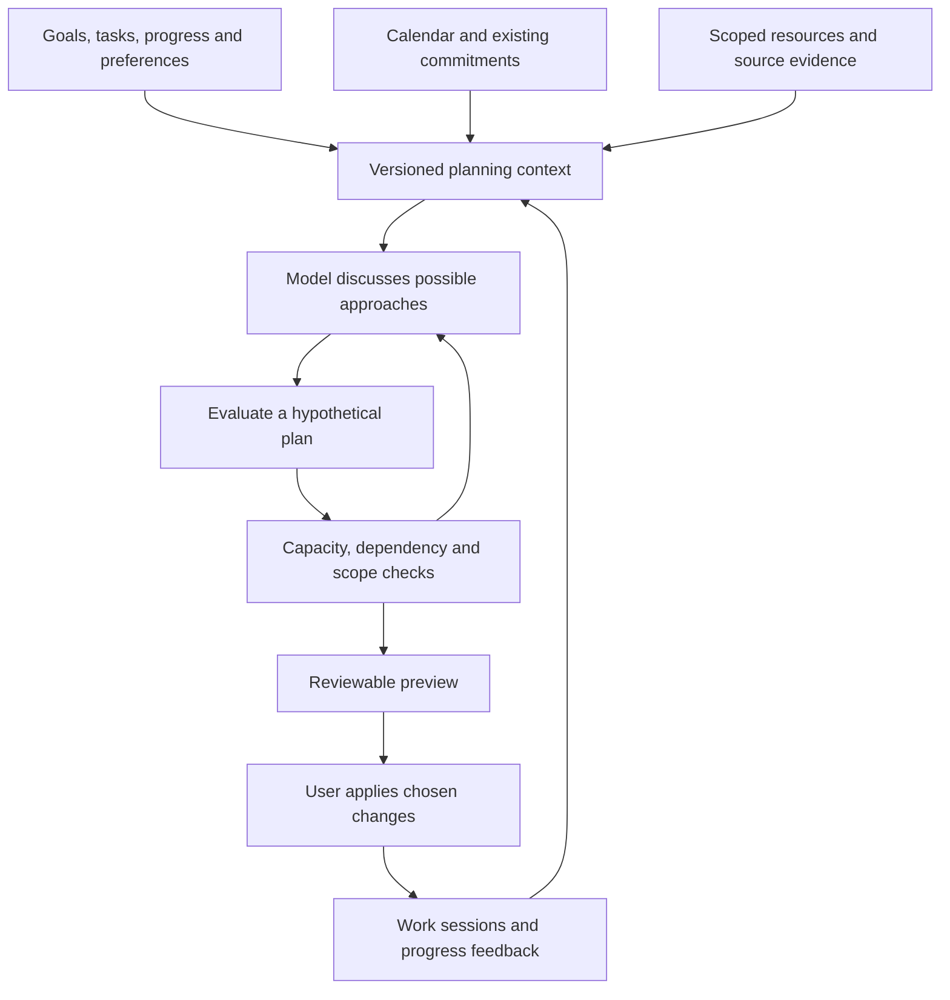

# Marina: time management informed by resources, work and study

Research and implementation recommendation, 3 October 2026. Current Marina source inspected at `1783f7ce611fc2e87984f822b145df542c7199fe`. This supplements the [implementation checkpoint](copilot-implementation-2026-10-03.md) and [earlier architecture review](copilot-architecture-review-2026-10-02.md).

**Product objective:** help the user decide how to use their time across goals, work, studying, routines and commitments. Understand relevant resources to improve that advice. Discuss alternatives and revise them with the user, without a predetermined strategy or mandatory menu. A task with no documents is still a first-class planning task.

**Status:** research and proposed design. No new runtime capability, dependency, schema, model deployment or production reindexing is delivered by this document.

The follow-up [section-by-section implementation game plan](time-management-copilot-implementation-plan-2026-10-03.md) translates the recommendation into 26 work packages with 78 detailed frontend/backend sections, test and stress oracles, dependencies, rollout gates and checkpoint prompts. Its coverage matrix also includes the complete chatbot experience and existing application domains. [P00's three foundation sections](planning-checkpoints/P00.md) now have implementation evidence; the remaining 75 checkboxes stay open. This research document itself remains a recommendation, not a delivery receipt for those future capabilities.

## 1. Recommendation

Keep Marina's current TypeScript application, Google Drive originals, Neon database, selected chat models and reviewable Apply workflow. The next substantial addition should connect **what the work involves**, **what remains**, **what it might take**, and **what time is actually available**.

Build a versioned planning context and a way to evaluate hypothetical work plans before changing saved tasks. Let the model develop approaches and discuss tradeoffs; use explicit checks for calendar occupancy, dependencies, capacity and permissions. Give the model useful failure explanations so it can revise a proposal or explain why it does not fit.

The expanded search found closer precedents: **Conversational Planning for Personal Plans** for an evolving discussion, **PExA/PTIME** for integrated task/time management, **TaskTracer** for task-associated resources, and **GAIA** for assembling a personal assistant's context. Section 16 compares these with additional implementations and explains what they change in the recommendation. Continue borrowing narrower patterns from Super Productivity, Sunsama, Reclaim, LlamaIndex, Docling, LangGraph and OR-Tools.

No inspected product or repository established the entire desired combination as a ready-to-install, validated solution. This is a conclusion about the reviewed evidence, not a claim that no other product can offer it. The closest research makes the objective much less speculative: persistent, resource-informed personal planning has identifiable predecessors.

The first implementation should improve remaining-work semantics and planning context. Replacing the chat model, adding MCP, switching vector databases or installing an agent framework alone will not supply the missing task understanding.

## 2. What was examined and how to interpret the evidence

The expanded review combines five commercial products' official documentation, selected source or prompt/template files from fifteen pinned public repositories, twenty-nine research papers, official framework guidance and Marina's existing code. Twelve inspected repositories have open-source core licenses; Task Genius, GAIA and Open Assistant have restricted source-available licenses. Orient and Open Sunsama were additionally screened through their own product documentation, without a pinned implementation review. Product claims describe documented behavior; they are not independent quality benchmarks. Repository inspection establishes how selected functions work, not that the entire project is suitable or defect-free. Papers establish results within their experiments, not a performance guarantee for Marina's Kimi/Nemotron models.

Public source files were read without installing or executing the projects. Core repository licenses were inspected. Model weights, hosted services and optional dependencies can have separate terms and costs. No private document content or credentials were submitted to research services. No live model quality or latency benchmark was run in this research pass.

## 3. Product comparisons

| Product | Verified behavior | Useful lesson for Marina | Boundary or adaptation |
| --- | --- | --- | --- |
| Motion | Its scheduler takes duration, start date, deadline, priority, splitting, working schedules, breaks and busy calendar events into account. | A task needs explicit scheduling attributes; long work may need multiple sessions. | The inspected scheduling documentation does not establish effort prediction from a collection of documents. Its hard-deadline FAQ permits scheduling outside normal hours: Marina should expose that as a tradeoff requiring the user's choice. |
| Reclaim 2.0 | Tasks are recommended using deadlines, priorities, current calendar context, scheduling hours, memories and task metadata. The documented workflow reserves general work time rather than automatically creating individual task events. | Conversation can help decide what to work on within available time without forcing every choice into a permanent calendar block. | Version matters: the documentation directs users who need individual task auto-scheduling to 1.0. Do not blend the two descriptions. Marina need not copy the fixed number of recommended tasks. |
| Sunsama | Separates planned and actual time, provides timers and workload totals, and distinguishes daily from cumulative task views. | Make the day's workload and actual progress visible, including multi-day work. | A documented optional setting substitutes planned time for actual time on completion. Such values must be labeled as inferred if used for Marina's estimate calibration. |

Sources: [Motion scheduling inputs](https://www.usemotion.com/help/time-management/auto-scheduling/reference-auto-scheduling/what-auto-scheduling-considers), [Motion hard-deadline behavior](https://www.usemotion.com/help/project-management/task/task-scheduling-faq), [Reclaim 2.0 task workflow](https://help.reclaim.ai/en/articles/16558552-reclaim-2-0-tasks-overview), [Sunsama planned and actual time](https://help.sunsama.com/docs/usage-guides/tasks/planned-and-actual-times/).

**Design conclusion:** support both conversational advice and a concrete schedule preview. A user asking whether something is realistic should not need to create subtasks, overwrite estimates or book time just to explore an option. The chosen plan should be materialized only through the existing review-and-Apply flow.

## 4. Open-source and source-available implementations worth learning from

### 4.1 Super Productivity: useful task accounting, with a remaining-work caveat

The inspected task model includes attachments, daily time records and distinct deadline fields. The remaining-time helper returns the parent's rolled-up estimate when there are subtasks; for a leaf it floors estimate minus time spent at zero. Its subtask aggregation ignores completed subtasks and similarly floors overruns. [Task model](https://github.com/super-productivity/super-productivity/blob/8eef049de5c80bf2dc8be7e49236c0107af79a4a/src/app/features/tasks/task.model.ts), [remaining-time helper](https://github.com/super-productivity/super-productivity/blob/8eef049de5c80bf2dc8be7e49236c0107af79a4a/src/app/util/get-time-left-for-task.ts), [subtask aggregation](https://github.com/super-productivity/super-productivity/blob/8eef049de5c80bf2dc8be7e49236c0107af79a4a/src/app/features/tasks/util/sum-sub-task-time-left.ts).

Borrow the explicit records and parent/child accounting. For Marina, keep remaining-work estimates separate from elapsed time: an unfinished task that has exhausted its original estimate still needs attention. A parent summary and its executable children must not both add to the same workload total.

### 4.2 LlamaIndex: collection orientation plus precise evidence

The document-summary index generates summaries associated with source documents. The auto-merging retriever can replace several retrieved children with their parent context when a configured ratio is exceeded. These are concrete mechanisms for moving between an overview and detailed evidence. [Document summary implementation](https://github.com/run-llama/llama_index/blob/962940ddc079cc21701d28d1237c84c82a7c5164/llama-index-core/llama_index/core/indices/document_summary/base.py), [auto-merging implementation](https://github.com/run-llama/llama_index/blob/962940ddc079cc21701d28d1237c84c82a7c5164/llama-index-core/llama_index/core/retrievers/auto_merging_retriever.py).

For Marina, create document/section outlines and task-relevant requirement summaries with links back to exact pages. Use them to discover what needs inspection, not as proof that every requirement is satisfied. A summary of a brief and a summary of a textbook serve different planning questions; a generic “what is this document about?” summary does not by itself describe the work required.

The linked Drive tutorial demonstrates incremental ingestion when the pipeline is rerun; it uses Redis in its example. Marina does not need to adopt Redis to use the idea of persisted transformations and stable document identities. The tutorial is not a complete continuous Drive synchronization service. [Drive ingestion tutorial supplied by the user](https://developers.llamaindex.ai/python/examples/ingestion/ingestion_gdrive/).

**Important implementation trap:** the inspected `UPSERTS_AND_DELETE` path computes deletions from stored IDs absent from the incoming batch. Applying that mode to a partial `@task` folder refresh against a shared document store can treat unrelated documents as deleted. Use incremental upserts for partial scopes, with separately verified deletions, or a correctly isolated complete reconciliation scope. [Ingestion implementation](https://github.com/run-llama/llama_index/blob/962940ddc079cc21701d28d1237c84c82a7c5164/llama-index-core/llama_index/core/ingestion/pipeline.py).

**Adoption decision:** initially implement the needed structures around Marina's current services. Evaluate the Python framework in a separate worker only if a representative extraction/retrieval comparison shows a worthwhile gain. A framework migration would not remove scope enforcement, job recovery or data-version responsibilities.

### 4.3 Docling: preserve the document's structure and visual objects

The inspected example exports page images and separate picture/table crops. The picture-description base model uses page/bounding-box provenance, can filter small images, and stores generated descriptions with provenance. [Figure/table export example](https://github.com/docling-project/docling/blob/a1c5ff2a8c5ab2bf87d7c1eb896b5bc351f51220/docs/examples/export_figures.py), [picture description implementation](https://github.com/docling-project/docling/blob/a1c5ff2a8c5ab2bf87d7c1eb896b5bc351f51220/docling/models/picture_description_base_model.py).

Evaluate this against Marina's current pipeline using scanned briefs, dense tables, diagrams and mathematical pages. Preserve text, tables and figures as different evidence types. A generated image description is an interpretation, and a small diagram can still contain a required task instruction. Do not use image size alone to decide whether task-relevant evidence matters.

**Adoption decision:** a promising extraction-worker candidate, not an automatic replacement or a requirement for the first planning improvement. Compare fidelity, latency, memory and storage before deployment; keep parser/model versions on all outputs.

### 4.4 LangGraph: preserve planning state across interruptions

The documentation distinguishes checkpoints for conversation/run state from stores for longer-lived application data. The inspected `interrupt` implementation documents that resume restarts the node and re-executes its logic; checkpointing is required. [Persistence documentation](https://docs.langchain.com/oss/python/langgraph/persistence), [pinned interrupt implementation](https://github.com/langchain-ai/langgraph/blob/7dc9195e4141c8fbd8118581b3dd61d158628aa8/libs/langgraph/langgraph/types.py).

Borrow the distinction between a current planning discussion and durable user preferences. Preserve the considered option, assumptions, source versions and unresolved questions when the user returns. Idempotency and fresh-data checks must protect side effects after resume. Marina already has persistence and background-job infrastructure; it can adopt these principles without adding another orchestration service immediately.

### 4.5 OR-Tools: optional placement engine behind the conversation

The pinned job-shop sample creates intervals, prevents overlap, enforces predecessor completion and minimizes makespan. It distinguishes a feasible solution from an optimal one. [Sample implementation](https://github.com/google/or-tools/blob/100f66e6242ab8bf8d32feb8f3bf086db66ae2b5/ortools/sat/samples/minimal_jobshop_sat.py), [official job-shop guide](https://developers.google.com/optimization/scheduling/job_shop).

These are useful mechanics. Minimizing total finishing time is not automatically the right objective for a person's week. Marina's potential objectives include deadline risk, disruption to an accepted plan, fragmentation and user preferences. Weights or tradeoffs must be explicit and discussable. A solver neither reads resources nor knows whether a forecast is realistic.

**Adoption decision:** retain the deterministic checker and current greedy planner as a baseline. Compare an OR-Tools worker on difficult, representative scenarios before replacing placement logic. If a solver times out, report the distinction between “no solution found yet” and “proved infeasible.”

### 4.6 Natural Plan: useful benchmark source, unsuitable as a direct product scorer

The inspected calendar evaluator parses a specific textual time format and compares it with a golden answer; its time parser handles half-hour increments. [Pinned evaluator](https://github.com/google-deepmind/natural-plan/blob/ca76db336072ff8931db43bc1ca8d381038cf073/evaluate_calendar_scheduling.py).

Use its scenario ideas. Marina needs a different evaluator that accepts any valid schedule, supports arbitrary minute values and local timezones, and separately judges tradeoffs and explanations. Matching one reference answer is insufficient when several plans can reasonably satisfy the user.

### 4.7 Khoj: a fuller resource-aware personal assistant

The inspected research router separates tool execution and observations, tracks previous research iterations and inferred document queries, passes user/conversation/file context into search, and supports cancellation and continued investigation. This is more useful as an interaction reference than a simple one-shot document chatbot. [Pinned research implementation](https://github.com/khoj-ai/khoj/blob/ae229ca894c0b80ad84664afcfdde523b5e87057/src/khoj/routers/research.py).

Borrow bounded investigation, explicit source results and continuation after a user correction. Do not equate scheduled assistant automations with allocating a person's work across a calendar. The inspected files do not establish resource-derived personal effort forecasting. Khoj's core license is AGPL-3.0, so it is not a permissively licensed drop-in module for Marina; this recommendation is about architectural patterns.

### 4.8 DailyOS: a closer daily-planning implementation, with fixed choices to avoid copying

The adaptive replanner compares a saved plan with fresh context, records material change reasons, rejects replanning when calendar context is unavailable, and saves a revised proposal without immediately changing external services. The inspected path is limited to the current day and includes a regular-expression request detector. [Adaptive replanner](https://github.com/stadimeti19/DailyOS/blob/98b859fd85293f08d698cb1c12373fb616aa3eee/packages/core/src/planning/adaptive-replan.ts).

Its daily planner contains deterministic priority/deadline scores and assigns task focus durations from a common `focusMinutes` input. [Daily planner](https://github.com/stadimeti19/DailyOS/blob/98b859fd85293f08d698cb1c12373fb616aa3eee/packages/core/src/planning/daily-plan.ts).

For Marina, borrow saved-plan provenance, material-change detection and stale-action handling. Keep conversational interpretation and task-specific forecasts; do not inherit this fixed scoring formula, intent detector or session size as the user's planning policy. Source inspection has not established production maturity, and the project was not installed or tested here.

### 4.9 Task Genius: tasks within notes and multiple views

The inspected Obsidian forecast view organizes tasks temporally; its relevant-date helper prefers a scheduled date and falls back to a due date. That is a view-organizing decision, not a duration forecast. [Forecast view](https://github.com/taskgenius/taskgenius-plugin/blob/16c778bc8d670251dfa7ce1f6c5f5e4032dece16/src/components/features/task/view/forecast.ts).

The useful product pattern is keeping tasks close to their supporting notes and making different views reflect the same task. Marina should still preserve deadline, planned day and actual appointment as distinct facts. The repository's inspected FSL-1.1-ALv2 license contains use restrictions and a future-license transition; it is classified here as source-available, and no code is proposed for copying.

### 4.10 LangMem: structured memory can change, not just accumulate

The inspected memory manager accepts structured schemas and controls for inserting, updating and deleting memories. Updates are enabled by default; deletes are disabled by default. Its namespace mechanism partitions stored memories. [Memory extraction implementation](https://github.com/langchain-ai/langmem/blob/48e3c11f5bb527282c7d5339c6a87a0b35abccfc/src/langmem/knowledge/extraction.py), [memory tools](https://github.com/langchain-ai/langmem/blob/48e3c11f5bb527282c7d5339c6a87a0b35abccfc/src/langmem/knowledge/tools.py).

Borrow typed, scoped memory updates with traceable changes. Automatically inferred preferences should not become authoritative personal facts, and a memory update must not rewrite scheduling rules or grant permissions. Initially, implement a small decision/preference store in Marina's existing database; a separate memory framework is optional.

## 5. Research findings and their limits

| Research | What it establishes | Consequence for Marina | Limit of the inference |
| --- | --- | --- | --- |
| Natural Plan, Zheng et al., 2024 | Evaluates trip, meeting and calendar planning with relevant tool outputs supplied in context; complexity exposes failures in the tested models. | Test planning independently of retrieval, then test the integrated system. | Historical model results do not measure current Kimi/Nemotron performance; this benchmark does not estimate personal effort from documents. |
| LLM-Modulo, Gundawar et al., 2024 | Evaluates a generate/check/feedback loop across four scheduling domains. | Let the model propose and revise while external checks validate encoded constraints. | Correctness is relative to sound checks and the supplied problem specification. It does not prove estimates, extracted requirements or user preferences are correct, nor guarantee that a solution is found. |
| TimeArena, Zhang et al., ACL 2024 | Models action duration, prerequisites and occupancy in 30 simulated tasks, including cases with parallel processes. | Distinguish active human effort from waiting for a download, build or other background process. | Simulation results do not establish safe human multitasking or predict a person's productivity. |
| Planning fallacy, Buehler, Griffin and Ross, 1994 | Studies optimistic completion predictions and the role of attending to relevant past experience. | Use comparable actual outcomes as evidence alongside task-specific analysis. | This is not an algorithm for accurate personalized duration prediction or a justification for one universal padding factor. |
| Time-management meta-analysis, Aeon, Faber and Panaccio, 2021 | Reports relationships between time management, performance and well-being across studies. | Evaluate whether plans help the user, including perceived control and overload; do not optimize calendar occupancy alone. | The results do not establish that an AI planner causes those improvements. |
| RAPTOR, Sarthi et al., 2024 | Uses recursive clustering and summaries to retrieve information at different abstraction levels. | Evaluate overview-plus-evidence retrieval for collections of task resources. | QA results do not prove complete requirement coverage or accurate workload estimates; summaries need source links and freshness checks. |
| ColPali, Faysse et al., 2024 | Uses page-image multi-vector representations for visually rich retrieval. | Consider a visual retrieval lane if relevant figures remain hard to find. | It is a different indexing/scoring architecture. The paper reports a substantial per-page representation; evaluate storage and latency rather than swapping it into the current single-vector field. |
| Lost in the Middle, Liu et al., TACL 2024 | Shows context-position effects in the models and tasks tested. | Test selected context and evidence ordering instead of assuming a larger prompt ensures understanding. | It does not prove every newer model behaves identically or that long context is always inferior to retrieval. |
| PersonaLens, Zhao et al., ACL Findings 2025 | Evaluates task-oriented personalization with interaction histories and simulated users/judges. | Include preference corrections and multi-turn decisions in evaluations. | Simulated user success is not equivalent to this user's satisfaction. |
| MyScholarQA study, Balepur et al., ACL 2026 | Finds personalization problems through real-user feedback that automated judges missed. | Validate planning suggestions with the user as well as programmatic checks and model grading. | It studies research assistance, not calendar scheduling; the transferable point concerns evaluation. |

Primary sources: [Natural Plan](https://arxiv.org/html/2406.04520v1), [LLM-Modulo empirical paper](https://arxiv.org/html/2411.14484v1), [TimeArena](https://aclanthology.org/2024.acl-long.215/), [planning-fallacy original paper, author-hosted copy](https://www.researchgate.net/profile/Dale-Griffin-4/publication/232558487_Exploring_the_Planning_Fallacy_Why_People_Underestimate_Their_Task_Completion_Times/links/00b4951e69bd280c66000000/Exploring-the-Planning-Fallacy-Why-People-Underestimate-Their-Task-Completion-Times.pdf), [time-management meta-analysis](https://journals.plos.org/plosone/article?id=10.1371/journal.pone.0245066), [RAPTOR](https://arxiv.org/html/2401.18059v1), [ColPali](https://arxiv.org/html/2407.01449v1), [Lost in the Middle](https://aclanthology.org/2024.tacl-1.9/), [PersonaLens](https://aclanthology.org/2025.findings-acl.927/), [MyScholarQA user evaluation](https://aclanthology.org/2026.acl-long.723/).

**Evidence gap:** the reviewed papers do not validate an end-to-end estimator of this user's remaining work from arbitrary books, specifications, images and progress reports. That connection needs a measured Marina implementation. A stronger language model can help interpret the material, but an unsupported duration is still an unsupported duration.

### 5.1 Additional research directly relevant to the missing connection

| Research | Finding or mechanism | Useful application and limitation |
| --- | --- | --- |
| White and Awadallah, WSDM 2019, Task Duration Estimation | Learns duration classes using appointment content, context and history from large-scale calendar data. | Supports using multiple signals instead of a same-goal median alone. Its labels are time allocated on calendars, not verified human completion time; its reported classification accuracy must not be presented as Marina's forecast accuracy. |
| Ahmetoglu et al., CHIWORK 2025, task-duration feedback | Two field studies: a two-week app trial with 10 participants and a four-week simpler tracking trial with 30. Burdensome tracking reduced engagement; the latter improved perceived bias but not objective optimistic bias. | Keep feedback low-friction and evaluate actual forecast accuracy separately from perceived usefulness. Academic-work findings do not automatically generalize to every task type. |
| Horvitz, CHI 1999, mixed-initiative interfaces | Develops principles for combining direct manipulation and automated assistance, illustrated through scheduling/meeting management. | Support fluid conversation, editable previews and user correction. The publication is conceptual/design evidence, not a benchmark of current LLM planning. |
| Fu, Liu and Yu, 2024, robust resource-constrained scheduling | Publisher abstract describes distributionally robust optimization for uncertain, interacting activity durations. | Test plans under different duration assumptions rather than declaring a single forecast certain. This is an operations-research model with assumptions, not a ready personal-planning component. Only the public abstract/preview was available here. |
| LongMemEval, Wu et al., 2024 preprint, revised 2025 | Tests extraction, multi-session reasoning, temporal reasoning, knowledge updates and abstention in long conversation histories. | Test whether Marina remembers a correction and knows when old information no longer applies. A memory QA score does not establish correct plan execution. |
| Hindsight, Latimer et al., 2025 preprint | Separates retaining, recalling and reflecting, including distinctions between observations and agent opinions. | Keep user statements, source facts and model hypotheses distinct. This review does not adopt its personality/disposition machinery or treat confidence scores as calibrated truth. |
| ADaPT, Prasad et al., NAACL Findings 2024 | Decomposes tasks as needed in response to execution difficulty. | Useful inspiration for refining an uncertain work item instead of always producing a large fixed subtask tree. Its agent-environment experiments do not validate human task-duration estimates. |
| Sufficient Context, Joren et al., 2024 preprint / 2025 publication page | Distinguishes inadequate retrieved evidence from failure to use sufficient evidence. | Grade missing context separately from bad reasoning. A model's sufficiency assessment remains fallible and cannot certify complete collection coverage. |
| StructRAG, Li et al., 2024 preprint | Organizes scattered information into a task-relevant structure for knowledge-intensive reasoning. | Investigate a requirements table or dependency representation for a task's resources. Structural conversion can introduce errors; preserve original evidence and do not assume a generated graph is correct. |

Sources: [Task Duration Estimation, original paper](https://www.microsoft.com/en-us/research/wp-content/uploads/2019/01/TaskDuration-WSDM2019.pdf), [CHIWORK 2025 field-study paper](https://discovery.ucl.ac.uk/id/eprint/10209357/1/chiwork25-6.pdf), [mixed-initiative interface principles](https://www.microsoft.com/en-us/research/publication/principles-mixed-initiative-user-interfaces/), [uncertain-duration scheduling, publisher abstract](https://doi.org/10.1016/j.eswa.2023.122002), [LongMemEval](https://arxiv.org/html/2410.10813v2), [Hindsight](https://arxiv.org/html/2512.12818v1), [ADaPT](https://aclanthology.org/2024.findings-naacl.264/), [Sufficient Context](https://arxiv.org/html/2411.06037v1), [StructRAG](https://arxiv.org/html/2410.08815v1).

These additions change the recommendation in practical ways: collect trustworthy progress signals with little effort from the user; preserve preference corrections across sessions; inspect whether the resources answer the planning question; and expose sensitivity to uncertain durations. None requires a predetermined planning strategy.

## 6. What Marina currently has, and the important gaps

| Existing source | Observed behavior | Consequence for the next implementation |
| --- | --- | --- |
| [Estimate suggestions](../server/services/estimateSuggest.ts) | Uses same-goal history with at least two logged samples, broader history with at least three, otherwise a labeled 60-minute starting guess. | It is a useful fallback, not resource-derived or activity-specific estimation. Do not present it as a confident forecast. |
| [Resource context](../server/services/resourceContext.ts) | Reads saved relationships and indexing metadata; relationships come from attachments/mentions rather than semantic similarity. | Preserve this boundary. Add task-relevant requirements and evidence alongside it, without inventing ownership. |
| [Copilot tools](../server/services/copilotTools.ts) | Can inspect current task facts, resources and calendar ranges; schedule previews work with eligible saved tasks and estimates. | Add read-only hypothetical scenario evaluation so discussing alternatives does not require editing those tasks first. |
| [Planning route](../server/routes/ai.ts) | The scheduling gate subtracts logged and committed time from the estimate. A zero remainder is excluded with an explicit reason. It also requires an estimate and target/deadline and excludes parent rollups. | Distinguish reserved time from completed work and estimate overruns. Surface tasks needing re-estimation; support discussion of undated work without inventing deadlines. |
| [Capability rules](../server/services/copilotCapabilities.ts) | Task rules say not to infer missing estimates; domain capabilities load as needed. | Introduce an explicit provisional forecasting contract. Do not merely remove the instruction and allow guessed durations to become saved facts. |
| [Scheduler](../server/services/scheduler.ts) and [clock layout](../server/services/planLayout.ts) | Provide deterministic allocation and placement, with previously added dependency/cycle protection. | Keep these checks; extend scenario inputs and uncertainty handling before considering a different optimizer. |

Two examples clarify the current accounting gap. If an unfinished task was estimated at 60 minutes and has 70 minutes logged, additional work is unknown, not necessarily zero. If a 120-minute task has 30 minutes logged and 90 minutes reserved tomorrow, it may need no additional reservation, but it still has planned work remaining. These are distinct states even when the current allocation arithmetic yields zero in both cases.

## 7. Proposed architecture

This is a design recommendation, not an instruction to force every conversation through every stage.



### 7.1 Build a context about the work

For a selected task or goal, assemble a bounded, inspectable context containing the desired outcome, known work, progress, resource requirements, constraints, commitments and open questions. Keep timestamps and versions. The model can request more evidence when a material point remains unclear.

Separate the following records, initially as typed read models or persisted versioned artifacts where needed:

| Record | Essential contents |
| --- | --- |
| Resource overview | Resource/version IDs, document and section outline, page/figure/table references, extraction status, analyzed versus unknown coverage. |
| Requirement or work item | Task association, expected output, supporting source references, whether explicit in the source, inferred by the model or confirmed by the user. |
| Effort forecast | Work item, remaining-effort range, assumptions, relevant history, uncertainty, model/version and basis. Keep a user-entered estimate separately. |
| Progress observation | Work-session identity, observed minutes, completed outputs or user-reported progress, remaining work, and whether time was measured or inferred. |
| Planning scenario | User intent, affected tasks, hypothetical breakdown, alternatives considered, resource/task/calendar versions, proposed blocks, conflicts and unplaced work. |
| Decision memory | Explicit user choices, scoped preferences and corrections, their source and time, and any later superseding decision. |

A requirement mentioned in a document is evidence about the work; it is not authority to modify the user's deadline or goals. A model-inferred prerequisite starts as a proposed relationship. A shared reference can support several tasks without duplicating the original file or automatically merging their work.

### 7.2 Use two kinds of retrieval

For a precise question, retrieve passages/pages. For workload planning, first retrieve the task's resource inventory and structural overviews, then inspect relevant sections, tables and figures. Search similarity identifies candidates; it cannot establish that all required work was discovered.

An assignment may require only a small part of a book. A specification may require implementation and verification that take far longer than reading it. Resource length is an input to investigation, not a conversion formula from bytes or pages to minutes.

Record coverage with a meaningful denominator: resources discovered, versions checked, pages processed and requirements still uncertain. Separate “indexed,” “inspected for this question,” and “work completed.” A page OCR success says nothing about whether its exercise has been solved.

For scattered requirements, construct a temporary or cached task-specific evidence table: requirement, source/version/page, contradiction, relevance to the desired outcome, and inspection status. Expand to a dependency graph only when relationships matter. This can live in ordinary relational tables/JSON; the concept does not require a new graph database. Conflicting editions or instructions should remain visible, not silently collapse into one confident summary.

### 7.3 Keep the resource boundary and global calendar context distinct

Enforce the Marina Drive root and selected `@goal`/`@task` for evidence discovery, page reads and citations. Include subtask directories only when selected. Keep calendar occupancy and competing commitments available for feasibility, without expanding resource scope or the set of tasks the assistant may change.

A cross-goal consequence can be explained as “this would displace 45 minutes already allocated elsewhere.” Reading an unrelated goal's documents or changing its tasks requires appropriate scope, not an assumption that the schedule conflict grants it.

## 8. Effort estimation and adaptation

Start with explainable provisional forecasts, then calibrate them using actual outcomes. Avoid false precision and avoid labeling an LLM's invented range a statistical confidence interval.

1. **Understand completion.** Determine the output and known remaining activities. Reading, problem-solving, implementation, testing, travel and waiting can have different duration patterns. These are descriptive examples; users need not fill a rigid taxonomy before receiving help.
2. **Use the user's facts first.** Preserve their stated budget, estimate, progress and constraints separately. “I have two hours” is not evidence that the task needs two hours.
3. **Consult comparable history.** Same goal is a weak proxy. Similar activity, scale, task type and conditions may be more useful. Show sample count and provenance. Avoid treating copied estimates as measured completion times.
4. **Represent uncertainty.** When evidence is sparse, disclose the basis and give a broad scenario range or mark effort unknown. Ask a focused question when its answer would change the plan materially; otherwise offer a reversible first step and update afterward.
5. **Reassess remaining work.** After a session, use accomplishments and new information. Logged minutes alone neither prove completion nor justify reducing the remaining forecast by the same amount.

For statistical calibration later, compare personal and pooled reference groups with time-ordered held-out observations. Partial pooling or empirical quantiles are candidate techniques, not established choices for this dataset. Evaluate absolute error, systematic underestimation and interval coverage; percentage error is unstable for tiny tasks. Do not promise a “90% interval” until measured coverage supports that label.

Keep focused work duration separate from elapsed waiting. Waiting for a build can free the user for another activity; two attention-demanding tasks should not overlap merely because their tools can run concurrently. Session splitting, setup cost, buffers and preferred hours should be explicit constraints or user preferences, not universal assumptions.

### 8.1 Learn from the right labels

Calendar reservations, user-entered estimates, timer measurements and retrospective guesses describe different things. Preserve their origin. A canceled or interrupted session may provide elapsed-time evidence without a completion label. An unfinished task is an incomplete observation, not a zero-duration success. Do not train only on quickly completed work while ignoring slower tasks still open.

A later estimator should compare at least: the current median fallback; a simple task/activity/history model; and a resource-aware forecast. Split evaluation chronologically and prevent revised versions of the same task or document from leaking across training and test examples. The model should only receive progress and resources that were available at prediction time. This is a proposed evaluation design, not a claim that Marina already has sufficient data for training.

### 8.2 Make feedback useful without requiring constant bookkeeping

Use an existing timer or work log where available, then allow a short correction such as “the draft is done; I still need the chart” or “I was interrupted for half that session.” Provide a discreet optional progress control and an editable summary. On mobile, avoid a form with many mandatory fields or hover-only actions.

Focus follow-up on uncertainty that could change the user's decision. An errand with a known window may need no further breakdown; a report blocked by missing data may benefit more from discussing the blocker than refining a minute estimate. Offer explanations and choices without blaming the user for a task taking longer than expected. These are proposed interaction principles, to validate with actual use.

## 9. Hypothetical plans, verification and conversation

Add a read-only `evaluate_plan_scenario` capability that accepts candidate work items and constraints without requiring saved task creation. Return feasible placements, unmet constraints, uncertain estimates, affected existing reservations and a versioned preview identity. Proposed work can later be converted into saved tasks through Apply.

The model may suggest whatever alternatives the evidence and conversation support. The evaluator should accept a variable number of activities and approaches. Do not hard-code three options, decide automatically to skip material, or let a keyword classifier choose a planning strategy.

Check at least: duration conservation; fixed occupancy; prerequisites; cycles and unresolved blockers; working windows; chosen daily limits; parent/child double counting; currently reserved time; exact change scope; timezone/DST semantics; stale source/task/calendar versions. An incomplete plan should identify its unplaced work. A fit conditional on an optimistic estimate must be described as conditional.

At Apply, re-read affected state. If the calendar or requirements changed, recalculate and present the meaningful difference. Use idempotency and transactional writes so retries do not create duplicate tasks or blocks. Preserve the existing visible error behavior.

If an optimizer is evaluated later, compare candidate objectives rather than hiding them in one unexplained score. A plan that protects a deadline but moves five existing sessions differs from one that leaves the week stable with more deadline risk. The user and model can discuss that difference; a solver supplies feasible candidates under the stated assumptions.

### 9.1 Check sensitivity before promising a fit

Evaluate a candidate against its stated duration assumptions. If it fits with a 60-minute report estimate but misses the deadline at 100 minutes, show that dependence. Do not label the result “80% likely to succeed” without a calibrated probabilistic model. Summing task-level upper quantiles does not automatically produce a plan-level quantile, especially when delays share a cause.

For an initial implementation, low/central/high scenarios with labeled assumptions are easier to inspect than a hidden stochastic optimizer. Later, simulation can incorporate empirical distributions and shared disruptions if sufficient data supports them. Replanning should preserve unaffected accepted work where possible and show the cost of moving existing sessions, not rebuild the whole calendar on every small update.

### 9.2 Proposed tool result shape

Illustrative contract only; synthetic IDs and numbers, not current user data or implemented API:

```json
{
  "scenario_id": "example-scenario-1",
  "snapshot_id": "example-task-calendar-snapshot",
  "work_items": [{
    "id": "example-report-chart",
    "task_id": "example-report",
    "outcome": "Finish and check the report chart",
    "requirement_basis": "source_explicit",
    "evidence": [{"resource_id": "example-brief", "version": "v2", "page": 3}],
    "remaining_minutes": {"low": 45, "central": 70, "high": 110},
    "range_basis": "provisional_model_assumptions",
    "calibrated_probability": null,
    "assumptions": ["Input data is usable"],
    "unknowns": ["Data cleanup has not been inspected"]
  }],
  "evaluation": {
    "available_minutes": 90,
    "fit_under_central_assumption": true,
    "fit_under_high_assumption": false,
    "high_assumption_shortfall_minutes": 20
  },
  "writes_applied": false
}
```

The server supplies authorized scope and current snapshots; the model cannot expand them through tool arguments. Evidence validity, arithmetic and entity types are checked separately. Keep source-supported requirements distinct from model-estimated minutes even when they appear in the same card.

### Example: work and study competing for one evening

Hypothetical context: the user has three free hours, a work report with an attached brief, and an assignment with notes and exercises. The report draft exists but its chart is unfinished. Two exercises are done; one diagram has not been analyzed.

Marina should inspect the relevant evidence, recognize progress and discuss the consequences of different allocations. If the remaining work is provisionally four to five hours, it should show the shortfall. It can investigate whether part of the report is optional, whether a deadline is negotiable, or whether a smaller useful outcome is acceptable, without silently choosing one. If the user says the assignment now matters more, revise the options and show what that means for the report.

The useful response is a decision supported by the actual work and calendar, with honest uncertainty. A document summary or a perfectly packed calendar alone does not deliver that.

## 10. Prompting, tools and memory

Keep the stable role centered on time management. Supply fresh task/calendar facts and selected resource scope as data. Load resource analysis or scheduling instructions only when relevant, building on the existing capability catalogue.

Useful future capabilities are `get_planning_context`, `inspect_work_requirements`, `forecast_remaining_effort`, `evaluate_plan_scenario` and a progress-update proposal. These are proposed contracts, not implemented tool names. Each should return evidence, assumptions, coverage and freshness rather than a long undifferentiated blob.

Store concise decisions and their provenance instead of repeatedly replaying the entire discussion. Preserve corrections and rejected options with appropriate scope; do not turn a one-off preference into a permanent rule. Source text and old conversation remain untrusted data, not new instructions.

OpenAI's function-calling documentation supports using schemas to structure tool arguments. Schema validity alone does not validate calendar facts or authorize writes. Keep Marina's server checks and provider adapters; NVIDIA endpoints do not automatically support every OpenAI-specific tool feature. [Official function-calling guidance](https://developers.openai.com/api/docs/guides/function-calling).

MCP can expose these capabilities to another client later. It is an integration protocol, not an effort estimator, memory policy, resource index or planning engine. No additional MCP service is necessary merely to make Marina's internal tools callable by its own copilot.

### 10.1 Memory should preserve corrections, scope and time

Keep a small structured memory layer rather than appending every inference to a profile. For each candidate preference or decision, retain its source, applicable task/goal, recorded time, effective interval if known, and supersession state. Distinguish an explicit user statement from an inferred pattern. A later task-specific exception can override a broad preference for that task without deleting the broad preference.

Examples: “I prefer mornings” is a general preference; “this week I have morning classes” is a dated constraint; “leave Friday free for this project” is scoped; “perhaps I work better at night” is tentative. Treating all four as permanent instructions would damage planning. Fresh calendar and task records remain authoritative for current occupancy and status.

Allow the user to inspect, correct or forget stored preferences. Retrieve relevant memory under the active scope and time interval, and refresh facts that may have changed. Deleting access to a resource must also prevent its cached summaries or derived memories from resurfacing its content. Keep completed decisions compact enough to avoid recreating the earlier oversized prompt.

## 11. Large collections and operational design

Preserve originals in Drive; store application facts, manifests, evidence references, selected structured extraction, summaries and searchable representations in Neon. Scope expensive work to changed resources and task-relevant investigation. A user asking about today's errands must not wait for a book collection to finish indexing.

Use separate lifecycles for immutable source-derived artifacts and changing task facts. A deadline update should refresh planning context without re-embedding every document. A changed document should invalidate affected overviews, requirements and forecasts using their recorded source versions. A permission or ancestry failure must revoke access even if a cached representation exists.

Cache original downloads and rendered pages; checkpoint extraction at recoverable units; bound concurrency, retries and model spend. Keep serving an explicitly versioned last verified index during ordinary replacement when access remains valid. Scope-specific refreshes must not delete unrelated records. Full reconciliation and verified deletion need their own accounting.

Measure storage using actual counts and representation sizes. Raw vector storage alone is approximately vector count times dimensions times bytes per dimension, before text, metadata, indexes and database overhead. Document storage in Drive does not make all derived database data free. Visual multi-vector retrieval requires a separate sizing exercise. Terabyte-scale originals are not proof of terabyte-scale indexing capability.

For future Python extraction or solver components, use a bounded worker interface rather than putting heavy processing in the interactive Vercel request. Keep the interface compatible with the current background jobs, cancellation, progress and retries. Do not add a worker just because a library exists: first establish a measurable quality or capability benefit.

## 12. Evaluation plan

The following is proposed work, not a claim of tests already run. Existing unit/integration results remain documented in the implementation checkpoint.

### 12.1 Baselines and ablations

Compare the current Marina copilot; task/calendar context without document analysis; document overviews plus selected evidence; and the full proposed workload/scenario path. For placement, compare the existing greedy implementation with any optional solver using the same constraints. Hold the model and fixtures constant when comparing architecture, then separately compare configured models.

Use saved synthetic snapshots first. Introduce consented real tasks and source excerpts for a pilot, with versioned, privacy-conscious evaluation records. Repeat model runs and report variation. Historical paper scores are not substitute measurements.

### 12.2 Required scenario families

| Family | Cases that should be covered | Observable requirement |
| --- | --- | --- |
| Task interpretation | Typo-heavy request, vague task title, task with no attachments, wrong but similar document title. | Investigate candidates appropriately; do not require documents for all tasks or attach a semantically similar resource automatically. |
| Collection understanding | Multiple complementary files, duplicate editions, shared references, conflicting briefs, image-only requirement, unindexed page. | Identify evidence and gaps; preserve source versions and avoid a false full-coverage claim. |
| Effort and progress | No history, mixed activity history, inferred actual time, task overrun, partially completed work, parent with children. | Keep uncertainty visible and avoid elapsed-time/completion and parent/child accounting errors. |
| Timing | Firm versus negotiable deadlines, undated important work, fragmented availability, breaks, travel, passive wait, DST transition. | Calculate time correctly; distinguish missing data from infeasibility and discuss tradeoffs. |
| Dependencies | Missing blocker, partial prerequisite, cycle, zero-minute cyclic item, downstream blocked work. | Preserve existing invariants in every hypothetical scenario and placement path. |
| Replanning | Unexpected meeting, changed priority, rejected option, source revision, task completed elsewhere. | Update only affected reasoning and proposals; preserve the user's latest correction and surface meaningful changes. |
| Scope and persistence | Selected task with global busy time, out-of-root resource, interrupted discussion, resumed preview, duplicate Apply. | Keep evidence/write boundaries, preserve valid state and avoid duplicate or stale writes. |
| Reliability and scale | Provider timeout, partial OCR, delayed sync, cold/warm cache, growing file/page counts. | Return bounded failures and useful partial context; measure throughput, backlog and cost. |
| Memory | Superseded preference, temporary exception, contradictory source, absent evidence, correction in another session. | Use current scoped information, preserve provenance and acknowledge uncertainty instead of inventing a preference. |
| Learning data | Calendar reservation mistaken for actual time, canceled session, incomplete task, repeated document revision. | Preserve measurement provenance and avoid completion, selection and evaluation-leakage errors. |

### 12.3 Metrics and release conditions

Use deterministic checks for constraint violations, duplicate writes, duration arithmetic and scope. Evaluate retrieval with labeled relevant requirements/pages, not only similarity scores. Score unsupported requirement claims and false completeness separately from missed evidence.

For effort forecasts, compare predictions with actual outcomes and user-reported remaining work, tracking provenance and sparse samples. For planning usefulness, ask whether the user understood the tradeoff, accepted or edited the proposal, and found the revised plan useful. Acceptance alone is not proof of feasibility or optimality. Report planning latency, time to first useful response, tool rounds, token cost and indexing cost separately.

Use human review to calibrate any LLM judge. Official OpenAI evaluation guidance likewise emphasizes task-specific evaluations and human calibration; the principles can be implemented locally without adopting a hosted evaluation platform. [Evaluation guidance](https://developers.openai.com/api/docs/guides/evaluation-best-practices).

Before enabling writes for the new scenario path, require no known hard-constraint/scope/idempotency failures in the release suite and no regression in the existing scheduler tests. Before claiming better estimates or recommendations, show improvement on held-out examples and a user pilot. Passing a finite suite is not a zero-defect guarantee.

### 12.4 An evaluation pack that diagnoses the cause of failure

Prepare small reproducible fixtures with a frozen clock, timezone, task hierarchy, calendar, progress records, resource versions and labeled required evidence. Pair each successful case with a controlled variant: remove a requirement page, change one deadline, add an interruption, or supersede a preference. Record which change should affect the plan and which should not.

Separate the score into evidence discovery, evidence sufficiency, requirement interpretation, duration forecast, calendar feasibility, user-preference adherence and write correctness. A perfectly valid schedule based on a missed requirement should fail the interpretation test; a complete resource analysis with impossible dates should fail the feasibility test. Do not hide either failure behind a single average quality score.

For a mixed work/study scenario, compare supported outcomes and constraint satisfaction rather than requiring one exact recommendation. Preserve model/provider settings and run identifiers so changes can be compared fairly. Include typos and follow-up corrections resembling the user's actual interaction style. Once a pilot exists, add observed failures to the pack while keeping a held-out set for honest evaluation.

## 13. Implementation sequence and concrete deliverables

| Stage | Deliverable | Evidence required before continuing |
| --- | --- | --- |
| 1. Correct the planning facts | Explicit separation of estimated total, forecast remaining effort, logged time, reserved time and completion; surface overrun and unestimated tasks; a bounded planning-context read. | Unit/integration cases for accounting and scope, plus examples showing tasks without resources or deadlines remain discussable. |
| 2. Connect resource evidence to work | Versioned task-relevant requirements and document/section overviews, visual references, coverage and provisional forecasts. | Labeled multi-file work/study cases; source support, incomplete-index behavior and useful forecasts compared with the existing history fallback. |
| 3. Compare options without mutation | Hypothetical scenario evaluation using existing checks, reviewable alternatives and stale-preview protection. | Valid feasible/partial/conflicted results, no unauthorized scope expansion, and multi-turn preference revisions. |
| 4. Learn from progress | User-correctable progress observations, comparable-history calibration and proposal revision after interruptions or overruns. | Held-out estimate measurements and a pilot showing more useful replanning; no assumption that time logged equals progress. |
| 5. Add infrastructure only where justified | Benchmarked Docling/LlamaIndex worker, visual retrieval lane or OR-Tools placement worker if the earlier comparisons demonstrate need. | Measured fidelity, latency, operational cost, recovery and migration plan; preserve the current path until a replacement is verified. |

The first useful vertical slice should be narrow but complete: discuss one task's real remaining work using its resources and the user's broader availability, offer a hypothetical plan, revise it after a correction, and apply only the accepted changes. Then expand to competing goals and larger collections.

Schema or production-data changes in these stages require a fresh verified backup and additive, recoverable migrations under the project's existing instructions. This research has not changed production data.

## 14. Repository snapshots and licensing

| Repository | Inspected commit | Core license |
| --- | --- | --- |
| Super Productivity | `8eef049de5c80bf2dc8be7e49236c0107af79a4a` | [MIT](https://github.com/super-productivity/super-productivity/blob/8eef049de5c80bf2dc8be7e49236c0107af79a4a/LICENSE) |
| LlamaIndex | `962940ddc079cc21701d28d1237c84c82a7c5164` | [MIT](https://github.com/run-llama/llama_index/blob/962940ddc079cc21701d28d1237c84c82a7c5164/LICENSE) |
| Docling | `a1c5ff2a8c5ab2bf87d7c1eb896b5bc351f51220` | [MIT](https://github.com/docling-project/docling/blob/a1c5ff2a8c5ab2bf87d7c1eb896b5bc351f51220/LICENSE) |
| LangGraph | `7dc9195e4141c8fbd8118581b3dd61d158628aa8` | [MIT](https://github.com/langchain-ai/langgraph/blob/7dc9195e4141c8fbd8118581b3dd61d158628aa8/LICENSE) |
| OR-Tools | `100f66e6242ab8bf8d32feb8f3bf086db66ae2b5` | [Apache-2.0](https://github.com/google/or-tools/blob/100f66e6242ab8bf8d32feb8f3bf086db66ae2b5/LICENSE) |
| Natural Plan | `ca76db336072ff8931db43bc1ca8d381038cf073` | [Apache-2.0](https://github.com/google-deepmind/natural-plan/blob/ca76db336072ff8931db43bc1ca8d381038cf073/LICENSE) |
| Khoj | `ae229ca894c0b80ad84664afcfdde523b5e87057` | [AGPL-3.0](https://github.com/khoj-ai/khoj/blob/ae229ca894c0b80ad84664afcfdde523b5e87057/LICENSE) |
| DailyOS | `98b859fd85293f08d698cb1c12373fb616aa3eee` | [MIT](https://github.com/stadimeti19/DailyOS/blob/98b859fd85293f08d698cb1c12373fb616aa3eee/LICENSE) |
| Task Genius | `16c778bc8d670251dfa7ce1f6c5f5e4032dece16` | [FSL-1.1-ALv2; source-available](https://github.com/taskgenius/taskgenius-plugin/blob/16c778bc8d670251dfa7ce1f6c5f5e4032dece16/LICENSE) |
| LangMem | `48e3c11f5bb527282c7d5339c6a87a0b35abccfc` | [MIT](https://github.com/langchain-ai/langmem/blob/48e3c11f5bb527282c7d5339c6a87a0b35abccfc/LICENSE) |
| GAIA | `adc7f59cc6bb99c1c475aa156b9905c2248554b9` | [PolyForm Noncommercial 1.0.0](https://github.com/theexperiencecompany/gaia/blob/adc7f59cc6bb99c1c475aa156b9905c2248554b9/LICENSE.md); differs from the inspected website's MIT claim |
| Smart Agentic Calendar | `6088e957e17eda94fd362f8e420510827b5ed858` | [MIT](https://github.com/fbdo/smart-agentic-calendar/blob/6088e957e17eda94fd362f8e420510827b5ed858/LICENSE) |
| Open Assistant | `32c55d2643f9fe38777f9212588b2eee45392514` | [Repository license labeled Business Source License 1.1](https://github.com/open-assistant-org/open-assistant/blob/32c55d2643f9fe38777f9212588b2eee45392514/LICENSE); explicit noncommercial restrictions |
| Herwanto OS | `7ba724cc349f279bcd4c9ca09486bc7c09d0530f` | [MIT](https://github.com/MTLdept2026/herwanto-os/blob/7ba724cc349f279bcd4c9ca09486bc7c09d0530f/LICENSE) |
| Microsoft M365 agent templates | `d981551c891b16e439c1643133e95e1fbb971fdd` | [MIT](https://github.com/microsoft/m365-agent-templates/blob/d981551c891b16e439c1643133e95e1fbb971fdd/LICENSE); hosted M365 services are separate |

These license observations apply to the inspected core repositories, not every linked model, dataset, hosted API or third-party component. Source inspection and literature review guide the implementation choice; they do not replace compatibility, load, quality or recovery testing in Marina.

## 15. Search coverage and unresolved evidence

The search expanded from task/calendar products and retrieval frameworks to personal duration estimation, planning-fallacy interventions, mixed-initiative assistance, uncertain project scheduling, adaptive task decomposition, long-term assistant memory and retrieval sufficiency. Representative queries included “personal task time estimation research,” “task duration large language models,” “adaptive personal scheduling uncertain task durations,” and exact titles/citations discovered from the primary papers. Repository searches were followed by pinned source inspection rather than accepting README claims alone.

The duration-estimation and CHIWORK 2025 papers were available in full text; their methods, measurement distinctions and reported limits informed this design. The robust-scheduling article was limited to its public publisher abstract/preview. Some other paper comparisons rely on publication abstracts and relevant accessible sections, not independent replication. The CHIWORK 2024 planning-fallacy app-design paper was discovered but not treated as a fully inspected empirical source because its full text was unavailable in this pass.

Excluded as direct solutions: papers predicting an AI agent's own execution latency rather than a person's work duration; simulated robotics/shopping success as proof of human scheduling quality; automatic calendar placement as proof of document understanding; and a license labeled merely “public on GitHub” as proof of permissive reuse.

Still unresolved by this research: how much comparable history Marina actually has, which resource structures best predict the user's effort, current chosen-model reliability on these scenarios, acceptable planning latency/cost, and production-scale ingestion/recovery behavior. These require bounded experiments and a user pilot. No literature result or library choice can settle them in advance.

## 16. Closer alternatives: the expanded search for Marina's actual objective

This pass specifically searched for assistants combining personal context, the meaning of tasks, resources, ongoing conversation and time management. It adds five pinned repositories, ten research papers, two commercial comparisons and two product-level screenings to the earlier review. Queries included “intelligent personal assistant task time management,” “conversational planning personal plans,” “task-centric resources,” “personal calendar assistant preferences,” and “planning oversubscribed resources.” Following older systems' citations was useful: much of this objective predates LLMs.

**The main change to the recommendation:** make the ongoing plan a durable part of the product. Each goal/task needs a compact, revisable account of its intended outcome, relevant evidence, remaining work, current assumptions and decisions. Calendar blocks are one possible result of that conversation. Resource search is one way of informing it. The user should be able to resume the discussion after a correction or interruption without reconstructing everything.

### 16.1 Closest conceptual predecessors and current research

| System or paper | What the inspected evidence establishes | Relevance and limit for Marina |
| --- | --- | --- |
| **PExA / CALO, 2007** | Integrates task management, a personalized time manager, execution monitoring/prediction, explanations and user advice. It considers current commitments and can discuss remedies for infeasible requests. | The closest historical architecture for the overall objective. It used modeled procedures and a partly simulated office environment, not modern multimodal document ingestion or an installable Marina replacement. [Paper](https://www.sri.com/wp-content/uploads/2021/12/1666.pdf). |
| **PTIME, 2011** | Personalized calendaring combines preference elicitation/learning and constraint reasoning; the publication describes a multifaceted usefulness evaluation. | Supports learning how this person prefers to arrange time. The accessible publication abstract does not establish accurate effort inference from documents; this pass did not inspect the full evaluation. [SRI publication](https://www.sri.com/publication/ptime-personalized-assistance-for-calendaring/). |
| **Conversational Planning for Personal Plans, 2025** | An LLM selects whether to ask a question, add steps or change steps. Structured plan steps can carry retrieved resources, and user feedback changes subsequent actions. Its evidence is qualitative examples, including learning and coaching. | The closest modern interaction model to the user's request. Adopt adaptive discussion and persistent plan revisions; its examples do not establish calendar feasibility, personal duration accuracy or long-term field effectiveness. [Paper](https://arxiv.org/html/2502.19500v1). |
| **RADAR, 2008** | Links source-message passages to task representations, coordinates multiple tasks and assists with execution. Its study used a fictional conference, 119 messages and a disruptive event requiring replanning, comparing learned/unlearned assistance and other conditions. | A useful example of deriving work from incoming information and testing the whole process. Its bounded office experiment does not establish performance on arbitrary books, images or today's LLMs. [Full paper](https://www.cs.cmu.edu/~bam/papers/AAAI08-204-Freed.pdf). |
| **TaskTracer, 2005** | Associates resources and interaction history with tasks and supports restoring task context. The paper explicitly says the prototype had not yet been tested in a real work environment and identifies noisy task labels and manual tracking burden. | A precedent for `@task` reopening the context of work. Marina should use explicit links and lightweight corrections before considering automatic activity inference. [Full paper](https://web.engr.oregonstate.edu/~tgd/publications/iui2005-tasktracer.pdf). |
| **Activity-Centric Computing Systems, 2019** | Reviews computing organized around activities spanning resources, services, devices and people, including adoption and infrastructure difficulties. | Supports a goal/task workspace that can contain several documents and decisions. A conceptual review is not evidence that another organizational UI alone improves Marina's planning. [Author-hosted paper](https://stephen.voida.com/uploads/Publications/Publications/bardram-cacm2019.pdf). |
| **PEARL / CalConflictBench, ACL 2026** | Studies repeated calendar conflict decisions with external preference memory and reinforcement learning. Synthetic year-long calendars use structured role-conditioned preferences; the action selects one conflicting event. | Useful for tests of preference correction over time. It is a narrower accept/decline problem, with acknowledged limits around transient human context; it does not justify autonomous calendar changes or RL training for Marina now. [Paper and limitations](https://aclanthology.org/2026.acl-long.1547.pdf). |
| **COMPASS, 2025** | Evaluates multi-turn travel planning using tools and simulated users. Distinguishes satisfying hard constraints from optimizing preferences, and tests coordination across services. | Borrow separate feasibility/preference scores and progressively revealed constraints. Travel data, simulated users and benchmark-defined utility differ from personal work planning. [Paper](https://arxiv.org/html/2510.07043v1). |
| **ScheduleMe, PACLIC 2025** | Uses a supervisor and specialist agents for natural-language Google Calendar operations. Its evaluation has 120 cases per language; the limitations describe largely stateless interaction, limited personalization and one model configuration. | An example of modular calendar tools, not proof that adding agents supplies persistent understanding of the user's work. [Paper](https://aclanthology.org/2025.paclic-1.27.pdf). |
| **Togedule, CSCW 2025** | Adjusts the choices and presentation used for group scheduling. IBM's publication abstract reports a formative study of 10 and controlled studies totaling 66, with benefits to availability entry and organizer decisions. | A useful UI hypothesis: adapt which tradeoffs are shown. Group meeting coordination is narrower than managing personal resources and workload; only the primary publication abstract was reviewed here. [IBM Research](https://research.ibm.com/publications/togedule-scheduling-meetings-with-large-language-models-and-adaptive-representations-of-group-availability). |

These are different kinds of evidence. A historical prototype, a qualitative architecture, a synthetic benchmark and a controlled user study must not be ranked by a shared “accuracy” number. Their strongest contribution here is identifying mechanisms to test in Marina.

### 16.2 Five additional public repositories: implementation findings

#### GAIA: a strong context-assembly reference, with an unsuitable default planning policy

The inspected context assembler separates relatively stable configuration from per-turn context, builds sections concurrently, records timing and bounds the volatile block. The registry selects sections by agent tier and includes agenda/activity, recalled memory and active/tracked todos. This is concrete support for modular context rather than continually expanding a single prompt. [Assembler](https://github.com/theexperiencecompany/gaia/blob/adc7f59cc6bb99c1c475aa156b9905c2248554b9/apps/api/app/agents/context/assemble.py), [section registry](https://github.com/theexperiencecompany/gaia/blob/adc7f59cc6bb99c1c475aa156b9905c2248554b9/apps/api/app/agents/context/sections.py).

Its daily-planning instructions gather calendar/tasks/issues/reviews but prescribe an urgency table, rank undated work low and require a top-three presentation. Its todo schema stores task references and a workspace path; `scheduled_at` is explicitly when GAIA should execute a todo, not a forecast of a person's remaining effort. [Daily-planning instructions, inspected as source data](https://github.com/theexperiencecompany/gaia/blob/adc7f59cc6bb99c1c475aa156b9905c2248554b9/apps/api/app/agents/skills/builtin/plan-my-day/SKILL.md), [todo model](https://github.com/theexperiencecompany/gaia/blob/adc7f59cc6bb99c1c475aa156b9905c2248554b9/apps/api/app/models/todo_models.py).

**Decision:** use the context separation and task workspace ideas as design references. Do not inherit its prioritization table or pretend its execution scheduler predicts human workload. Its head/tail truncation can discard middle evidence; Marina should budget typed sections and report omitted/incomplete evidence. Stable ordering may help provider caching, but NVIDIA cache behavior must be measured separately.

**License discrepancy:** the inspected [GAIA product page](https://heygaia.io/open-source-ai-assistant) advertises MIT, whereas the pinned repository has PolyForm Noncommercial 1.0.0. The repository license is the basis of this review's classification. No code was copied into Marina.

#### Smart Agentic Calendar: a small TypeScript placement backend to compare, not adopt wholesale

Its scheduler consumes explicit task durations, availability and events, uses fixed scoring weights and returns blocks plus conflicts/at-risk tasks. Its dependency policy blocks work while a present prerequisite remains incomplete, differing from Marina's ability to propose a future sequence completing both tasks. [Scheduler](https://github.com/fbdo/smart-agentic-calendar/blob/6088e957e17eda94fd362f8e420510827b5ed858/src/engine/scheduler.ts), [dependency resolver](https://github.com/fbdo/smart-agentic-calendar/blob/6088e957e17eda94fd362f8e420510827b5ed858/src/engine/dependency-resolver.ts).

The coordinator coalesces replanning requests and replaces stored schedule blocks; that mutation path cannot be used as a hypothetical preview without adaptation. Its estimation module calculates historical error statistics rather than predicting effort from resource contents. [Coordinator](https://github.com/fbdo/smart-agentic-calendar/blob/6088e957e17eda94fd362f8e420510827b5ed858/src/engine/replan-coordinator.ts), [estimation analytics](https://github.com/fbdo/smart-agentic-calendar/blob/6088e957e17eda94fd362f8e420510827b5ed858/src/analytics/estimation.ts).

Its README targets a small active task set and explicitly says full rescheduling would not scale to thousands of tasks. Inspected randomized tests cover non-overlap, availability and score bounds; their presence is not a result from this review, since they were not run. [Scope statement](https://github.com/fbdo/smart-agentic-calendar/blob/6088e957e17eda94fd362f8e420510827b5ed858/README.md), [test source](https://github.com/fbdo/smart-agentic-calendar/blob/6088e957e17eda94fd362f8e420510827b5ed858/tests/pbt/scheduler.pbt.test.ts).

**Decision:** use it as a comparison implementation for a future isolated placement benchmark. Keep Marina's existing scheduler and invariants initially. The useful adoption target is a small set of selected work items; library size and active scheduling size are different measurements.

#### Open Assistant: adaptive tool execution is not yet a person's work plan

Its planner parses numbered model output into tracked steps, supports revising pending steps while preserving other states, and prompts for reflection after failures or checkpoints. It also bypasses planning for messages shorter than 80 characters and uses English sequencing/keyword heuristics. These are concrete choices, including a poor fit for short requests such as “replan my week.” [Planner implementation](https://github.com/open-assistant-org/open-assistant/blob/32c55d2643f9fe38777f9212588b2eee45392514/src/services/planner.py).

The inspected plan is principally the assistant's sequence of tool actions. Completion of that sequence does not mean the user has completed the underlying work. Its adaptive-planning test file checks plan tracking and revision mechanics; it is not evidence of improved personal time management. [Tests inspected, not executed](https://github.com/open-assistant-org/open-assistant/blob/32c55d2643f9fe38777f9212588b2eee45392514/tests/test_adaptive_planning.py).

**Decision:** borrow the concept of revisable, resumable execution state where necessary. Keep it separate from the user's work plan. Prefer structured outcomes to text-keyword failure detection, and do not route planning solely by message length. This repository's custom license text imposes noncommercial restrictions; it is not a permissive replacement stack.

#### Herwanto OS: relevant product scope, but the inspected extraction is too narrow

This project advertises documents, projects, calendars and personal memory together. In the inspected document service, DOCX paragraphs/tables and PPTX slides are ranked through keywords, dates and personal work terms, then a capped selection is truncated into excerpts. PPTX extraction reads text and notes in this path, not the meaning of every embedded image. [Public project](https://github.com/MTLdept2026/herwanto-os), [document service](https://github.com/MTLdept2026/herwanto-os/blob/7ba724cc349f279bcd4c9ca09486bc7c09d0530f/document_service.py).

**Decision:** a useful example of assembling work context for a personal assistant, but the reviewed extraction does not meet Marina's multi-file and visual evidence requirements. A high keyword score is not proof that all requirements were examined. This was a narrow extraction review, not an audit of every route or model path.

#### Microsoft's Plan My Day template: a useful briefing pattern

The actual prompt in the public template asks for meetings, messages, relevant files, pending decisions and preparation, followed by short and detailed briefing views. It uses fixed time windows and presentation rules. This is an inspectable example of assembling practical context, but the artifact is a declarative M365 agent and prompt, not an independently verified effort estimator or general scheduling engine. [Pinned template and instructions](https://github.com/microsoft/m365-agent-templates/blob/d981551c891b16e439c1643133e95e1fbb971fdd/Plan%20My%20Day/README.md).

**Decision:** borrow preparation links and compact-to-detailed presentation. Derive working days from the user's real calendar; avoid its hard-coded weekend/Monday and evening rules. Keep M365 hosting/licensing separate from the MIT template. Marina can implement the presentation with its existing interface.

### 16.3 Additional product options and why they are partial matches

| Option | Useful documented capability | Recommendation for Marina |
| --- | --- | --- |
| **SkedPal** | Time Maps express preferred work windows. Budgets cap hours for a zone/project/task, including daily/weekly limits. [Time Maps](https://docs.skedpal.com/time-maps/introduction-to-time-maps), [budgets](https://docs.skedpal.com/board/prioritization-and-budget). | Add optional user-controlled time allocations when discussing competing goals. A maximum budget is not an effort prediction or a guaranteed minimum allocation. The reviewed docs do not establish document-derived remaining effort. |
| **Morgen** | Frames specify intended types of work at different times; its planner proposes blocks using task attributes, filters and availability, with review/adjustment controls. [Planning guide](https://www.morgen.so/guides/plan-your-day-using-the-ai-planner). | Useful for editable work windows and previews. Treat these as user preferences or explicit constraints, not a fixed “deep work always in the morning” policy. No source-code or resource-to-effort audit was performed. |
| **Orient / Ori** | Advertises a conversational assistant across calendars, tickets, documents and messaging. [Official site](https://www.orient.bot/). | Retain as a broader integration candidate. Product-level screening did not establish a personal workload forecasting or scenario-evaluation mechanism. Its runtime and license were not pinned/inspected in this pass. |
| **Open Sunsama** | Day-oriented tasks, calendar blocks, REST and MCP access. Its own page explicitly describes noncommercial licensing despite the product name. [Official product page](https://opensunsama.com/open-source-task-manager). | A UI/integration reference. MCP access lets another assistant operate tools; it does not supply resource understanding or dependable forecasts. This was a documentation screening, not a source audit. |

No purchase, installation or migration is needed to benefit from these comparisons. A public repository or an MCP connector is not evidence that an entire planning system has been solved.

### 16.4 What this changes in Marina's design

The following are proposed adaptations based on the combined evidence, not claims that any single source implements them all.

1. **Persist a working plan for each active goal/task.** Store the desired outcome, relevant resource IDs and versions, provisional work items, confirmed progress, assumptions, open questions and the latest accepted decisions. Keep chat messages, the assistant's tool-execution steps and the user's work plan distinct. This extends the records in section 7 without requiring a new graph database.
2. **Let the model choose the next useful conversational action.** It may inspect a source, discuss a tradeoff, ask a focused question, propose a change or evaluate a scenario. It should not run every operation on every turn, enforce a fixed option count, or treat short messages as incapable of requesting planning. Structured tool contracts bound operations; they do not prescribe the user's strategy.
3. **Represent what a resource contributes to the work.** A PDF can be a brief defining a deliverable, required reading, optional reference, prerequisite material, an example or evidence of completed work. The role belongs to its relationship with the task, because the same document can serve different purposes elsewhere. Explicit/confirmed roles differ from inferred ones, and a changed source can invalidate a related requirement or forecast. An attachment must not automatically become an obligation to read everything.
4. **Keep planning at several time scales.** Discuss goals and workload over weeks; investigate the next task more deeply; allocate concrete sessions when useful. Defer detailed decomposition of distant uncertain work. Expand the relevant part of the plan when deadlines, progress or the user's request make detail valuable. This is a way to limit context and stale assumptions, not a reason to ignore future obligations.
5. **Compare meaningful consequences, including disruption.** For a proposed alternative, show workload, uncovered requirements, deadline risk under stated duration assumptions, impact on other commitments and which existing blocks move. Use the user's expressed preferences to compare alternatives. A lower-disruption plan may be preferable, but disruption is a tradeoff unless the user makes it a hard constraint.
6. **Ask only when the answer can materially change the recommendation.** If two plans remain equivalent under the missing fact, proceed with a disclosed assumption. If the choice depends on whether a deliverable is mandatory or already partly finished, surface that uncertainty. This is a design hypothesis to evaluate through question burden and usefulness, not a claim of a calibrated decision-theory algorithm.
7. **Revisit plans using explicit changes and fresh evidence.** A source revision, new meeting or progress correction can mark affected proposals stale. Preserve unaffected decisions. Proactive notifications would need their own user settings; this research does not enable monitoring or reminders.

The request to consider “all possible options” should mean exploring useful alternatives without a predetermined menu. There are generally too many possible plans to enumerate. Marina should explain the alternatives it evaluated and their assumptions, avoid claiming exhaustive search, and allow the user to introduce an entirely different approach.

### 16.5 Example: the same resources can imply very different plans

This is a hypothetical product scenario, not analysis of the user's live resources.

The user selects a task with a client brief, an old report, a large reference PDF and an example spreadsheet, then asks whether the task can fit before Friday alongside coursework. Marina first determines what the task requires and what has already been done. The client brief may define the deliverable; the old report may supply reusable work; only a few sections of the reference PDF may be needed; the spreadsheet may show the expected format. Those roles must be supported or marked tentative.

If the user says the calculations are already done, the remaining work and forecast change. If they later say the spreadsheet is only an example, its contents must stop being treated as mandatory requirements. Neither correction requires re-embedding an unchanged book. Selected-source scope still applies; competing commitments can contribute calendar occupancy without exposing their documents.

Marina can then investigate alternatives that actually emerge from the evidence: a complete deliverable with different work sessions, a genuinely optional part deferred, a request to change the deadline, or postponing another negotiable commitment. It must not silently omit mandatory work or claim an extension has been granted. It should calculate each scenario from the same fresh task/calendar snapshot and apply only accepted changes through the existing workflow.

After a session, “the figures are finished, but the discussion is still rough” is more informative than assuming that 45 logged minutes means 45 minutes of the estimate have been completed. The revised plan should retain the work evidence and explain what changed.

### 16.6 Build-versus-adopt decision after the wider search

| Path | Benefit | Unresolved work / decision |
| --- | --- | --- |
| **Extend Marina with a persistent planning context and scenario tools** | Preserves current Drive scope, tasks, UI, models, scheduler checks and Apply flow; directly addresses the clarified objective. | **Recommended first.** Requires explicit requirements/progress/effort semantics and the evaluations below. |
| **Use a full assistant stack such as GAIA or Open Assistant** | Existing integration, context or execution machinery. | Major migration and licensing considerations; inspected planning logic still does not establish Marina's desired resource-to-effort behavior. Use as references before considering a fork. |
| **Attach a calendar backend such as Smart Agentic Calendar or a later solver** | A bounded comparison for placement and conflicts. | Does not decide what the work involves. Must preserve scope, preview, dependency semantics and update accounting. Benchmark before replacing working code. |
| **Add a specialized extraction/retrieval worker** | Potentially improves structured/visual evidence from difficult files. | Appropriate only after extraction comparisons; it complements rather than supplies personal planning. LlamaIndex/Docling remain candidates from the earlier sections. |

**Revised first deliverable:** one persistent task plan whose requirements link to resource evidence, whose remaining effort is explicitly uncertain, and whose alternatives can be discussed, checked and revised across several turns. Demonstrate a mixed work/study case, a task without documents, an overrun, and a mid-discussion correction before expanding infrastructure.

### 16.7 Additional evaluation cases introduced by this search

These add to section 12 and are proposed tests, not new passing results.

- **Plan versus execution:** the assistant finishes reading files, but the human deliverable remains incomplete. Tool completion must not complete the user's task.
- **Preference versus feasibility:** two schedules fit; one violates a stated preference unnecessarily. Evaluate this separately from non-overlap and deadline arithmetic.
- **Resource role correction:** a linked file changes from required material to optional reference, or serves different roles for two tasks. Recompute only affected requirements/forecasts, with no cross-scope leakage.
- **Short and ambiguous requests:** “plan tomorrow,” “less reading,” and typo-heavy follow-ups use existing context appropriately. Do not rely on an 80-character or English-keyword gate.
- **Missing context:** a calendar fetch fails or a prompt budget omits a section. Mark what is unknown; do not infer free time or full evidence coverage from absence.
- **Budget semantics:** distinguish a maximum allocation from a minimum reservation, preference and deadline. Detect impossible combinations rather than silently exceeding limits.
- **Interruption cost:** compare the proposed plan with accepted blocks and report moved/canceled sessions. A tiny preference gain should not silently rewrite the whole week.
- **History and changed preferences:** an old general preference is overridden by a dated exception; a correction changes future advice but does not retroactively rewrite observed progress.
- **Different scale dimensions:** evaluate many stored resources, many active tasks, many dependency edges and many concurrent ingestion jobs separately. A small-task scheduler benchmark does not establish large-library performance.

For evidence accounting: PExA, RADAR, TaskTracer, Conversational Planning, PEARL, ScheduleMe and COMPASS were inspected through accessible full texts or relevant methods/limitations sections; the activity-centric review was examined for its framework and challenges. PTIME and Togedule are primary-publication abstract-level reviews here. None was independently replicated. Repository tests were inspected selectively and not executed, and no live Marina runtime behavior changed during this research extension.
